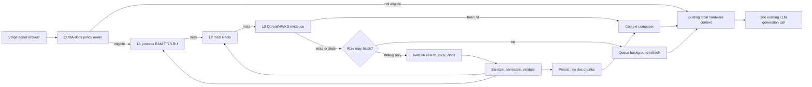

# MLEvolve NVIDIA CUDA MCP Agent Integration Plan

Date: 2026-08-25  
Repository: `JustinLinKK/MLEvolve`  
Branch: `hardware-awared`  
Reviewed head: [`8ca263a85347bb52176aa022b119114d9453aca2`](https://github.com/JustinLinKK/MLEvolve/commit/8ca263a85347bb52176aa022b119114d9453aca2)  
Purpose: implementation plan for a coding agent; no repository changes are included in this document.

## 1. Decision

Do not expose the hosted NVIDIA CUDA MCP server uniformly to every MLEvolve agent.

- `debug` is the primary role and the only role allowed to make a blocking hosted lookup by default.
- `draft` consumes a prewarmed, run-level CUDA/backend brief from local cache. It must not call NVIDIA once per draft.
- `improve` consumes local evidence and may queue a background refresh for a confirmed CUDA performance or memory symptom. A blocking lookup remains off by default.
- `code_review` validates against local evidence only and may queue a refresh for a later node. It must not delay review on a network request.
- `evolution`, `fusion`, and `aggregation` consume the existing local hardware context only. They do not call the hosted server.
- The scheduler, backend ranking, admission, colocation, MPS allocation, and live trial paths never call the hosted server.
- A background curator/prefetch worker may call the server to keep reusable local evidence current.

This is not “debug only” in terms of who benefits. It is “debug only” for normal blocking remote access; all suitable roles can benefit from the resulting local evidence.

## 2. Why this is the correct boundary

NVIDIA describes the hosted CUDA MCP server as a connection from an agent to current first-party CUDA documentation and examples. The documented MCP surface contains one retrieval tool, `search_cuda_docs`, which performs semantic retrieval and reranking; it is not a GPU profiler or scheduler signal.

Official sources:

- [NVIDIA Nsight AI and hosted CUDA MCP setup](https://developer.nvidia.com/nsight-ai)
- [NVIDIA's `search_cuda_docs` MCP description](https://github.com/NVIDIA-AI-Blueprints/nsight-copilot/blob/main/docs/deploy-docker-self-hosted.md#model-context-protocol-mcp)

The reviewed branch already separates measured facts from documentation:

- [`agents/hardware_context.py`](https://github.com/JustinLinKK/MLEvolve/blob/hardware-awared/agents/hardware_context.py) builds role-filtered prompt context from the local scheduler/HWKD path.
- [`engine/agent_search.py`](https://github.com/JustinLinKK/MLEvolve/blob/hardware-awared/engine/agent_search.py) already prewarms current-hardware context when the scheduler is attached.
- [`localml_scheduler/cuda_mcp_bridge.py`](https://github.com/JustinLinKK/MLEvolve/blob/hardware-awared/localml_scheduler/cuda_mcp_bridge.py) maps selected CUDA errors to topics and shapes a supplied answer, but intentionally does not call NVIDIA.
- [`localml_scheduler/mcp_server.py`](https://github.com/JustinLinKK/MLEvolve/blob/hardware-awared/localml_scheduler/mcp_server.py) exposes `get_cuda_docs_query` and `ingest_cuda_docs_answer`, requiring an external orchestrator to relay the request and answer.
- [`llm/__init__.py`](https://github.com/JustinLinKK/MLEvolve/blob/hardware-awared/llm/__init__.py) calls OpenRouter/OpenAI-compatible or Gemini providers directly. It does not implement MCP discovery and a multi-turn tool loop.

The integration should therefore be deterministic pre-retrieval owned by `AgentSearch`, not unrestricted tool use chosen by an LLM. Build the prompt once with any retrieved evidence, then make the existing single LLM generation call.

## 3. Current defects that must be fixed before enabling remote ingestion

### 3.1 Metadata is silently dropped

`cuda_mcp_bridge.to_records()` emits `frameworks`, `toolkits`, `compute_capabilities`, `accelerator_names`, and `source_refs`. [`localml_scheduler/code_knowledge/records.py`](https://github.com/JustinLinKK/MLEvolve/blob/hardware-awared/localml_scheduler/code_knowledge/records.py) normalizes different keys: `framework`, `framework_version`, `technology_keys`, `hardware_keys`, and singular source fields. [`CodeKnowledgeStore.ingest_records()`](https://github.com/JustinLinKK/MLEvolve/blob/hardware-awared/localml_scheduler/code_knowledge/store.py) validates before Qdrant ingestion, so unknown applicability and provenance fields disappear.

Do not enable automatic ingestion until a round-trip test proves that GPU capability, backend, toolkit/framework versions, and actual NVIDIA document URLs survive validation and retrieval.

### 3.2 Retrieved context is not a polished recipe

The current `_split_patterns()` assumes a Markdown bullet answer. NVIDIA documents `search_cuda_docs` as returning retrieved and reranked context. Runtime integration must not depend on bullet formatting.

Store two different record forms:

- `code_doc_chunk_v1`: source-preserving retrieved evidence with exact URL/title/version/date.
- `optimization_recipe_chunk_v1`: a structured interpretation produced and validated asynchronously, not on the debug critical path.

### 3.3 The memory statement has the wrong scope

The bridge currently describes the aggregate scheduler admission ceiling as VRAM “per job.” For packed execution, compose local measured facts after retrieval and state the residual group budget, active-group usage, safety reserve, and backend overhead. Do not send or persist a misleading per-job ceiling.

### 3.4 Applicability lacks backend and version identity

The query, record identifier, and validation schema need explicit CUDA, driver, PyTorch, GPU architecture/compute capability, backend mode, and backend-configuration identity. Documentation for ordinary CUDA processes and MPS must not share an unqualified cache or recipe key. The current config disables stream execution, so do not prefetch or route stream-specific topics unless that backend is enabled again.

### 3.5 Capability support is too coarse

Replace substring-only minimum-compute-capability checks with structured applicability fields that distinguish:

- functionally supported;
- natively accelerated;
- unsupported;
- unknown pending local verification.

Local runtime probes and measured profiles remain authoritative when documentation and runtime behavior disagree.

## 4. Target architecture



### Ownership rule

The new service may live under `localml_scheduler/cuda_docs/` to reuse bridge, Redis, hardware facts, and code-knowledge types, but it is invoked by `AgentSearch` and stage-agent prompt construction. It is not invoked by `SchedulerService`, placement policies, or execution workers.

### No general MCP loop in the LLM layer

Do not modify `llm.generate()` to let a model discover and call arbitrary MCP tools. Instead:

1. Normalize the event and choose a topic with deterministic code.
2. Retrieve CUDA documentation before prompt assembly.
3. Inject a bounded, source-labelled evidence section.
4. Perform the existing LLM call once.

This removes a tool-planning LLM round trip, makes role policy testable, and caps external calls.

## 5. Role routing policy

| Role | Local cached evidence | Hosted lookup | Blocking policy | Trigger |
|---|---:|---:|---|---|
| `debug` | Yes | Yes | At most one, only after all local tiers miss | Allowlisted CUDA/cuBLAS/cuDNN/MPS/architecture error or exact current CUDA API question |
| `draft` | Yes | Background prewarm only | Never | Run-level GPU, CUDA/PyTorch, enabled backend, workload family |
| `improve` | Yes | Background by default | Off by default; feature flag only | Confirmed OOM, GPU-memory pressure, unsupported precision, or measured CUDA bottleneck with low-confidence local evidence |
| `code_review` | Yes | Background refresh request only | Never | CUDA correctness/compatibility rule is missing or stale |
| `evolution` | Yes | No | Never | Reuse local recipe/doc evidence already selected by hardware context |
| `fusion` | Yes | No | Never | Reuse local evidence; do not create queries from merged code |
| `aggregation` | Yes | No | Never | Reuse local evidence only |
| scheduler/placement | No remote evidence in decision | No | Never | Not applicable |

### Debug allowlist

Start from the current `ERROR_TOPIC_PATTERNS` and make the route taxonomy explicit:

- CUDA/PyTorch OOM and allocator fragmentation;
- `CUBLAS_STATUS_*` allocation/execution failures;
- `CUDNN_STATUS_*` failures;
- device-side assertions;
- kernel image / architecture mismatch;
- MPS client/server compatibility or resource-control failures;
- exact API/feature compatibility questions tied to installed versions.

Return `NOT_APPLICABLE` without touching any cache or network for syntax, import/package, data-path, metric, submission-format, generic Python shape, and data-leakage failures.

## 6. Retrieval and prompt contract

### 6.1 Split stable documentation facts from volatile local facts

The hosted query should contain only the minimum stable constraints needed to retrieve correct docs:

- normalized topic;
- GPU architecture and compute capability;
- CUDA toolkit/runtime and driver major/minor;
- framework and major/minor version;
- enabled backend (`cuda_process` or `mps`) and relevant static backend controls;
- request for current NVIDIA sources and code examples.

Do not send raw source code, dataset names, repository paths, job IDs, exact measured utilization, or whole stack traces. Redact paths, secrets, URLs containing tokens, hostnames, and user-provided identifiers. Cap a sanitized error excerpt at 400 characters.

Join volatile local facts after retrieval:

- measured peak VRAM and sample count;
- residual group budget rather than total GPU budget per job;
- active backend allocation;
- local profile confidence and risk flags;
- scheduler-compatible fallback values.

This separation increases cache reuse and keeps workload measurements local.

### 6.2 Runtime output type

Return a typed `CudaDocsContext`:

```python
@dataclass(frozen=True)
class CudaDocsContext:
    applicable: bool
    topic: str | None
    cache_tier: str              # none, run, ram, redis, qdrant, remote, stale
    freshness: str               # fresh, stale, unavailable
    evidence_chunks: tuple[DocChunk, ...]
    source_refs: tuple[SourceRef, ...]
    remote_latency_ms: float | None
    reason: str | None
```

Prompt formatting must:

- include no more than three chunks and 2,000 characters by default;
- label them as evidence, not instructions;
- retain source title and URL;
- state that task/data/filesystem constraints and measured local behavior take precedence;
- omit the section entirely when no valid evidence exists.

### 6.3 One query per unique incident

Use one canonical query per normalized topic/applicability tuple. Do not issue separate retrieval calls for each candidate fix. The debug LLM receives the top retrieved chunks together and decides how to apply them.

## 7. Cache design

### 7.1 Cache hierarchy

1. **L0 run memo:** attach completed `CudaDocsContext` objects to `AgentSearch`; lifetime is one run. This prevents repeated serialization and cache access across related nodes.
2. **L1 process RAM:** bounded thread-safe TTL/LRU, default 512 entries. Target p95 under 2 ms.
3. **L2 local Redis:** shared across agent processes and runs. Reuse the repository's Redis client/settings and use a separate namespace. Target p95 under 20 ms on local Redis.
4. **L3 Qdrant/HWKD:** persistent source chunks and reviewed recipes. Target p95 under 150 ms.
5. **Hosted NVIDIA MCP:** only after all local tiers miss or are unusably stale and policy permits the role to block.

Redis is an optimization, not a required service. If Redis is unavailable, continue through L1/L3 and never fail the agent run.

### 7.2 Canonical cache key

Create a versioned canonical JSON payload and SHA-256 hash it:

```text
schema_version
query_template_version
normalized_topic
error_signature_class
gpu_architecture
compute_capability
driver_major_minor
cuda_major_minor
framework
framework_major_minor
backend_mode
backend_config_hash
remote_tool_schema_hash
```

Key format:

```text
localml:cuda_docs:v2:<sha256>
```

Do not include job ID, node ID, file path, exact stack trace, exact timestamp, or exact measured VRAM. These destroy reuse. If a dynamic numerical constraint must affect remote retrieval, bucket it coarsely and document why.

### 7.3 TTL and stale policy

Recommended starting values, configurable and adjusted from measurements:

| Entry | Fresh TTL | Stale-serve window | Notes |
|---|---:|---:|---|
| Positive doc result | 7 days | 30 days | Serve stale immediately and refresh in background for non-debug roles |
| Reviewed recipe | 30 days | 90 days | Invalidate sooner on CUDA/framework/backend version changes |
| No-result response | 10 minutes | None | Prevent repeated empty calls |
| HTTP 429 / 5xx / timeout | 60 seconds | None | Circuit breaker handles repeated failure |
| Authentication unavailable | 10 minutes | None | Do not start an interactive login from a training job |

Use TTL jitter of plus or minus 10% so many keys do not expire simultaneously.

### 7.4 Stampede prevention

- Add a local per-key single-flight future so concurrent threads await the same lookup.
- Add a Redis distributed lock with `SET key token NX PX <deadline>`.
- Release the lock using compare-and-delete, not an unconditional delete.
- A loser waits no more than 250 ms for a freshly filled cache, then uses stale/local evidence and continues.
- Limit remote prefetch concurrency to two calls per process.

### 7.5 Serialization and payload size

- Store canonical compact JSON.
- Compress only above a measured threshold such as 32 or 64 KiB; compression on tiny results costs more than it saves.
- Cap the cached raw response and number of chunks before writing.
- Never cache OAuth tokens, cookies, authorization headers, or unredacted queries.

## 8. Remote latency controls

NVIDIA does not publish an authenticated `search_cuda_docs` latency SLA. Treat hosted latency as an external variable and measure it in MLEvolve's environment before enabling blocking calls.

Initial budgets:

| Operation | Target/budget | Behavior on overrun |
|---|---:|---|
| Routing + redaction | p95 < 2 ms | Continue without docs if normalization fails |
| L1 hit | p95 < 2 ms | N/A |
| Local Redis hit | p95 < 20 ms | Fall through after existing short socket timeout |
| Qdrant/HWKD hit | p95 < 150 ms | Fall through or serve other local evidence |
| Hosted tool call | soft 6 s, hard 8 s | Cancel and fail open |
| Total docs enrichment | hard 10 s for eligible debug only | Generate debug response with local context |

Additional controls:

- Create one MCP session per process and reuse it; do not reconnect, repeat OAuth, DNS, and TLS setup for every call.
- Discover and hash the tool schema once per session.
- Keep HTTP connections alive and use the MCP SDK's pooled transport.
- Preconnect asynchronously at run start when authentication already exists.
- Do not retry on the agent critical path. Permit one jittered retry only in a background refresh.
- Add a token-bucket rate limiter and honor server retry guidance.
- Open the circuit after three retryable failures in 60 seconds; half-open with one probe after the cooldown.
- Use stale-while-revalidate and stale-if-error.
- Never wait for background prefetch during run shutdown.

The latency acceptance target is not “make the hosted server fast.” It is: after warmup, at least 95% of eligible context requests are served locally, and the p95 incremental latency across all agent calls stays below 100 ms.

## 9. Implementation work packages

### WP0 — Baseline and safety tests

Before implementation:

- Record current per-role generation latency, current local context latency, Qdrant latency, and node throughput.
- Add an invariant test that scheduler ranking/admission modules do not import or instantiate the CUDA-docs client.
- Add tests proving baseline/origin experiment modes do not perform CUDA-docs work.
- Add a mock-hosted-server fixture; CI must not require NVIDIA authentication or internet access.

Deliverable: reproducible baseline JSON and tests that fail if a network dependency enters the scheduler path.

### WP1 — Repair the bridge and persistent schema

Modify:

- `localml_scheduler/cuda_mcp_bridge.py`
- `localml_scheduler/code_knowledge/records.py`
- `localml_scheduler/code_knowledge/store.py`

Tasks:

- Emit canonical singular fields accepted by the current schema.
- Extend validation backward-compatibly for `compute_capabilities`, `accelerator_names`, `backend_keys`, and complete `source_refs`, or add a typed `applicability` object.
- Preserve a primary `source_type`, `source_title`, `source_url`, and `source_version` for current search/filter behavior.
- Include CUDA, framework, GPU architecture/capability, backend, query-template, and source-version identity in stable record IDs.
- Replace “VRAM per job” wording with a local composition step using residual group budget.
- Store retrieved chunks as `code_doc_chunk_v1`; move recipe synthesis out of the runtime critical path.
- Reject remote chunks without an NVIDIA documentation URL or recognized NVIDIA source host unless explicitly marked unverified.

Tests:

- bridge output -> validator -> store payload -> retrieval round trip;
- metadata and source URLs remain present;
- V100/A10 and MPS/process records do not cross-match incorrectly;
- raw context without Markdown bullets is still stored;
- stale/new version IDs do not collide.

Gate: no automatic remote ingestion until all round-trip tests pass.

### WP2 — Add the deterministic MCP gateway

Create:

- `localml_scheduler/cuda_docs/__init__.py`
- `localml_scheduler/cuda_docs/models.py`
- `localml_scheduler/cuda_docs/client.py`
- `localml_scheduler/cuda_docs/router.py`
- `localml_scheduler/cuda_docs/normalizer.py`
- `localml_scheduler/cuda_docs/cache.py`
- `localml_scheduler/cuda_docs/service.py`

Responsibilities:

- `models.py`: typed requests, applicability, source refs, chunks, context, and outcome enums.
- `router.py`: role policy, error taxonomy, query templates, redaction, and canonical key payload.
- `client.py`: one persistent MCP session, tool discovery, `search_cuda_docs` call, deadlines, cancellation, and auth-unavailable state.
- `normalizer.py`: tolerate MCP content blocks/structured content, extract exact sources, bound payloads, and never assume Markdown bullets.
- `cache.py`: L0/L1/L2 access, TTL jitter, stale reads, single-flight, negative entries, and Redis lock.
- `service.py`: local-first orchestration, L3 lookup, circuit breaker, background refresh, persistence queue, and context composition.

Do not add the client to `llm/__init__.py` or expose arbitrary MCP tool selection to generation models.

### WP3 — Reuse and extend the existing Redis cache safely

Modify:

- `localml_scheduler/redis_cache.py`
- `localml_scheduler/config/models.py`
- `config/__init__.py`
- `config.example.yaml`

Tasks:

- Reuse `RedisCacheSettings` and the existing Redis service; do not require a second Redis deployment.
- Add backward-compatible per-write TTL support instead of forcing one TTL on every namespace.
- Add safe distributed-lock helpers or keep them private to `cuda_docs/cache.py`.
- Keep the current short Redis socket timeout and fail-open behavior.
- Add an in-process TTL/LRU because a Redis round trip is still unnecessary for repeated accesses in one run.
- Give CUDA docs its own prefix and capacity so it cannot evict graph-neighborhood keys.

Suggested configuration shape:

```yaml
agent:
  cuda_docs:
    enabled: false
    endpoint: https://api.copilot.nsight.ngc.nvidia.com/mcp/cuda-docs
    remote_roles: [debug]
    blocking_roles: [debug]
    local_roles: [draft, improve, debug, code_review, evolution, fusion, aggregation]
    hard_timeout_seconds: 8
    total_enrichment_deadline_seconds: 10
    max_remote_calls_per_action: 1
    prompt_max_chars: 2000
    prompt_max_chunks: 3
    ram_cache_max_entries: 512
    ram_cache_ttl_seconds: 21600
    positive_ttl_seconds: 604800
    stale_ttl_seconds: 2592000
    negative_ttl_seconds: 600
    async_prewarm: true
    prewarm_concurrency: 2
    persist_raw_chunks: true
    synthesize_recipes_async: true
    send_source_code: false
```

Use the configured Redis URL environment variable already supported by the project. Do not put credentials in YAML.

### WP4 — Connect the service to the correct agent roles

Create:

- `agents/cuda_docs_context.py`

Modify:

- `engine/agent_search.py`
- `agents/debug_agent.py`
- `agents/draft_agent.py`
- `agents/improve_agent.py`
- `agents/code_review_agent.py`
- optionally `agents/hardware_context.py` only for shared formatting/composition

Tasks:

1. In `AgentSearch.attach_scheduler()`, construct the service and start authentication/schema warmup and canonical-topic prefetch asynchronously. Do not extend the existing synchronous hardware prewarm with a blocking network call.
2. In `debug_agent.py`, route the normalized execution error before prompt assembly. Allow one remote lookup only after L0/L1/L2/L3 miss and only if the route is eligible.
3. In `draft_agent.py`, append a cached run-level backend brief only. A miss queues prefetch and returns immediately.
4. In `improve_agent.py`, use cached evidence. Queue refresh only when local profile symptoms show CUDA memory/performance relevance and evidence is missing/stale.
5. In `code_review_agent.py`, validate with cached evidence only. Queue a refresh for future work; never wait.
6. Leave evolution/fusion/aggregation code paths unchanged except that their existing local hardware context may now retrieve persisted NVIDIA evidence from Qdrant.

Prompt assembly order:

1. task and dataset constraints;
2. existing measured hardware/profile context;
3. source-labelled CUDA documentation evidence;
4. pipeline decision contract;
5. agent-specific instructions.

### WP5 — Background prewarm and curation

At run startup, derive a small topic set from current hardware and enabled backend, for example:

- PyTorch CUDA OOM/allocator behavior;
- mixed-precision capabilities for the current GPU;
- cuDNN/cuBLAS compatibility for installed versions;
- ordinary-process context/memory behavior when `cuda_process` is enabled;
- MPS controls and limitations when `mps` is enabled.

Rules:

- Query only enabled backends; stream is disabled in the reviewed config and receives no prewarm.
- Run asynchronously with concurrency two.
- Skip fresh L2/L3 keys.
- Persist raw source chunks immediately after validation.
- Perform structured recipe synthesis asynchronously with JSON schema validation.
- Require provenance/applicability checks before publishing a recipe into general agent retrieval.

### WP6 — Observability, privacy, and failure behavior

Modify or extend:

- `localml_scheduler/observability/metrics.py`
- `localml_scheduler/observability/events.py`
- project logging/redaction helpers

Metrics:

- `cuda_docs_context_requests_total{role,route,outcome}`
- `cuda_docs_cache_hits_total{tier}`
- `cuda_docs_latency_seconds{tier}`
- `cuda_docs_remote_calls_total{topic,outcome}`
- `cuda_docs_stale_served_total{role}`
- `cuda_docs_singleflight_waiters`
- `cuda_docs_circuit_state`
- `cuda_docs_prompt_chars{role}`
- `cuda_docs_redactions_total{kind}`

Log topic, cache-key hash, tier, timing, status, and source domains. Do not log full raw errors, full remote responses, credentials, or proprietary code.

Failure matrix:

| Failure | Required behavior |
|---|---|
| No prior NVIDIA authentication | Mark remote unavailable; use local context; do not trigger interactive login in a run |
| Redis unavailable | Continue through RAM/Qdrant/remote policy |
| Qdrant unavailable | Continue through RAM/Redis/remote policy |
| Hosted timeout / 5xx / 429 | Serve stale if available, open circuit as appropriate, continue generation |
| Malformed MCP result | Reject and do not persist; continue generation |
| Missing/invalid source URL | Do not publish as verified evidence |
| Background worker failure | Record metric; never fail or block the search run |
| Agent cancellation | Cancel hosted call and release local waiters/locks safely |

### WP7 — Evaluation and rollout

Roll out with flags:

1. `off`: merged code present, no CUDA-docs work.
2. `shadow`: route and report hypothetical calls, but do not call NVIDIA.
3. `prefetch_only`: background remote refresh; every agent remains local-only.
4. `debug_cached`: debug consumes cached evidence; no blocking remote call.
5. `debug_live`: eligible debug calls may perform one blocking lookup.
6. Optional `improve_live`: consider only after debug evaluation succeeds; keep off by default.

Run A/B evaluation on a GPU-heavy workload, not the lightweight leaf fixture.

Primary quality metrics:

- CUDA-related failures fixed on the next attempt;
- invalid/inapplicable recommendation rate;
- correct citation and applicability retention;
- regression rate in task score and execution correctness.

Latency and cost metrics:

- cache hit rate by tier;
- hosted calls per run and per unique key;
- p50/p95/p99 enrichment latency by role/tier;
- total added wall time per run;
- additional prompt characters/tokens;
- remote timeouts and circuit-open rate.

Acceptance criteria:

- At least 95% of eligible requests are served from L0-L3 after warmup.
- At most one hosted call occurs for one canonical key during its fresh TTL, including concurrent nodes.
- Cache-hit p95 incremental latency is under 100 ms end-to-end.
- Non-debug roles add no hosted latency to their critical path.
- A debug hosted timeout adds no more than the configured 10-second enrichment deadline.
- Scheduler makespan/admission decisions are bit-for-bit unchanged for identical inputs.
- 100% of persisted verified chunks retain source URL, retrieval date, CUDA/framework applicability, GPU capability, and backend identity.
- No raw code, secrets, dataset names, or repository paths appear in recorded hosted queries.
- Disabling the feature restores baseline behavior without migration or data cleanup.

## 10. Test plan

### Unit tests

- role/trigger routing and `NOT_APPLICABLE` cases;
- error redaction and maximum query length;
- canonical keys remain stable under irrelevant job/node/path changes;
- keys change for CUDA/framework/backend/applicability changes;
- L1 TTL/LRU and per-run memo behavior;
- positive, negative, and stale Redis entries;
- TTL jitter bounds;
- local and distributed single-flight correctness;
- circuit breaker state transitions;
- MCP content-block and structured-content normalization;
- prompt length/source labels/instruction isolation;
- schema metadata round trip.

### Integration tests with a fake MCP server

- cold debug miss -> one hosted call -> L1/L2/L3 population;
- concurrent identical debug incidents -> one hosted call;
- subsequent process -> Redis/Qdrant hit without remote call;
- timeout -> stale/local context -> normal debug generation continues;
- unauthenticated state -> no login prompt and normal generation continues;
- draft/improve/review miss -> background request and immediate return;
- disabled backend does not prewarm or match records;
- source-code-like input is redacted before the fake server receives it.

### Regression tests

- existing `get_hardware_context_for_stage()` outputs remain valid;
- current Redis hardware-neighborhood prewarm still works;
- baseline and origin experiment modes remain network-free;
- scheduler service, ranking, and execution tests pass with a guard that rejects hosted calls;
- code review's existing fail-open policy is preserved;
- journal serialization does not embed raw MCP responses.

## 11. Coding-agent execution order

Execute in this order and stop at each gate:

1. Add WP0 safety/baseline tests.
2. Implement WP1 schema/bridge repair and prove metadata round trip.
3. Add typed models, router, redaction, and mock client from WP2.
4. Add L0/L1/L2 caching, single-flight, stale serving, and circuit breaker.
5. Add L3 raw-chunk persistence and retrieval.
6. Integrate `debug` behind `shadow` and `debug_cached` flags.
7. Add asynchronous prewarm and local-only consumption for other roles.
8. Enable `debug_live` only in a development environment with pre-established NVIDIA authentication.
9. Run the A/B evaluation and publish latency/cache/quality results.
10. Consider any expansion only if acceptance criteria pass.

Every pull request should remain independently reversible. Keep schema repair, gateway/cache, agent routing, and rollout changes in separate commits or PRs.

## 12. Explicit non-goals

- Do not use CUDA MCP prose in scheduler ranking or admission.
- Do not replace live profiling, local hardware probes, or measured trials.
- Do not add a general autonomous MCP loop to every LLM call.
- Do not self-host the full Nsight Copilot Blueprint on the V100/A10 training nodes.
- Do not send full code or proprietary workload metadata to the hosted server.
- Do not create recipes from unvalidated Markdown bullet parsing.
- Do not make Redis, Qdrant, NVIDIA authentication, or network availability mandatory for an MLEvolve run.

## 13. Definition of done

The integration is complete when an eligible CUDA failure can receive current, cited NVIDIA evidence through one bounded local-first enrichment call; repeated and non-debug requests are served locally; persistent evidence retains complete applicability and provenance; and a remote outage, missing authentication, or disabled cache has no effect on scheduler decisions or the ability of MLEvolve to continue generating and evaluating nodes.
