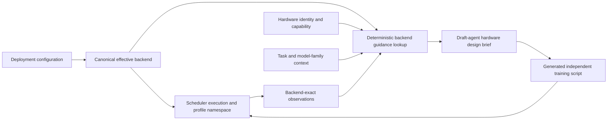

# MLEvolve CUDA-Stream Removal and Backend-Conditioned Hardware Knowledge Refactor

Implementation plan for a coding agent

Repository: `JustinLinKK/MLEvolve`  
Branch reviewed: `hardware-awared`  
Review commit: `8ca263a85347bb52176aa022b119114d9453aca2`  
Plan status: design only; no repository code was modified

## 1. Goal

Change MLEvolve and the single-GPU scheduler so that:

1. CUDA-stream execution is removed from the production scheduler and from the MLEvolve agent framework.

2. The deployment has one authoritative packed-execution mode selected before MLEvolve drafts a model.

3. The drafting agent receives deterministic, backend-specific coding guidance for that mode.

4. Historical performance evidence, static hardware knowledge, prompt context, and caches never mix incompatible backend semantics.

5. The existing asynchronous workflow is preserved: each MLEvolve node may be submitted as soon as it is ready. The implementation must not introduce round-based submission or wait for a complete job group.

The scheduler's primary objective remains trace makespan. This project does not ask the drafting agent to predict colocation slowdown, and it does not add an ML model to the knowledge-selection path.

## 2. Required architecture decisions

### 2.1 Remove CUDA streams from the supported runtime

Remove all production support for these identifiers:

- `stream`

- `cuda_stream`

- `mps_stream`

- `stream_mps`

Do not map an old stream placement or profile to `cuda_process`. Those modes have different CUDA-context and concurrency semantics. Old stream data must be retained only as retired, non-selectable evidence or exported before cleanup.

The reason is specific to the current runner contract. The stream host selects a `torch.cuda.Stream` in a parent process, while an ordinary MLEvolve generated script is launched as a child subprocess. The child owns a different CUDA context, so the parent's stream cannot control the child's CUDA work. Dynamic job arrival is not inherently incompatible with streams; the incompatibility is that MLEvolve jobs are independent subprocess programs rather than structured, in-process training callables sharing one CUDA context.

Do not replace the removed backend with a hidden stream wrapper. A future stream experiment would require a new runner ABI, shared failure domain, allocator-lifetime rules, synchronization rules, and in-process model execution. That is outside this plan.

### 2.2 Correct the backend taxonomy

Do not expose the following as three independent packing backends:

1. CUDA process only.

2. MPS only.

3. CUDA process plus MPS.

NVIDIA MPS is a service used by CUDA client processes. Independent MLEvolve jobs do not execute “inside MPS without processes.” Therefore, the useful production taxonomy is:

| Canonical mode | Process topology | MPS state | Scheduler meaning |
|---|---|---|---|
| `cuda_process` | One OS process and CUDA context per job | Off | Concurrent independent job processes without MPS spatial sharing |
| `mps_process` | One OS process and CUDA context per job | On; processes connect as MPS clients | Concurrent job processes mediated by MPS, optionally with scheduler-owned active-thread allocations |
| `exclusive` | One OS process for the only admitted GPU job | Off unless deployment requires otherwise | Safe fallback and solo-profiling mode, not a packed mode |

The user's “CUDA process plus MPS” case is exactly `mps_process`. “MPS only” is not a separate multi-job topology. If a product surface insists on showing it, label it as a single-client diagnostic state and do not offer it as a packing backend.

Use `mps_process` as the canonical persisted name. Accept legacy `mps` at configuration boundaries for one deprecation window, normalize it immediately to `mps_process`, and never write new profiles under the legacy name.

### 2.3 Make the preset mode authoritative

Replace the ambiguous idea that the first element of `backend_priority` represents the drafting target. Add one authoritative field, for example:

```yaml
gpu_scheduler:
  packing_backend: mps_process  # cuda_process | mps_process
  exclusive_fallback_enabled: true
```

The exact field name may follow repository conventions, but its semantics must be singular and unambiguous.

Rules:

- The scheduler ranks job pairs, batch combinations, and backend configurations only inside the configured packed mode.

- `exclusive` remains an explicit safety/profiling fallback and is not an alternative optimization target for draft-time model design.

- `cuda_process` mode must not start, configure, or depend on the MPS daemon.

- `mps_process` mode must launch separate job processes as MPS clients.

- If `mps_process` is configured but MPS is unavailable, fall back to `exclusive` or fail according to an explicit availability policy. Do not silently switch to multi-job `cuda_process`, because that changes the performance/profile domain after code was drafted for MPS.

- Preserve asynchronous admission. Do not delay a ready job merely to construct a round. Existing MPS shares are treated as immutable after CUDA-context creation; if safe incremental admission is impossible for the active configuration, decline that addition and re-evaluate later rather than pretending the share was changed.

## 3. Current repository findings that motivate the work

At the reviewed commit:

- [`execution/backend_registry.py`](https://github.com/JustinLinKK/MLEvolve/blob/8ca263a85347bb52176aa022b119114d9453aca2/localml_scheduler/execution/backend_registry.py) registers `exclusive`, `mps`, `cuda_process`, and `stream`.

- [`execution/backends.py`](https://github.com/JustinLinKK/MLEvolve/blob/8ca263a85347bb52176aa022b119114d9453aca2/localml_scheduler/execution/backends.py) implements a persistent `StreamBackend` and an `MPSBackend` that still launches one subprocess per job. This confirms that MPS is already process-based.

- [`execution/stream_host.py`](https://github.com/JustinLinKK/MLEvolve/blob/8ca263a85347bb52176aa022b119114d9453aca2/localml_scheduler/execution/stream_host.py) owns one CUDA context and assigns threads/streams, but the ordinary generated-script runner executes user code through a child subprocess.

- [`config/models.py`](https://github.com/JustinLinKK/MLEvolve/blob/8ca263a85347bb52176aa022b119114d9453aca2/localml_scheduler/config/models.py) still includes `StreamSettings`, stream overheads, stream-offset templates, and a default priority of `mps`, `stream`, `cuda_process`, `exclusive`.

- [`scheduler/backend_aware_planner.py`](https://github.com/JustinLinKK/MLEvolve/blob/8ca263a85347bb52176aa022b119114d9453aca2/localml_scheduler/scheduler/backend_aware_planner.py) enumerates stream offsets and converts them into launch delays.

- [`scheduler/backend_compatibility.py`](https://github.com/JustinLinKK/MLEvolve/blob/8ca263a85347bb52176aa022b119114d9453aca2/localml_scheduler/scheduler/backend_compatibility.py) recognizes `stream`, `cuda_stream`, and `mps_stream`. The hybrid is rejected at runtime, but it still remains in the analysis/configuration domain.

- [`scheduler/trial_priority.py`](https://github.com/JustinLinKK/MLEvolve/blob/8ca263a85347bb52176aa022b119114d9453aca2/localml_scheduler/scheduler/trial_priority.py) generates MPS, stream, and MPS-plus-stream configuration candidates.

- [`agents/hardware_context.py`](https://github.com/JustinLinKK/MLEvolve/blob/8ca263a85347bb52176aa022b119114d9453aca2/agents/hardware_context.py) derives `backend_preference` from the first submission allowlist or priority entry. It does not receive a guaranteed authoritative effective backend.

- [`localml_scheduler/client.py`](https://github.com/JustinLinKK/MLEvolve/blob/8ca263a85347bb52176aa022b119114d9453aca2/localml_scheduler/client.py) does not include backend mode in code-knowledge filters, and its fallback relaxes to framework-only retrieval. That can surface advice from the wrong runtime mode.

- [`graph_knowledge.py`](https://github.com/JustinLinKK/MLEvolve/blob/8ca263a85347bb52176aa022b119114d9453aca2/localml_scheduler/graph_knowledge.py) treats `backend_preference` mainly as a ranking bonus. It does not enforce exact-backend isolation for packed evidence.

- [`hardware_knowledge/feature_filter.py`](https://github.com/JustinLinKK/MLEvolve/blob/8ca263a85347bb52176aa022b119114d9453aca2/localml_scheduler/hardware_knowledge/feature_filter.py) excludes the `parallelism` category from the `model_design` composite stage, so backend-related features are unlikely to reach the drafting agent.

- [`code_knowledge/records.py`](https://github.com/JustinLinKK/MLEvolve/blob/8ca263a85347bb52176aa022b119114d9453aca2/localml_scheduler/code_knowledge/records.py) has technology and hardware keys but no first-class backend applicability, runner contract, rule strength, or evidence transferability.

- [`code_knowledge/store.py`](https://github.com/JustinLinKK/MLEvolve/blob/8ca263a85347bb52176aa022b119114d9453aca2/localml_scheduler/code_knowledge/store.py) turns a list-valued filter into a match on only its first item. Backend constraints must not inherit this behavior.

- [`hardware_features/seed_records.yaml`](https://github.com/JustinLinKK/MLEvolve/blob/8ca263a85347bb52176aa022b119114d9453aca2/localml_scheduler/hardware_features/seed_records.yaml) contains useful generic CUDA guidance but no backend-specific records.

- Both `localml_scheduler/hardware_knowledge/` and a top-level `hardware_knowledge_graph/` implementation exist. The runtime client imports the former. The coding agent must avoid updating only the inactive duplicate and should either consolidate the implementations or keep them intentionally synchronized.

## 4. Target data flow



The effective backend must be computed once from validated configuration and passed through every layer. No layer may reconstruct it by taking the first item from a priority or allowlist.

## 5. Target knowledge model

Keep one shared knowledge system, but make backend applicability first-class. Do not build unrelated per-backend databases.

### 5.1 Add a backend-guidance record contract

Introduce a validated record schema such as `backend_guidance_rule_v1`. Recommended fields:

```yaml
schema_version: backend_guidance_rule_v1
rule_id: pytorch.mps_process.no_job_owned_mps_control
title: Keep MPS control outside generated jobs
text: The scheduler owns the MPS daemon, active-thread allocation, priorities, and memory limits.
backend_modes: [mps_process]
runner_contracts: [subprocess_job_v1]
pipeline_stages: [model_design, datatype_precision, training_evaluation]
rule_type: safety
owner: scheduler
strength: hard
transferability: exact_backend
framework: pytorch
workload_types: []
hardware_constraints:
  vendor: nvidia
  min_compute_capability: "7.0"
recommended_patterns: []
avoid_patterns:
  - Do not start or stop the MPS daemon from generated model code.
source_refs: []
confidence: 1.0
last_verified: YYYY-MM-DD
```

Required enumerations:

- `backend_modes`: `backend_neutral`, `exclusive`, `cuda_process`, `mps_process`.

- `runner_contracts`: initially `subprocess_job_v1`; reserve other values only when a real runner exists.

- `pipeline_stages`: the current composite stages `model_design`, `datatype_precision`, and `training_evaluation`.

- `rule_type`: `invariant`, `safety`, `recommendation`, or `heuristic`.

- `owner`: `scheduler`, `runner`, or `job_code`.

- `strength`: `hard`, `preferred`, or `informational`.

- `transferability`: `backend_neutral`, `exact_backend`, or `exclusive_baseline`.

Backend applicability is a hard eligibility condition, not an embedding hint and not a score bonus.

### 5.2 Retrieval precedence

Merge knowledge in this order:

1. Task correctness and metric constraints.

2. Hard physical hardware constraints.

3. Hard runner and backend safety rules for the exact effective backend.

4. Successful empirical evidence from the same hardware, software stack, backend, and relevant backend configuration.

5. Exclusive solo measurements labelled `exclusive_baseline`.

6. Curated preferred patterns for the exact backend.

7. Backend-neutral recommendations.

8. Static heuristics, clearly marked as unverified until a colocation trial confirms them.

A lower layer must never override a higher layer. In particular, a semantic-search result cannot override a hard MPS rule or introduce a retired stream technique.

### 5.3 Deterministic lookup before semantic ranking

Add a method with semantics similar to:

```python
get_backend_design_guidance(
    effective_backend="mps_process",
    runner_contract="subprocess_job_v1",
    pipeline_stage="model_design",
    hardware_context=...,
)
```

The method must:

- include `backend_neutral` rules plus rules for exactly one effective backend;

- reject stream-related records;

- apply hardware and runner constraints before ranking;

- return hard rules even if Qdrant or an embedding model is unavailable;

- use semantic ranking only within the already eligible record set;

- expose selected rule IDs, sources, confidence, and exclusion reasons for debugging.

Do not use the existing framework-only fallback for backend-specific queries. Soft filters such as model family or workload may be relaxed; backend, runner contract, and hardware safety constraints may not.

### 5.4 Empirical evidence isolation

Use the following transfer rules:

- A packed `cuda_process` profile is valid only for `cuda_process` under a matching hardware/software/profile identity.

- A packed `mps_process` profile is valid only for `mps_process` with a matching allocation/configuration identity.

- An exclusive solo profile may supply baseline VRAM and epoch time to either packed mode, but it must be labelled `exclusive_baseline`. It is not evidence of packed slowdown.

- No stream profile may be returned to active planning or drafting.

- Legacy `mps` profile keys may be normalized to `mps_process` only when their recorded launch metadata proves they used the MPS backend. Do not normalize by name alone if provenance is ambiguous.

Profile and context cache identities should include at least:

```text
hardware_key
driver/CUDA/PyTorch identity
model or execution signature
batch size
canonical effective backend
backend configuration identity
runner contract
knowledge schema/corpus version
```

## 6. Backend-specific drafting guidance

The drafting agent should adapt generated code to the preset mode without taking ownership of scheduler controls.

### 6.1 Shared rules for all modes

Apply these to `backend_neutral`:

- Preserve task quality and the competition/production metric. Do not choose a weaker model merely because it may pack better.

- Make physical batch size configurable and separate it from effective batch size through correct gradient accumulation.

- Avoid assumptions that batch size is fixed at code-generation time. Prefer batch-insensitive normalization where task-appropriate; never mechanically replace a normalization layer without considering accuracy.

- Keep model width, depth, input resolution, crop size, and sequence length configurable when the architecture permits.

- Reduce persistent VRAM, activation peaks, temporary workspace spikes, and unnecessary tensor copies.

- Prefer stable, supported PyTorch/CUDA operators over custom extensions unless the extension is required and verified on the installed hardware.

- Make DataLoader workers, pinned memory, prefetching, OMP threads, and MKL threads configurable rather than hardcoded.

- Use process-local checkpoints, logs, temporary files, random seeds, and output directories.

- Never hardcode GPU IDs, launch sibling jobs, or assume another job starts at the same time.

- Emit machine-readable resolved batch size, epoch/step timing, peak memory, and failure information so the scheduler can learn from trials.

### 6.2 `cuda_process` guidance

The drafting packet should say:

- Optimize normal solo-process throughput. Without MPS, independent CUDA contexts do not provide the same inter-process kernel concurrency controls as MPS.

- Do not intentionally make kernels smaller or the model underutilized in the hope that another process will fill the GPU.

- Prefer efficient fused/standard operators and reduce launch overhead while keeping memory within the scheduler budget.

- Use one main GPU-training process per submitted job. Do not create nested CUDA multiprocessing or additional GPU worker processes.

- Keep CPU and DataLoader parallelism configurable because several job processes may coexist and otherwise oversubscribe host resources.

- Avoid CUDA initialization before any multiprocessing boundary used by the job itself.

- Do not include MPS daemon setup, active-thread percentages, client priority, or MPS pipe/log variables in generated code.

- Treat colocation benefit as more likely when the process has natural GPU-idle/CPU-input gaps, but keep this as a scheduler heuristic, not an architectural requirement.

### 6.3 `mps_process` guidance

The drafting packet should include every relevant process-safety rule above, plus:

- Each job remains a separate CUDA process and address space. Do not claim that similar models share weights, PyTorch state, CUDA context, or allocator state through MPS.

- Keep peak/reserved memory and large temporary workspaces conservative because clients still compete for the same physical GPU memory.

- Favor batch elasticity and operators whose performance remains reasonable under the scheduler's tested MPS active-thread allocations.

- Avoid CUDA dynamic parallelism and any operation known to be unsupported by the deployed MPS/GPU generation.

- Avoid frequent device-wide synchronization in the training loop when an event/tensor dependency or normal framework ordering is sufficient. Never remove correctness-required synchronization.

- Prefer ordinary PyTorch/cuDNN/cuBLAS operators with well-understood resource behavior. Treat custom long-running or resource-monopolizing kernels as higher-risk and require explicit validation.

- The generated job must not start/stop MPS, set its own active-thread percentage, choose client priority, enforce MPS memory limits, or change device compute mode. Those are scheduler/deployment responsibilities.

- MPS percentages are resource-usage limits, not guaranteed reserved shares. Do not promise a slowdown or makespan improvement in the prompt; only measured trials can establish it.

- Structural similarity between two models may improve static-analysis confidence but is not a physical MPS sharing advantage. Do not instruct the draft agent to make models structurally similar for context sharing.

### 6.4 `exclusive` guidance

Use `exclusive` guidance for solo probes and fallback execution:

- Optimize throughput, memory stability, and measurement repeatability for one job.

- Keep the same scheduler interface and configurable batch behavior so the job remains portable.

- Do not inject packed-mode heuristics or MPS controls.

## 7. Phased implementation plan

### Phase 0 — Baseline and dependency inventory

Tasks:

1. Record the branch SHA and run the current targeted test suites before editing.

2. Use `rg` across code, tests, configuration, schemas, migrations, examples, documentation, and fixtures for:

   ```text
   stream
   cuda_stream
   mps_stream
   stream_mps
   StreamBackend
   StreamSettings
   stream_offset_steps
   streams_per_client
   cuda_stream_id
   stream_host_pid
   ```

3. Inventory database rows and serialized fixtures whose backend name is one of the retired identifiers.

4. Record current behavior for one exclusive job, two `cuda_process` jobs, and two MPS clients if the test host supports MPS.

5. Confirm which imports use `localml_scheduler/hardware_knowledge/` and which use the top-level `hardware_knowledge_graph/` package.

Acceptance criteria:

- A checked-in or PR-attached inventory lists every removal site and every affected test.

- Baseline test results and profile counts are recorded before migration.

### Phase 1 — Canonical backend configuration

Primary files:

- `localml_scheduler/config/models.py`

- `localml_scheduler/config/__init__.py`

- `config.example.yaml`

- scheduler submission/config parsing and CLI/API surfaces found in Phase 0

Tasks:

1. Add a single authoritative `packing_backend` or equivalent enum with only `cuda_process` and `mps_process`.

2. Make `exclusive` an explicit fallback/probe policy, not a competing draft-time target.

3. Deprecate `backend_priority` as the source of deployment mode. During migration, allow it only when it contains one non-exclusive backend plus optional `exclusive`; otherwise fail with an actionable message.

4. Normalize legacy `mps` to `mps_process` at parse time. Persist and emit only the canonical value.

5. Reject all retired stream identifiers at startup. The error should explain that independent generated-script subprocesses cannot inherit a parent CUDA stream.

6. Remove `StreamSettings`, stream-offset configuration, stream overhead entries, and hybrid names.

7. Validate contradictory settings. For example, `mps_process` must have MPS runtime configuration; `cuda_process` must not accidentally start MPS.

8. Increment the scheduler/config schema or decision schema version so stale caches cannot be silently reused.

Acceptance criteria:

- Exactly one packed mode is authoritative.

- Legacy `mps` can be read during the deprecation window but becomes `mps_process` immediately.

- Every stream identifier fails validation with a migration message.

- Serialized settings contain no stream section or stream offsets.

### Phase 2 — Remove the stream execution path

Primary files:

- `localml_scheduler/execution/backend_registry.py`

- `localml_scheduler/execution/backends.py`

- `localml_scheduler/execution/stream_host.py`

- execution package exports and supervisor/handle code discovered by `rg`

Tasks:

1. Remove `StreamBackend` imports and registry registration.

2. Delete `StreamBackend` and `execution/stream_host.py` after all callers are removed.

3. Remove stream-host socket, shared-process monitoring, stream assignment events, and stream-specific metadata fields.

4. Rename `MPSBackend.name` to `mps_process` and keep the runtime behavior as separate subprocess clients attached to MPS.

5. Keep `CudaProcessBackend` and `ExclusiveBackend` behavior distinct.

6. Ensure shutdown no longer attempts to manage a stream host.

7. Do not change `mlevolve_runner.py` into an in-process runner. Its subprocess boundary is the desired isolation contract for this framework.

Acceptance criteria:

- The registry exposes only `exclusive`, `cuda_process`, and `mps_process`.

- No production process creates a CUDA stream host or Unix control socket.

- Two independently ready jobs still launch as separate OS processes.

- Under `mps_process`, both processes receive the MPS connection environment; under `cuda_process`, neither does.

### Phase 3 — Remove stream planning, ranking, and profile semantics

Primary files:

- `localml_scheduler/scheduler/backend_aware_planner.py`

- `localml_scheduler/scheduler/backend_compatibility.py`

- `localml_scheduler/scheduler/trial_priority.py`

- `localml_scheduler/scheduler/trial_candidate.py`

- `localml_scheduler/scheduler/placement_planner.py`

- `localml_scheduler/scheduler/colocation_decisions.py`

- `localml_scheduler/scheduler/colocation_trials.py`

- `localml_scheduler/scheduler/dispatching.py`

- `localml_scheduler/scheduler/placement_replay.py`

- `localml_scheduler/scheduler/source_fingerprint.py`

- `localml_scheduler/scheduler/time_objective.py`

- `localml_scheduler/scheduler/trace_simulator.py`

- `localml_scheduler/domain/identity.py`

Tasks:

1. Remove stream branches from compatibility evaluation and candidate generation.

2. Remove `_stream`, phase-offset scoring, `STREAM_*` reason codes, and `MPS_STREAM_RUNTIME_UNSUPPORTED`.

3. Remove `stream_offset_steps`, `streams_per_client`, and start-delay metadata when they have no non-stream consumer. Retain only fields required by MPS allocations.

4. Remove stream overheads from memory admission and trial amortization.

5. Restrict the backend-aware ranker to the configured backend. Continue ranking job pair, batch vector, and—under MPS—finite allocation templates.

6. Keep source-analysis fields that still improve `cuda_process` or `mps_process` heuristics. Do not delete synchronization/kernel features solely because streams are removed if MPS/process ranking still consumes them.

7. Canonicalize backend names before building profile keys, decision records, replay identities, logs, and metrics.

8. Ensure active-job logic preserves asynchronous admission and MPS share immutability. No round barrier may be introduced.

Acceptance criteria:

- The planner cannot generate a stream or hybrid action.

- Candidate/config cardinality tests reflect only process and MPS allocation actions.

- No launch-delay decision is produced from a stream offset.

- Same pair and batch under `cuda_process` and `mps_process` have different profile identities.

### Phase 4 — Clean the MLEvolve agent framework and prompts

Primary files:

- `agents/hardware_context.py`

- `agents/draft_agent.py`

- other agent prompts and node serialization discovered by `rg`

- `localml_scheduler/adapters/mlevolve_runner.py`

Tasks:

1. Add `effective_backend` and `runner_contract` to the job-design candidate contract.

2. Populate `effective_backend` from the authoritative configured mode. Remove inference from `backend_allowlist[0]` or `backend_priority[0]`.

3. Set the current runner contract to `subprocess_job_v1`.

4. Replace the prompt instruction that generically says not to hardcode “CUDA process, CUDA stream, MPS” with a precise contract:

   - generated code must be valid as an independent subprocess;

   - generated code should follow the exact preset mode's coding preferences;

   - scheduler-owned launch/resource controls must not be implemented inside generated code.

5. Add a structured `backend_guidance` section to the hardware design brief with hard rules, preferred patterns, avoid patterns, evidence references, and uncertainties.

6. Require draft output to state the selected memory strategy, batch-elasticity strategy, operator/normalization considerations, configurable dimensions, prohibited backend controls, and fallback behavior.

7. Remove every active prompt or example that suggests cross-job CUDA streams, shared CUDA context, stream offsets, or MPS-plus-stream execution.

Acceptance criteria:

- The draft prompt always names one canonical effective backend.

- MPS draft guidance never claims model/context/weight sharing.

- `cuda_process` draft guidance never recommends MPS setup.

- No prompt asks independently submitted nodes to integrate their training loops.

### Phase 5 — Refactor and seed backend-conditioned knowledge

Primary files:

- `localml_scheduler/code_knowledge/records.py`

- `localml_scheduler/code_knowledge/store.py`

- `localml_scheduler/hardware_features/seed_records.yaml`

- `localml_scheduler/hardware_knowledge/records.py`

- `localml_scheduler/hardware_knowledge/feature_filter.py`

- `localml_scheduler/hardware_knowledge/store.py`

- `schema/hardware_knowledge_graph.json`

- schema documentation and ingestion tools

Tasks:

1. Implement and validate the backend-guidance fields in Section 5.1.

2. Add exact-match indexes/filters for backend mode, runner contract, pipeline stage, rule type, and transferability.

3. Fix list-valued filtering so it expresses intended membership/OR semantics rather than silently using only the first value.

4. Add curated `backend_neutral`, `cuda_process`, `mps_process`, and `exclusive` seed rules from Section 6.

5. Make backend guidance visible to `model_design`. Do not rely on the existing `parallelism` category, which the current composite model-design stage excludes.

6. Migrate the existing CUDA-process and MPS scheduler-compatibility knowledge into validated, reachable records. Remove or retire the CUDA-stream compatibility record.

7. Distinguish hardware capability from runtime guidance. For example, “this GPU supports MPS” is a hardware fact; “do not start MPS in generated job code” is an `mps_process` backend rule.

8. Resolve the duplicate `localml_scheduler/hardware_knowledge/` and top-level `hardware_knowledge_graph/` implementations. Preferred result: one canonical implementation plus a thin compatibility import, with tests proving both public entry points agree.

9. Add validation that every active backend rule is reachable by at least one supported hardware/backend query and that no active rule references a retired backend.

Acceptance criteria:

- Exact-backend rules are available before semantic search.

- Backend-specific rules appear in the `model_design` context.

- A graph/seed integrity test reports zero unreachable active backend rules.

- No active knowledge record recommends CUDA streams or a nonexistent MPS-only topology.

### Phase 6 — Enforce backend-aware retrieval and prompt assembly

Primary files:

- `localml_scheduler/client.py`

- `localml_scheduler/graph_knowledge.py`

- `agents/hardware_context.py`

Tasks:

1. Add `effective_backend` to `_JOB_DESIGN_CANDIDATE_KEYS` and all public context methods.

2. Make `get_model_design_hardware_context` accept or derive the authoritative backend and runner contract.

3. Retrieve backend guidance deterministically before model-family semantic search.

4. Add `backend_modes`, `runner_contracts`, and `pipeline_stages` to vector filters where vector retrieval is still used.

5. Prohibit fallback that drops backend or runner constraints. Only model-family/workload filters may relax.

6. Change graph evidence logic from a small backend score bonus to exact eligibility for packed profiles.

7. Keep exclusive solo evidence separate and label why it is transferable.

8. Return a structured context similar to:

   ```json
   {
     "effective_backend": "mps_process",
     "runner_contract": "subprocess_job_v1",
     "hard_rules": [],
     "preferred_patterns": [],
     "avoid_patterns": [],
     "backend_neutral_rules": [],
     "same_backend_evidence": [],
     "exclusive_baselines": [],
     "excluded_evidence": [],
     "evidence_refs": [],
     "confidence": 0.0
   }
   ```

9. Include the canonical backend, runner contract, hardware identity, and knowledge-corpus version in prompt-context cache keys.

Acceptance criteria:

- A CUDA-process query never returns an MPS-only rule or packed MPS profile.

- An MPS-process query never returns a CUDA-process packed profile as evidence.

- Backend-neutral and exclusive-baseline records remain available with correct labels.

- The same draft request under the two packed modes produces visibly different backend-guidance sections.

### Phase 7 — Update CUDA-document ingestion

Primary file:

- `localml_scheduler/cuda_mcp_bridge.py`

Tasks:

1. Add optional effective-backend and runner-contract context to documentation queries when the topic is backend-specific.

2. Include backend applicability in record IDs and record payloads for mode-specific guidance.

3. Classify generic memory, precision, and operator guidance as `backend_neutral` when it truly applies to both modes.

4. Reject or quarantine any ingested answer that recommends stream integration or MPS controls inside job code.

5. Preserve existing compute-capability and toolkit gating.

Acceptance criteria:

- Two mode-specific answers cannot collide on one record ID.

- Generic CUDA advice remains reusable.

- Generated records always declare transferability.

### Phase 8 — Data and compatibility migration

Tasks:

1. Add a dry-run migration report that counts configuration references, cache entries, profiles, events, and knowledge records for every legacy backend identifier.

2. Normalize provable legacy `mps` records to `mps_process` while preserving provenance and original identifier.

3. Mark `stream`, `cuda_stream`, `mps_stream`, and `stream_mps` profiles as retired/non-selectable. Do not delete them automatically and do not rewrite them as process profiles.

4. Invalidate or version-bump cached plans, source-ranking decisions, and hardware prompt contexts whose identity does not include the canonical backend.

5. Keep old stream events readable in historical reports, but remove them from active enums, dashboards, and admission logic.

6. Add an operator-facing migration note with before/after configuration examples.

Acceptance criteria:

- Dry run is non-destructive and reports exact counts.

- Running the migration twice is idempotent.

- Active scheduling cannot read retired profiles.

- Historical reports remain parseable.

### Phase 9 — Tests and evaluation

Remove or replace:

- `localml_scheduler/tests/test_persistent_stream_backend.py`

- stream-offset and hybrid-backend cases in `test_backend_aware_trial_ranking.py`

- stream fixtures in time-aware scheduler, replay, trace-simulator, configuration, and documentation tests

Add the following tests.

#### Configuration tests

- `packing_backend=cuda_process` is accepted.

- `packing_backend=mps_process` is accepted.

- legacy `mps` normalizes with a deprecation warning.

- every stream/hybrid alias is rejected.

- ambiguous multi-backend priority configuration is rejected.

#### Runtime tests

- Registry contains only the three canonical runtime entries.

- `cuda_process` launches independent processes without MPS variables.

- `mps_process` launches independent client processes with MPS variables and the selected allocation.

- MPS-unavailable behavior follows the explicit fallback policy.

- Jobs submitted at different times remain independently admissible; there is no group barrier.

#### Planner tests

- Ranker enumerates only the preset backend.

- MPS allocation templates remain distinct candidate/profile identities.

- No stream offset or launch-delay fields occur in a decision.

- Active MPS client allocations are never presented as dynamically mutable.

#### Knowledge tests

- MPS and CUDA-process model-design contexts contain their respective exact rules.

- Backend-neutral rules appear in both.

- Cross-backend packed evidence is excluded, not merely ranked lower.

- Exclusive solo VRAM/epoch evidence is included only as `exclusive_baseline`.

- Framework-only vector fallback cannot cross the backend boundary.

- Backend rules are returned when vector storage is disabled.

- No active rule contains a retired stream backend identifier.

- The draft prompt does not tell job code to start MPS, set active-thread percentages, or integrate with another job.

#### End-to-end tests

For both packed modes, simulate an asynchronous trace where job B arrives after job A has started:

1. Draft A with the configured backend packet.

2. Submit A immediately.

3. Draft and submit B when it becomes ready.

4. Verify that the scheduler evaluates B without waiting for a round.

5. Verify that all observations are stored under the canonical backend/config identity.

6. Verify that exclusive fallback remains possible and is labelled as fallback evidence.

Evaluation should compare before/after trace makespan, scheduler decision latency, number of viable trials reached, profile-cache hit rate, cross-backend evidence rejection count, and prompt-context size. Stream removal is successful even if makespan is unchanged; it removes a misleading action domain. The backend knowledge refactor is successful when guidance is correct, deterministic, and measurably isolated by mode.

### Phase 10 — Documentation and cleanup

Tasks:

1. Update `localml_scheduler/README.md`, root examples, schema docs, and the previously added backend-aware ranking plan.

2. Add an architecture decision record explaining why stream execution was removed and what would be required to reconsider it.

3. Document that `mps_process` means CUDA job processes connected to MPS.

4. Remove claims that MPS shares model state or that model structural similarity directly reduces context overhead.

5. Document knowledge ownership: scheduler-owned controls versus job-code preferences.

6. Run a final `rg` check. Remaining occurrences of retired identifiers must be limited to migration code, historical reports, and the architecture decision record.

Acceptance criteria:

- Active configuration/examples show only `cuda_process` or `mps_process`, with `exclusive` fallback.

- No current user-facing document lists CUDA streams as supported.

- Historical references are clearly labelled as retired.

## 8. Suggested commit sequence

Keep commits reviewable and avoid mixing schema migration with runtime deletion:

1. `config: introduce canonical preset packing backend`

2. `scheduler: remove cuda stream execution backend`

3. `scheduler: remove stream candidates and profile semantics`

4. `knowledge: add backend guidance record contract`

5. `knowledge: seed process and mps-process coding guidance`

6. `agents: inject authoritative backend design packet`

7. `knowledge: isolate empirical evidence by backend`

8. `migration: quarantine retired stream data and normalize mps names`

9. `tests: cover asynchronous process and mps-process modes`

10. `docs: document backend taxonomy and retired stream design`

Each commit should keep tests green or explicitly identify a short-lived migration boundary in the PR description.

## 9. Rollback strategy

- Configuration migration must be reversible until rollout is complete. Preserve the original backend identifier in migration metadata.

- Retire rather than delete historical stream profiles.

- Version new knowledge records and caches so rollback can select the previous corpus without rewriting records.

- Keep `mps` as a temporary read alias while writing only `mps_process`.

- If backend-guidance retrieval fails, fall back to `backend_neutral` hard rules and conservative baseline model design. Never fall back to another backend's guidance.

- Runtime fallback from an unavailable packed backend should be `exclusive`, not an unannounced alternative packed mode.

## 10. Definition of done

The work is complete when all statements below are true:

- CUDA stream and MPS-plus-stream are absent from active scheduler, config, MLEvolve prompts, knowledge retrieval, and tests.

- The execution registry contains `exclusive`, `cuda_process`, and `mps_process` only.

- The deployment exposes one authoritative packed backend.

- `mps_process` is documented and implemented as independent CUDA processes connected to MPS; no “MPS-only” packed backend exists.

- MLEvolve remains fully asynchronous and submits each node when ready.

- The draft agent receives exact-backend guidance before it chooses or modifies the initial model structure.

- Generated code never owns MPS daemon/resource controls and never assumes code-level integration with another job.

- Backend-specific knowledge is hard-filtered, not merely boosted in ranking.

- Packed performance evidence is exact-backend/configuration scoped; exclusive evidence is explicitly baseline-only.

- Retired stream data remains historically readable but can never influence new scheduling or drafting.

- All unit, integration, migration, prompt-contract, and asynchronous end-to-end tests pass.

## 11. Instructions to the coding agent

1. Work from the latest `hardware-awared` head and re-run the Phase 0 inventory; this plan is pinned to the review SHA above.

2. Preserve unrelated user changes and do not perform destructive database operations.

3. Prefer small, typed, validated contracts over string aliases spread across modules.

4. Normalize backend names once at the configuration/API boundary.

5. Keep the preset backend invariant visible in logs, decisions, profiles, and prompts.

6. Do not introduce an ML reranker or require a new interference dataset.

7. Do not introduce round-based admission or a wait-for-pair queue.

8. Do not implement a future in-process stream runner as part of this removal.

9. Use official NVIDIA/PyTorch behavior as the source for MPS/process constraints, but encode uncertain performance statements as heuristics requiring trials.

10. In the pull request, report the exact removed identifiers, migrated record counts, test commands/results, and any remaining historical stream references.

## 12. Reference semantics

- NVIDIA MPS architecture: <https://docs.nvidia.com/deploy/mps/architecture.html>

- NVIDIA MPS deployment and provisioning guidance: <https://docs.nvidia.com/deploy/mps/when-to-use-mps.html>

- CUDA asynchronous execution and streams: <https://docs.nvidia.com/cuda/cuda-programming-guide/02-basics/asynchronous-execution.html>

- PyTorch CUDA multiprocessing guidance: <https://docs.pytorch.org/docs/stable/notes/multiprocessing.html>

These references define capability and execution semantics. They do not substitute for MLEvolve's own colocation trials, which remain the authority for actual slowdown and makespan gain on the configured hardware.
