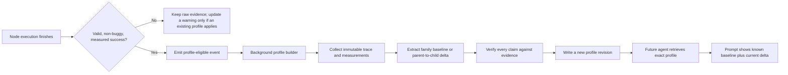
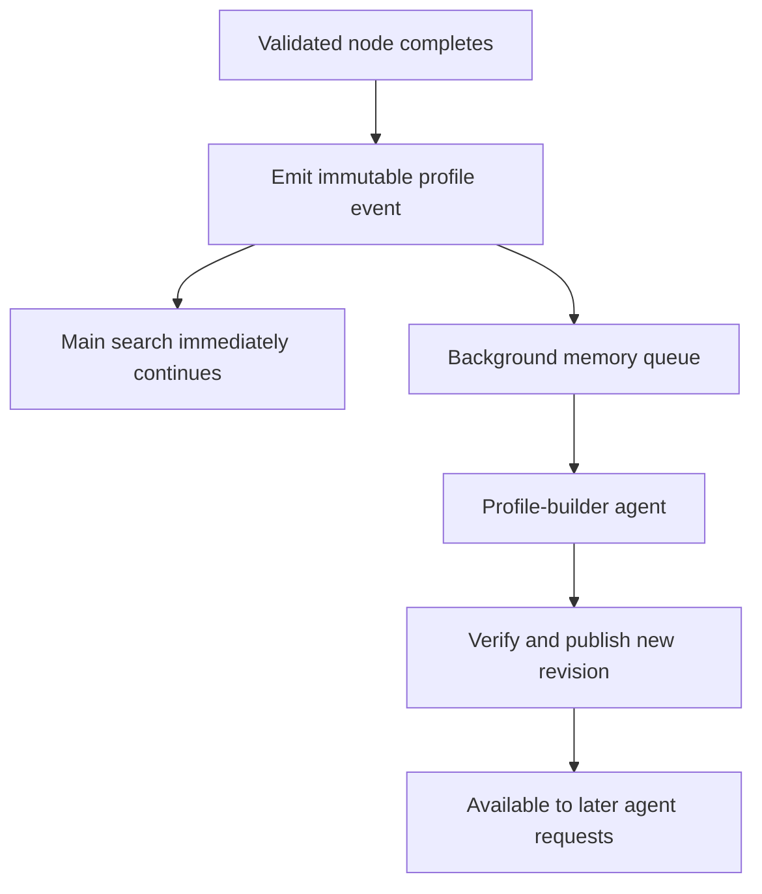

# Proposal: Model-Family Hardware Experience Profiles

**Status:** Research and design proposal only  
**Scope:** MLEvolve agent search and hardware-aware memory  
**Implementation:** Out of scope for this document

## The idea in one sentence

After the first valid model from a family succeeds on a particular GPU environment, MLEvolve should create a short, evidence-backed "recipe card" in the background. Later agents can start from that card and reason mainly about what changed, such as an added convolution layer, instead of relearning the whole model and hardware combination.

## Recommendation

This idea is worth pursuing.

MLEvolve already records most of the raw ingredients: the node plan and code, prompt snapshots, pipeline decisions, review and debug reports, scheduler events, model-family hints, batch-size results, runtime, VRAM, utilization, and validation metric. What is missing is a durable layer that turns those records into reusable knowledge across runs.

The recommended design has two kinds of memory:

1. A **family baseline profile**: what is already known to work for this model family on this hardware and software environment.
2. **Modification lessons**: what happened when an agent changed one part of that baseline, such as adding a CNN block, changing precision, or replacing the classifier head.

The first successful node creates a provisional baseline immediately. Later observations strengthen, refine, contradict, or supersede parts of it. Profile creation and updates run asynchronously, so the main search never waits for the summarizing agent.

## Why it fits the current MLEvolve design

The current repository already has three useful foundations:

| Existing capability | What it provides | Gap this proposal fills |
| --- | --- | --- |
| `SearchNode` and pipeline logging | Plan, code, prompt snapshot, parent link, stage, review history, pipeline decision, hardware context, outcome, and metric | The information is recorded but not consolidated into a cross-run family lesson |
| Scheduler and Neo4j evidence | Measured batch size, runtime, VRAM, utilization, hardware, model, config, backend, and status | Raw measurements do not explain which choices should be reused or which model change caused a difference |
| Global memory and Qdrant retrieval | Similarity-based recall of prior plans, fixes, docs, and optimization recipes | Current node memory is tied to the timestamped run workspace and is too shallow to act as a durable family–hardware profile |

This proposal preserves the repository's existing boundary:

```text
Neo4j       = what was measured
Qdrant      = how code was changed and what lesson was learned
Profile API = a compact combination of both for the next agent
```

It should not revive the older synthetic model-family probing path. The executor currently delegates real candidate profiling to the time-aware scheduler to avoid duplicate GPU work. The new background agent should summarize already completed evidence; it should not automatically launch another training or probe job.

## A simple example

The following is illustrative rather than a real measurement:

```yaml
profile:
  family: resnet
  hardware: nvidia-a10-24gb
  runtime: pytorch-2.x_cuda-12.x
  workload: image-classification_224x224
  maturity: provisional
  summary: >
    A ResNet-family model completed successfully with AMP, physical batch 32,
    and four data-loader workers. Keep batch size adaptive because this profile
    currently has only one supporting run.

known_good_baseline:
  precision: fp16_amp
  physical_batch_size: 32
  gradient_accumulation_steps: 1
  peak_vram_mb: 11800
  observed_runtime_seconds: 920
  validation_metric: 0.91

modification_lesson:
  change: add one Conv2d-BatchNorm-ReLU block before the classifier
  comparison: baseline_node -> child_node
  outcome: succeeded
  metric_change: positive
  resource_change: higher VRAM and longer step time
  advice: >
    The extra block worked in this location, but re-check batch headroom before
    copying it to a larger input size.
  support: 1
  confidence: low
  evidence_refs:
    - single_job:example-job-id
    - node:example-node-id
```

The important point is that the lesson says both **what worked** and **where its limits are**. It does not turn a single successful run into a universal rule.

## Proposed workflow



### Two parallel lanes: search and memory building

The profile summarization process should run in parallel with the main MLEvolve workflow. The main workflow must not wait for profile creation or consolidation.



The operational behavior should be:

- The successful-node path writes a small durable event and returns immediately.
- A dedicated background worker reads the frozen trace, summarizes it, verifies the result, and publishes a new profile revision.
- The next search step uses the newest completed profile revision available at prompt-construction time.
- If the new revision is not ready, the search continues with the previous revision or the existing hardware context. It never waits.
- An in-flight agent prompt is not changed after it starts. Newly published memory becomes visible only to later requests.
- Profile-builder retries, timeouts, or outages do not change the successful node's status and do not stop the search.
- Background work should have separate concurrency and rate limits so it cannot consume the capacity reserved for code-generation and execution agents.

This creates an eventually consistent memory system: knowledge may appear a little after the node completes, but the main workflow remains fast and failure-isolated.

### 1. Trigger only after final validation

The trigger should fire after all of these conditions are true:

- execution reached a terminal successful scheduler state when the scheduler is used;
- result parsing says the node is not buggy;
- deterministic output and submission validation passed;
- `is_valid` is true or the final validation event has outcome `valid`;
- a real metric is present;
- model-family and hardware identity meet the minimum confidence threshold.

This ordering matters in the current workflow. Node global-memory saving occurs during result parsing, while `validate_executed_node(...)` runs afterward and can still reject a missing submission or a zero metric. The profile trigger should therefore be attached to the later validated-success event, not to the existing memory-save hook.

### 2. Claim the first-seen profile atomically

Several parallel nodes may become the "first" success almost simultaneously. A unique profile key and an atomic insert/lease should choose one initial builder job. The others are not discarded; they become additional observations after the provisional profile exists.

An idempotency key can be conceptually defined as:

```text
profile_key + source_node_id + extractor_version
```

This prevents retries or duplicate events from adding the same evidence twice.

### 3. Snapshot the evidence

The background agent should read a frozen evidence packet so later log changes cannot alter the meaning of the profile revision. The packet should contain:

- node and parent identifiers;
- node stage, plan, code summary, and recorded prompt snapshot;
- parent and child code, plus a deterministic code diff;
- pipeline decision and cross-stage notes;
- review issues, debug report, and fix report when present;
- result-parser analysis and final validation result;
- model family, exact model key, workload identity, and input signature;
- hardware key, GPU type, VRAM, allocation or MIG slice, backend, CUDA/toolkit, framework, and relevant versions;
- resolved batch size, precision, accumulation, epochs, data-loader settings, and other training configuration;
- metric, runtime, throughput, step time, VRAM, utilization, and scheduler evidence references.

"Read all the reasoning" should mean all **recorded, auditable artifacts**—plans, decisions, actions, diffs, feedback, and measurements. The system should not depend on hidden chain-of-thought or store it as truth. Research has shown that generated chain-of-thought can be a plausible but unfaithful explanation of a model's answer ([Turpin et al., 2023](https://arxiv.org/abs/2305.04388)).

### 4. Extract facts before asking the profile agent to summarize

The reliable order is:

1. Deterministic code extracts identity, configuration, code hashes, measurements, and parent-to-child differences.
2. A structural extractor describes the model and changed layers as far as the code permits.
3. The profile agent writes the short human-readable lesson from those facts.
4. A verifier rejects or downgrades claims that have no evidence reference.

The LLM should explain evidence, not invent measurements.

### 5. Commit a new revision, never silently overwrite

Every accepted update produces an immutable profile revision. One revision is marked active, while earlier revisions remain available for audit and rollback. Conflicting evidence is recorded as a conflict rather than resolved by "latest write wins."

W3C PROV provides a useful conceptual model here: derived entities should retain links to the activities, inputs, and agents that produced them ([PROV-O](https://www.w3.org/TR/prov-o/)). MLEvolve does not need the full ontology, but it should keep the same provenance discipline.

## Defining “same family and same hardware”

This is the most important correctness decision. A GPU marketing name alone is not a safe reuse key.

### Exact profile scope

The initial exact-match key should include:

| Dimension | Example | Why it matters |
| --- | --- | --- |
| Model family | `resnet` | The reusable architecture family |
| Architecture type | `cnn` | Prevents a vague family label from joining unrelated structures |
| Hardware key | exact scheduler hardware key | Captures the observed host/device environment |
| Accelerator | GPU model, compute capability, VRAM | Determines supported and efficient kernels and precisions |
| Resource slice | full GPU, shared GPU, MIG profile, memory cap | Changes available memory and contention assumptions |
| Runtime stack | framework, CUDA/ROCm, driver, key library versions | Kernel choice and compatibility can change across versions |
| Backend | exclusive, stream, MPS, CUDA process | Changes concurrency and performance behavior |
| Workload bucket | modality, task type, input shape or sequence length | A 224×224 image and a 1024×1024 image are not equivalent |

A conceptual key is:

```text
hash(
  profile_schema_version,
  normalized_model_family,
  architecture_type,
  hardware_key,
  resource_slice,
  runtime_compatibility_class,
  backend_class,
  workload_bucket
)
```

TensorRT's timing cache is a useful hardware analogy: it reuses measurements for an identical layer configuration, but its entries are specific to the target device, CUDA/TensorRT versions, builder configuration, tensor shapes, and data types ([NVIDIA TensorRT timing cache](https://docs.nvidia.com/deeplearning/tensorrt/latest/performance/optimization.html#timing-cache)). MLEvolve should be equally cautious about declaring two experiences compatible.

### Three retrieval levels

The profile service should label every result as one of:

1. **Exact**: all strict scope fields match. It may provide defaults.
2. **Compatible**: family and accelerator match, but a declared-compatible stack or workload bucket differs. It provides suggestions with a warning.
3. **Similar only**: semantic similarity without hardware/config compatibility. It may inspire an experiment but must not provide a claimed safe batch size or runtime.

If model-family identification is uncertain, MLEvolve should fall back to cold start. Current script introspection recognizes explicit `MODEL_FAMILY`-style values; a production profile system will need a canonical family resolver that can also reconcile the pipeline decision, model key, library model name, and parent identity.

## What the profile stores

### Family baseline profile

The baseline answers, "What is a known-good starting point for this family here?"

Recommended fields:

```yaml
identity:
  profile_key: string
  schema_version: string
  model_family: string
  architecture_type: string
  hardware_key: string
  resource_slice_key: string
  runtime_compatibility_class: string
  backend_class: string
  workload_bucket: string

lifecycle:
  status: provisional | stable | conflicted | stale | retired
  revision: integer
  created_at: datetime
  updated_at: datetime
  builder_model: string
  builder_prompt_version: string
  extractor_version: string

known_good_baseline:
  source_model_key: string
  source_code_variant_key: string
  structural_fingerprint: string
  model_summary: string
  safe_training_defaults: object
  precision_policy: object
  scheduler_policy: object
  resource_envelope: object
  outcome_summary: object

trust:
  distinct_successful_runs: integer
  distinct_failed_runs: integer
  confidence: float
  conflicts: [string]
  evidence_refs: [string]
```

### Modification lesson

The modification lesson answers, "What did we learn when this baseline changed?"

```yaml
lesson:
  lesson_id: string
  profile_key: string
  parent_fingerprint: string
  child_fingerprint: string
  change_scope: one_layer | small_group | training_only | multi_change
  change_action: add | remove | replace | widen | deepen | reorder | wrap
  layer_type: conv2d | attention | normalization | pooling | head | other
  location_signature: string
  input_output_shape_signature: string
  before_spec: object
  after_spec: object
  training_changes: object
  observed_outcome: succeeded | failed | partial
  metric_delta: object
  runtime_delta: object
  memory_delta: object
  lesson_text: string
  agent_audiences: [draft, improve, debug, evolution, fusion, aggregation, review]
  retrieval_topics: [string]
  implementation_example:
    kind: minimal_patch | reusable_snippet | none
    language: string
    code: string
    insertion_point: string
    required_imports: [string]
    shape_contract: [string]
    source: extracted_from_successful_node | synthesized_and_verified
  applicability: [string]
  warnings: [string]
  support_count: integer
  contradiction_count: integer
  confidence: float
  evidence_refs: [string]
```

Lessons should be separate records rather than one ever-growing paragraph. This lets retrieval select only the two or three changes relevant to the current node.

### Small coding examples in lessons

A modification lesson should optionally include a small coding example. This can reduce future coding effort because the agent sees not only what worked, but also the minimum implementation pattern that produced the result.

The example should complement the structured lesson rather than replace it. The preferred order is:

1. Describe the change and why it was useful.
2. Store the smallest validated parent-to-child patch.
3. Include a short reusable snippet only when the patch needs surrounding context.

For example:

```yaml
lesson:
  change_action: add
  layer_type: conv2d
  applicability:
    - input channels must be 128
    - spatial dimensions must remain unchanged
  implementation_example:
    kind: reusable_snippet
    language: python
    code: |
      self.extra_block = nn.Sequential(
          nn.Conv2d(128, 128, kernel_size=3, padding=1, bias=False),
          nn.BatchNorm2d(128),
          nn.ReLU(inplace=True),
      )
    insertion_point: after backbone.stage3
    required_imports:
      - torch.nn as nn
    shape_contract:
      - input and output channel count is 128
      - height and width are preserved
    source: extracted_from_successful_node
  warnings:
    - Include the new block's parameters in the optimizer.
    - Re-check batch size because the block increases activation memory.
  evidence_refs:
    - node:successful-node-id
```

Coding examples should follow these rules:

- Prefer a minimal diff over a complete training script.
- Extract the example from code that passed final validation whenever possible.
- If the agent synthesizes a cleaner example, verify it against the successful diff and label it `synthesized_and_verified`.
- Keep it short—normally about 5–30 lines.
- Include the insertion point, required imports, shape assumptions, dependencies, and important warnings.
- Remove credentials, dataset paths, node-specific filenames, submission paths, and task-specific constants that are not part of the lesson.
- Link the example to its source node, code variant, profile revision, and measured evidence.
- Do not present a snippet from a `multi_change` node as the cause of an improvement; label it illustrative until isolated evidence exists.
- Treat framework, library, runtime, and model-version changes as compatibility boundaries.
- Store failed snippets only as clearly marked counterexamples or warnings, never as the default implementation example.

A useful coding example should let the future agent answer three questions quickly:

> What should I change?  
> Where should I change it?  
> What assumptions must I re-check?

At retrieval time, include the example only when its exact compatibility metadata and change signature match the current delta. Otherwise, return the textual lesson without code.

## Learning about layer changes

Layer-level knowledge is valuable, but it is also where false conclusions are easiest.

### Structural comparison

For each parent and child, create a normalized model fingerprint containing, where observable:

- ordered layer/operator types;
- important parameters such as channels, kernel size, stride, heads, hidden width, and normalization type;
- input and output shape signatures;
- precision wrappers and checkpointing boundaries;
- trainable/frozen state;
- a stable structural hash.

Then classify the difference. For example:

```text
ADD Conv2d(128 -> 256, kernel=3, stride=1)
AT backbone.stage3.after_block2
FOLLOWED_BY BatchNorm2d + ReLU
```

### Causality rule

If a child changes one layer and nothing else material, its outcome can become a relatively clear layer lesson. If it changes the layer, optimizer, image size, augmentation, batch size, and precision together, the record should be marked `multi_change`. It is useful branch history, but it must not claim that the new layer caused the outcome.

This is where the existing parent/child search tree and pipeline decision are especially useful: the profile builder can compare both the intended change and the actual code diff.

### Optional focused measurement

Whole-job telemetry can show that runtime or VRAM changed, but not which operator caused it. For the first appearance of a novel layer-change signature, MLEvolve could optionally collect a short operator profile if the run already permits profiling. PyTorch Profiler can report operator time and memory and group results by input shape ([PyTorch Profiler recipe](https://docs.pytorch.org/tutorials/recipes/recipes/profiler_recipe.html)).

This should be sampled, not enabled on every training run, because profiler overhead can disturb the measurement it is trying to explain.

## How the profile evolves

### First success

- Create the profile immediately.
- Mark it `provisional` and show `support_count: 1`.
- Allow exact-match agents to use it, but require a fallback and a visible low-confidence label.

### Later successful nodes

- Add an observation rather than replacing the first one.
- Compare with the parent and current baseline.
- Add or strengthen matching modification lessons.
- Update numeric summaries from underlying observations.
- Promote the profile to `stable` only after repeated compatible evidence.

The scheduler's existing decision-replay setting uses three stable observations as a safety threshold. Reusing that value as the initial profile-stability default would make the behavior easier to understand, while still allowing configuration later.

### Failed nodes

Failures should not create the initial baseline, but well-classified failures should update its warnings after a baseline exists. Examples include:

- a known OOM boundary;
- an unsupported precision path;
- a layer shape mismatch;
- a timeout after a particular size increase;
- a backend incompatibility.

Research on experiential agents supports distilling compact lessons rather than replaying raw histories. Reflexion stores verbal feedback in episodic memory ([Shinn et al., 2023](https://papers.neurips.cc/paper_files/paper/2023/hash/1b44b878bb782e6954cd888628510e90-Abstract-Conference.html)); ExpeL extracts natural-language knowledge from collected experiences ([Zhao et al., 2023](https://arxiv.org/abs/2308.10144)); and ReasoningBank reports benefits from distilling strategies from both successful and failed experiences rather than storing raw trajectories alone ([Ouyang et al., 2026](https://openreview.net/pdf/25563ee680c408f3ad91eab8c7b4ec9ab05b7193.pdf)).

### Conflicting observations

When two valid observations disagree:

- keep both evidence sets;
- check for an identity mismatch first;
- reduce confidence in the disputed claim;
- mark the claim or profile `conflicted` if the mismatch cannot be explained;
- ask future agents to re-measure the disputed part;
- never silently delete the earlier observation.

### Staleness

Changing a compatibility field—such as CUDA, PyTorch, a critical library, backend, GPU slice, or input-shape bucket—should cause an exact cache miss or a stale/compatible-only result. Old data remains useful as history but stops being presented as a verified current default.

## Storage proposal

Use the existing stores according to their strengths rather than placing everything in one large document.

### Neo4j: immutable observed evidence

Keep successful and failed run facts in the canonical evidence graph:

- `SingleJob` or `PackedJob` outcome;
- `Model`, `Hardware`, and immutable `TrainingConfig` identities;
- metric, runtime, throughput, VRAM, utilization, precision, backend, and status;
- stable evidence references.

Do not put the profile agent's prose into graph properties as if it were a measurement.

### Qdrant: searchable lessons

Add a dedicated collection or record type for:

- short baseline recipes;
- layer-change lessons;
- failure warnings;
- applicability and compatibility metadata;
- links to graph evidence and profile revisions.

Retrieval must apply exact metadata filters before semantic ranking. Qdrant payload filters are designed for combining structured conditions with vector search ([Qdrant filtering](https://qdrant.tech/documentation/search/filtering/)). Suggested indexed filter fields are `profile_key`, `model_family`, `hardware_key`, `runtime_class`, `workload_bucket`, `layer_type`, `change_action`, `status`, and `confidence_band`.

### Profile registry: revisions and concurrency

Use a small durable registry for:

- current active revision;
- builder job state and retry count;
- unique/idempotency keys;
- profile maturity and conflicts;
- exact links to Qdrant records and Neo4j evidence.

SQLite is sufficient for a single local coordinator. PostgreSQL is safer when multiple cluster workers may update the same profile. The repository's storage abstraction can hide that deployment choice. A unique constraint on the profile/event identity is essential; uniqueness should not depend on the profile agent behaving correctly.

### MCP/profile API: compose at read time

Extend the current compact optimization-context path conceptually with:

```yaml
family_hardware_profile:
  match_level: exact | compatible | similar | none
  maturity: provisional | stable | conflicted | stale
  baseline: {}
  relevant_modification_lessons: []
  warnings: []
  evidence_refs: []
  confidence: 0.0
```

The API combines graph measurements with the relevant Qdrant lessons. This maintains the current rule that human-readable context is generated from evidence rather than treated as a graph fact.

## What future agents should receive

Do not inject the whole profile or trajectory. The current hardware prompt limit is deliberately compact, so profile retrieval should return a small context packet such as:

```markdown
Known baseline (exact match, provisional, 1 supporting run)
- ResNet-family training completed with FP16 AMP and physical batch 32.
- Peak VRAM was 11.8 GB; keep an OOM fallback because evidence is still sparse.

Current node delta
- The candidate adds one Conv2d-BatchNorm-ReLU block in stage 3.

Relevant prior lesson
- A similar added block completed successfully once, with higher VRAM and step time.
- Reuse confidence: low. Check input shape and batch headroom.

Unchanged inherited decisions
- Data interface, loss, precision policy, and evaluation path match the baseline.

Evidence
- single_job:example-job-id
- node:example-node-id
```

This changes the agent's question from:

> How should a ResNet run on this GPU?

to:

> The family baseline is already known. Does this added block invalidate its batch, memory, precision, or runtime assumptions?

That is the main source of the expected reasoning and token savings.

### Agent-scoped memory views

The memory should be agent-based: different specialized agents should receive different views of the same family–hardware profile. A debug agent does not need the same context as a draft or fusion agent, and giving every agent the complete profile would gradually recreate the original context-size problem.

The recommended design is **one shared source of truth with agent-specific projections**, rather than separate copies of the facts. Raw evidence and canonical lessons stay shared, while each lesson carries `agent_audiences` and retrieval-topic metadata. The profile API then builds a compact view for the requesting agent.

| Agent | Profile content it should normally receive | Content normally omitted |
| --- | --- | --- |
| Draft | Stable family baseline, safe starting configuration, major hardware limits, and common failure warnings | Detailed branch history and small experimental deltas |
| Improve | Current baseline, parent-to-child delta, relevant layer-change examples, resource headroom, and metric trade-offs | Unrelated fixes and other layer types |
| Debug | Similar failure signatures, verified fixes, OOM or shape boundaries, and known counterexamples | Successful variations unrelated to the current error |
| Evolution | The branch trajectory, repeated successful or failed patterns, and lessons that changed confidence over time | Distant branches with no transferable pattern |
| Fusion | Compatible lessons from strong branches, including implementation assumptions and conflicts | Low-confidence branch-local details |
| Aggregation | Stable cross-branch conclusions and compatible baseline choices | Fine-grained single-node anecdotes |
| Code review | Correctness risks, required imports, shape contracts, version constraints, and unsafe examples | Performance history that does not affect correctness |

For example, one stored lesson about an added CNN block can produce several views:

- **Improve view:** the verified minimal patch, expected VRAM increase, and batch-size warning.
- **Debug view:** the channel-shape mismatch that previously failed and the validated repair.
- **Review view:** the required optimizer registration, imports, and input/output shape contract.
- **Fusion view:** whether the block transferred successfully across branches and under which conditions.

This scoping improves quality in two ways:

1. It reduces prompt size by excluding lessons outside the agent's responsibility.
2. It reduces context dilution, so high-value evidence is less likely to be hidden among irrelevant history.

Each view should have its own small token or character budget and top-K limit. The requesting agent role, current stage, exact profile key, current code delta, and active error or optimization target should determine retrieval. If no lesson is sufficiently relevant, returning no lesson is better than filling the context with weak matches.

Agent scoping must not create isolated beliefs. Every view should retain the same profile revision and evidence references, allowing two agents to receive different summaries without disagreeing about the underlying measurements.

## Retrieval policy

The recommended order is:

1. Filter to exact family, hardware, resource slice, runtime class, backend, and workload bucket.
2. Retrieve the active family baseline.
3. Compute the current node's delta from the baseline or parent.
4. Filter modification lessons by layer type, change action, location/shape compatibility, and status.
5. Rank the remaining lessons semantically.
6. Filter and format the results for the requesting agent's role and responsibility.
7. Return a compact baseline plus at most a few highly relevant lessons within that agent's context budget.
8. Fall back to the existing graph/vector optimization context when the profile is missing or uncertain.

This follows the classic case-based reasoning cycle: retrieve a similar case, reuse it, revise it against the new result, and retain the new experience ([Aamodt and Plaza, 1994](https://doi.org/10.3233/AIC-1994-7104)). Transfer-tuning research offers a closely related systems result: reusing schedules from previously tuned tensor programs can substantially reduce search time for new DNNs, although applicability still depends on program compatibility ([Gibson and Cano, 2022](https://arxiv.org/abs/2201.05587)).

## Profile-builder agent contract

The separate agent should have a narrow job.

It may:

- summarize only the supplied trace and measurements;
- distinguish observed facts from inference;
- compare a child with its parent and current baseline;
- produce structured baseline fields and modification lessons;
- cite an evidence reference for every numeric or causal-sounding statement;
- report uncertainty, missing evidence, and conflicts.

It may not:

- declare a failed or invalid node to be a known-good baseline;
- invent model family, hardware identity, measurements, or code changes;
- turn semantic similarity into hardware compatibility;
- claim one layer caused a result when many material settings changed;
- overwrite prior evidence;
- trigger a GPU job unless a separate profiling policy explicitly authorizes it;
- place secrets, raw dataset rows, credentials, or unrestricted prompt text into shared memory.

A deterministic validator should reject any output that violates the structured schema, references unknown evidence, reports impossible deltas, or changes immutable identity fields.

## Reliability and safety rules

| Risk | Guardrail |
| --- | --- |
| Two parallel first successes create duplicate profiles | Unique profile key, atomic claim, idempotent source-event key |
| A successful-looking node is later invalidated | Trigger only after final deterministic validation |
| Wrong family classification contaminates memory | Canonical resolver with confidence; no profile write below threshold |
| Same GPU name hides a different environment | Include resource slice, runtime stack, backend, and workload bucket in scope |
| One lucky run becomes a rule | First profile is provisional; show support and confidence |
| A large multi-change diff is misread as a layer lesson | Mark `multi_change`; do not assign layer causality |
| Old software evidence is reused as current | Compatibility classes, staleness state, exact-match miss on breaking fields |
| LLM summary hallucinates a measurement | Facts extracted first; every claim requires an evidence reference |
| Profile grows until it costs more tokens than it saves | Typed records, selective retrieval, strict result and character limits |
| Background processing slows search | Durable async queue; no wait on the main node path |
| A bad lesson recursively reinforces itself | Preserve raw evidence, track distinct observations, surface conflicts, support rollback |

## Rollout plan

### Phase 0: offline replay

Use completed run journals, pipeline SQLite logs, scheduler logs, and graph evidence to build profiles without changing live behavior. This tests identity resolution, trace completeness, and lesson quality at almost no GPU cost.

Deliverables:

- proposed profile and lesson schemas;
- exact key-generation rules;
- an offline profile-builder evaluation set;
- examples of correct, uncertain, conflicting, and rejected lessons.

### Phase 1: shadow writer

Run the background profile builder after eligible successes, but do not show profiles to search agents. Compare generated claims with their evidence and measure duplicate/conflict rates.

### Phase 2: exact-match read path

Expose only exact, non-conflicted profiles to draft and improve agents. Keep the existing hardware context as the fallback. Start with baseline recipes; do not yet use layer lessons to alter code automatically.

### Phase 3: delta-aware retrieval

Retrieve relevant modification lessons for improve, evolution, fusion, and debug stages. Require explicit warnings for low-support lessons.

### Phase 4: mature profiles

Add profile consolidation, compatible-match tiers, optional focused operator profiling, packed-run lessons, and operator approval tools for conflicts or retirement.

## Evaluation plan

Run controlled A/B experiments with the same task, model family, GPU environment, seed policy, search budget, and agent models.

### Primary outcome metrics

- wall-clock time to first valid non-buggy node;
- GPU minutes to first valid node;
- LLM calls and reasoning/input tokens to first valid node;
- number of buggy or invalid attempts before success;
- final validation metric under the same total budget.

### Memory quality metrics

- exact-profile hit rate;
- fraction of retrieved lessons actually relevant to the current delta;
- unsupported-claim rejection rate;
- stale or incompatible retrieval rate;
- contradiction rate per profile;
- percentage of profile claims with resolvable evidence references;
- profile-builder latency and failure rate;
- tokens added by the profile versus tokens saved later.

### Suggested initial success criteria

- the background builder adds no blocking latency to the main search path;
- every numeric claim resolves to immutable evidence;
- no increase in invalid-node rate or final-score regression beyond the experiment's normal variance;
- a meaningful reduction in median time, GPU work, and LLM tokens to the first valid node;
- exact-match profiles outperform generic or similarity-only retrieval in an ablation.

The evaluation should report actual confidence intervals rather than choosing a percentage target before baseline variance is known.

## Decisions to make before implementation

| Decision | Recommended starting choice |
| --- | --- |
| Initial trigger | Final validated success event |
| First profile maturity | Provisional, immediately retrievable with warning |
| Stable threshold | Three compatible successful observations |
| Builder execution | Durable asynchronous CPU/LLM worker |
| Main-workflow interaction | Emit and continue; never wait for profile completion |
| Identity policy | Strict exact key; cold start on uncertain family |
| Numeric source of truth | Neo4j/scheduler evidence, never agent prose |
| Lesson store | Dedicated Qdrant collection or typed record class |
| Revision registry | SQLite locally, PostgreSQL for multi-worker deployment |
| Retrieval | Metadata filter first, semantic ranking second |
| Agent memory | Shared evidence with role-specific compact views |
| Layer lesson promotion | Prefer one-layer or small, controlled diffs |
| Raw reasoning | Store auditable plans/actions, not hidden chain-of-thought |
| Automatic extra profiling | Off initially; sampled only for novel deltas later |

## Non-goals

This proposal does not:

- replace scheduler batch or runtime probes;
- assume a family profile transfers safely to another GPU;
- fine-tune the agent model;
- make profile advice mandatory;
- treat one success as proof of optimality;
- store every raw trajectory in every future prompt;
- change the evidence graph into a control-plane database;
- attempt automatic code changes as part of profile creation.

## Expected outcome

The practical end state is a compounding memory loop:

```text
first verified success
  -> provisional family–hardware baseline
  -> future node starts from known-good choices
  -> agent reasons about its actual delta
  -> validated delta becomes a typed lesson
  -> repeated evidence strengthens or corrects that lesson
```

This should reduce repeated learning without making the framework blindly trust old results. The profile gives agents a head start; the raw evidence, compatibility checks, confidence, and fallbacks keep that head start honest.

## Research references

- Agnar Aamodt and Enric Plaza, [Case-Based Reasoning: Foundational Issues, Methodological Variations, and System Approaches](https://doi.org/10.3233/AIC-1994-7104), 1994.
- Noah Shinn et al., [Reflexion: Language Agents with Verbal Reinforcement Learning](https://papers.neurips.cc/paper_files/paper/2023/hash/1b44b878bb782e6954cd888628510e90-Abstract-Conference.html), NeurIPS 2023.
- Andrew Zhao et al., [ExpeL: LLM Agents Are Experiential Learners](https://arxiv.org/abs/2308.10144), 2023.
- Siru Ouyang et al., [ReasoningBank: Scaling Agent Self-Evolving with Reasoning Memory](https://openreview.net/pdf/25563ee680c408f3ad91eab8c7b4ec9ab05b7193.pdf), ICLR 2026.
- Perry Gibson and José Cano, [Transfer-Tuning: Reusing Auto-Schedules for Efficient Tensor Program Code Generation](https://arxiv.org/abs/2201.05587), PACT 2022.
- NVIDIA, [TensorRT Timing Cache and Performance Optimization](https://docs.nvidia.com/deeplearning/tensorrt/latest/performance/optimization.html#timing-cache).
- PyTorch, [Profiler recipe](https://docs.pytorch.org/tutorials/recipes/recipes/profiler_recipe.html).
- W3C, [PROV-O: The PROV Ontology](https://www.w3.org/TR/prov-o/).
- Miles Turpin et al., [Language Models Don't Always Say What They Think](https://arxiv.org/abs/2305.04388), 2023.
- Qdrant, [Filtering](https://qdrant.tech/documentation/search/filtering/).

## Relevant MLEvolve documents

- [MLEvolve agent workflow](./mlevolve_agent_workflow.md)
- [Hardware-aware optimization](./mlevolve_hardware_aware_optimization.md)
- [Pipeline stage prompt contract](./pipeline_stage_prompt_contract.md)
- [Scheduler observability](./scheduler_observability.md)
- [Evidence graph schema](../schema/README.md)
