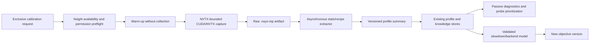

# NVIDIA Nsight Systems integration research for the MLEvolve scheduler

Status: recommendation and integration design
Research date: 2026-07-29
Repository revision reviewed: `2d845eb`
Nsight Systems release current at research time: 2026.4.1

## Executive conclusion

Yes, NVIDIA Nsight Systems has a credible path to improving scheduler
performance, but only indirectly and only after the scheduler turns profiler
output into reusable placement evidence. Merely launching jobs under `nsys`
will not optimize anything and may make measured jobs slower.

The recommended decision is:

> Integrate Nsight Systems as an optional, bounded, offline/on-demand profiling
> provider for exclusive calibration and controlled pair experiments. Do not
> make it an always-on telemetry source or a dependency of the scheduling hot
> path. First use its summaries as passive evidence and diagnostics; allow them
> to affect placement only after an A/B benchmark proves that a versioned,
> confidence-aware slowdown model improves queue-level outcomes.

The highest-value opportunity is better evidence about whether two jobs can
make useful concurrent progress on a particular backend. The current scheduler
can see aggregate device memory and utilization, but it cannot attribute GPU
work, idle gaps, synchronization, transfers, or co-run interference to a job or
training phase. Nsight Systems can provide that attribution through CUDA
activity timelines and NVTX ranges.

The expected value is not yet a measured speedup. The correct present claim is:

- **High confidence:** Nsight Systems will materially improve performance
  diagnosis and explain why a packing decision succeeded or failed.
- **Moderate confidence:** controlled profiles can improve pair-compatibility,
  backend-selection, and slowdown estimates enough to improve scheduling.
- **Low confidence:** continuous production profiling would improve throughput;
  its overhead, permissions, storage, and attribution limitations make this
  unlikely to be worthwhile.

## What Nsight Systems provides

Nsight Systems is a system-wide timeline and statistical profiler. It captures
the interaction among CPU threads, CUDA API calls, GPU kernels, memory
operations, synchronization, contexts, and user annotations. It is different
from Nsight Compute: Systems answers *where time and overlap are going across an
application*, whereas Compute is intended for deep analysis of individual
kernels.

The relevant capabilities are:

| Capability | Scheduler-relevant evidence | Important constraint |
|---|---|---|
| CUDA API and GPU workload tracing | Kernel intervals, streams, copies, launch latency, synchronization, and process/context identity | Collection perturbs execution and creates trace data; it is not a free production metric |
| NVTX ranges and marks | Correlate a job, epoch, step, forward pass, backward pass, optimizer step, and scheduler group with CPU and GPU work | Useful ranges must be added or enabled; very short/high-frequency annotations should be avoided |
| GPU Metrics sampling | SM Active, Tensor Active, issue activity, warp occupancy, DRAM/PCIe/NVLink throughput | Device-level rather than process/context-attributed; Turing-or-newer target and elevated performance-counter permission are required |
| GPU context-switch trace | Context and process scheduling on the GPU | More attributable but less precise than GPU Metrics sampling |
| CUDA allocation tracking | Per-process device/array allocation changes | Not equivalent to total device-used VRAM and documented as potentially high overhead |
| CPU/context-switch/Python/PyTorch tracing | Data-loader stalls, GIL/CPU blocking, framework phases, and launch bottlenecks | These features increase trace volume and overhead and should be diagnostic tiers, not defaults |
| CLI statistics, recipes, and exports | Machine-readable CUDA, NVTX, kernel, memory-operation, gap, utilization, and diff summaries | Raw SQLite/export schemas and recipe APIs can evolve; pin the tool version and version the importer |

NVIDIA recommends focused capture of performance-critical regions rather than
whole-application profiling. The CLI supports NVTX-triggered capture ranges,
and collection overhead is substantially reduced outside capture ranges. The
current CLI can emit `.nsys-rep` reports, CSV statistics, and exports suitable
for automated post-processing. See the official [Nsight Systems User
Guide](https://docs.nvidia.com/nsight-systems/UserGuide/index.html), especially
its focused-profiling, NVTX, CUDA trace, GPU Metrics, and CLI statistics
sections.

As of the research date, NVIDIA publishes Nsight Systems 2026.4.1 for Linux
x86-64 and Arm servers, including CLI-only packages. The exact target/driver
combination still needs a local preflight; availability on a download page is
not evidence that every metric set works on every GPU. See NVIDIA's [current
download and platform page](https://developer.nvidia.com/nsight-systems/get-started).

## Current scheduler: strengths and evidence gaps

The current `parallel_time_aware` scheduler already has a sound separation
between live admission, profile reuse, hard compatibility, and objective
scoring:

- [`scheduler/telemetry.py`](../localml_scheduler/scheduler/telemetry.py) invokes
  `nvidia-smi` and samples device-used memory and utilization. The example
  interval is 500 ms. A rolling memory average closes or reopens only new packed
  admission.
- [`profiling/batch_probe.py`](../localml_scheduler/profiling/batch_probe.py)
  runs controlled batch trials and records peak/average VRAM and step or epoch
  timing supplied by the runner.
- [`profiling/runtime_probe.py`](../localml_scheduler/profiling/runtime_probe.py)
  builds backend- and batch-specific runtime profiles.
- [`scheduler/resource_estimator.py`](../localml_scheduler/scheduler/resource_estimator.py)
  estimates average VRAM and remaining runtime for each batch option.
- [`scheduler/compatibility.py`](../localml_scheduler/scheduler/compatibility.py)
  rejects a historical pair only when it is marked incompatible or is on
  cooldown.
- [`scheduler/time_objective.py`](../localml_scheduler/scheduler/time_objective.py)
  minimizes predicted weighted flow time using solo/batch-indexed remaining
  times. It deliberately ignores SM utilization and stored slowdown values.
- [`scheduler/service.py`](../localml_scheduler/scheduler/service.py) records
  solo, combination, and pair profiles. Pair slowdown is accepted only when a
  same-batch exclusive runtime baseline exists, which is a good anti-confounding
  rule.

This design has four relevant gaps:

1. **Device metrics lack job and phase attribution.** When jobs overlap, a
   500 ms device sample cannot identify which process did useful work, waited on
   input, copied data, synchronized, or monopolized a GPU engine.
2. **The time-aware objective assumes no co-run slowdown.** A pair can be marked
   compatible and still make the flow-time prediction badly optimistic.
3. **Backend choice has little performance evidence.** `backend_priority` is a
   late deterministic tie-breaker, not a learned choice among MPS, CUDA
   processes, streams, and exclusive execution.
4. **The scheduler knows that a run was slow, but usually not why.** Aggregate
   elapsed time cannot distinguish compute contention, memory-bandwidth
   contention, launch serialization, CPU starvation, pageable copies, or input
   stalls.

Nsight Systems is well matched to gaps 1, 3, and 4. It can help close gap 2 only
if the integration collects matched solo/pair evidence and changes the planner;
the current objective will not consume Nsight data automatically.

## Optimization opportunities

### 1. Better pair selection

This is the strongest scheduler-specific use case. For each isolated job, a
focused trace can derive a resource phenotype such as

$$
\phi_i = [u_{\mathrm{GPU}}, u_{\mathrm{SM}}, u_{\mathrm{tensor}},
u_{\mathrm{DRAM}}, u_{\mathrm{PCIe}}, f_{\mathrm{gap}},
f_{\mathrm{sync}}, f_{\mathrm{copy}}].
$$

These values should not be converted into a hand-written "complementarity
score" and trusted immediately. They should be features for selecting which
pairs to probe and, after sufficient data exists, for a model that predicts
same-batch co-run slowdown:

$$
\widehat s_{i\mid G,h,\mathbf b}
= f(\phi_i,\{\phi_j:j\in G\setminus\{i\}\},h,\mathbf b,
\text{hardware},\text{software versions}).
$$

The ground-truth label should remain unprofiled matched-run timing:

$$
s_{i\mid G,h,\mathbf b}
= \frac{\operatorname{median}(t^{\mathrm{co\mbox{-}run}}_{i,\mathrm{step}})}
       {\operatorname{median}(t^{\mathrm{solo}}_{i,\mathrm{step}})},
$$

with identical job signature, batch, precision, hardware, and relevant software
versions. Nsight traces explain and predict this label; they should not be
treated as an unperturbed timing oracle.

### 2. Slowdown-aware flow-time prediction

The current objective uses each member's solo remaining time
$\widehat p_i$. A future, separately versioned objective could use

$$
\widehat d_i
= \widehat p_i\,s^{\mathrm{used}}_{i\mid G,h,\mathbf b}.
$$

To keep sparse profiles from over-controlling the scheduler, shrink the measured
or predicted slowdown toward the current neutral assumption of one:

$$
s^{\mathrm{used}} = 1 + \alpha(\widehat s-1),
\qquad
\alpha = c\frac{n}{n+k},
$$

where $c\in[0,1]$ is profile/model confidence, $n$ is the number of matched
observations, and $k$ is a tunable prior strength. The existing drain and
weighted-flow equations can then use $\widehat d_i$ without reintroducing a
VRAM-fill or arbitrary SM-utilization reward.

For safety-sensitive jobs, an upper confidence value can form a hard gate:

$$
s^{\mathrm{risk}}=s^{\mathrm{used}}+z\widehat\sigma_s,
\qquad
s^{\mathrm{risk}} > s_i^{\max}
\Longrightarrow \text{reject candidate}.
$$

This requires a new objective version and benchmark evidence. Reusing the
currently reserved slowdown thresholds without that version boundary would
silently change scheduler semantics and is not recommended.

### 3. Backend selection

The same job or pair can behave differently under `exclusive`,
`cuda_process`, `mps`, and `stream`. Short, matched captures can measure:

- GPU-work overlap and context switching;
- member step-time slowdown;
- kernel and copy serialization;
- MPS active-thread allocation behavior; and
- CPU launch and synchronization overhead.

The scheduler can then rank backends by predicted flow cost instead of using
`backend_priority` only at the end of an exact tie. MPS needs special handling:
the current Nsight Systems documentation says hardware CUDA trace is not
supported for MPS workloads and that `--trace=cuda-sw` should be used for the
legacy software trace. This affects overhead and comparability, so MPS profiles
must carry their trace method and must not be mixed with hardware-trace profiles.

### 4. More targeted batch and runtime calibration

Nsight-derived gap, transfer, and phase information can tell the probe controller
which additional batch option is informative. For example, an underfilled GPU
with input-pipeline gaps suggests that a larger batch alone may not improve
runtime, while a consistently compute-saturated job is a poor candidate for
co-running another compute-saturated job.

The existing measured batch-probe results should remain authoritative for VRAM
and unprofiled runtime. CUDA allocation tracking is not a replacement for the
current `nvidia-smi` admission gate because it reports traced process
allocations, not total device-used memory from all sources, and NVIDIA documents
that allocation tracking can have significant overhead.

### 5. Application-level optimization feedback

Even if no scheduler decision changes, Nsight reports can identify:

- long GPU idle gaps between training steps;
- synchronous or pageable memory transfers;
- excessive `cudaDeviceSynchronize` or stream synchronization;
- small, launch-bound kernel sequences;
- CPU or data-loader starvation; and
- missing Tensor Core use in workloads expected to use it.

Those findings can improve runner implementations and generated training code.
This is a real performance benefit, but it is code-tuning feedback rather than
online scheduling optimization.

## Recommended architecture



### Profiling tiers

| Tier | Default data | When to use | Scheduling behavior |
|---|---|---|---|
| Off | None | Normal production jobs | Current path remains unchanged |
| Calibration | CUDA + NVTX over a fixed measurement window; CPU sampling off | Missing/stale solo profile or explicit calibration | Run as an exclusive probe; summary may be reused after validation |
| Pair experiment | One coordinated capture containing all pair/group children | Benchmark suite and selected uncertain pairs | Never silently triggered in a latency-sensitive queue |
| Deep diagnostic | Add OS runtime, context switches, Python/PyTorch tracing, allocation tracking, or backtraces | Manual investigation of a bad profile or regression | Report-only; do not feed raw timing to the planner |
| Continuous | Not recommended | None by default | Device admission remains on `nvidia-smi` |

### Focused capture

Use a fixed warm-up followed by a short NVTX range around the same measurement
steps already used by batch/runtime probes. NVIDIA's Python NVTX package supports
domains, categories, payloads, and start/end or push/pop ranges; domain objects
have lower overhead than repeated global lookups. See the official [Python NVTX
documentation](https://nvidia.github.io/NVTX/python/).

Suggested stable annotations in one `MLEvolve` domain are:

- `job` with a non-sensitive profile ID payload;
- `warmup`;
- `measure` as the capture trigger;
- `epoch`;
- `train_step`;
- `forward`, `backward`, and `optimizer_step`; and
- `checkpoint` and `data_wait` where runner support exists.

Do not place job source, dataset paths, secrets, arbitrary user strings, or a
new unique message per iteration in NVTX messages. Use fixed registered messages
and numeric payloads so traces remain small and safe to retain.

A minimal calibration command would conceptually be:

```bash
nsys profile \
  --trace=cuda,nvtx \
  --sample=none \
  --cpuctxsw=none \
  --capture-range=nvtx \
  --nvtx-capture='measure@MLEvolve' \
  --capture-range-end=stop \
  --output=/runtime/localml_scheduler/profiles/nsight/PROFILE_ID/capture \
  python -m localml_scheduler.execution.worker_entry \
    --runtime-root /runtime/localml_scheduler \
    --job-id JOB_ID
```

When the permission preflight confirms GPU Metrics support, add a bounded
sampling tier such as:

```bash
--gpu-metrics-devices=cuda-visible --gpu-metrics-frequency=1000
```

The 1 kHz value is a proposed starting point, not an NVIDIA recommendation or a
universal optimum. Nsight Systems permits 10 Hz through 200 kHz and defaults to
10 kHz, but NVIDIA warns that the maximum rate without buffer overflow depends
on GPU size and system/load intensity. The experiment should select the lowest
rate that gives stable range summaries.

### Launcher changes

[`execution/executor.py`](../localml_scheduler/execution/executor.py) currently
launches each ordinary worker directly with `subprocess.Popen`, which makes a
safe argument-list prefix straightforward for a solo capture. The integration
should never construct a profiler command through a shell.

Pair capture is more difficult. `cuda_process` launches workers as sibling
processes, while one Nsight `process-tree` session naturally follows a root and
its descendants. Use one of these designs:

1. **Preferred:** add a profiling group coordinator that is the parent of all
   workers in the calibration group. Monitor the child jobs through the state
   store, like the existing stream host.
2. **Benchmark-only alternative:** run a system-wide/same-user interactive
   capture around the existing launch. This has greater permission,
   interference, and attribution risk and should not be the production design.

The current backend model must also prevent multiple independent profiling
sessions from claiming the same device simultaneously. Add a per-GPU profiling
lease and use the existing exclusive-probe drain mechanism for isolated solo
calibration.

### Extraction and storage

Extraction must happen after the profiled process exits and outside the scheduler
polling thread. The standard CLI can produce summaries such as
`nvtx_gpu_proj_sum`, `cuda_gpu_kern_sum`, `cuda_gpu_mem_time_sum`, and
`cuda_api_sum`; the analysis system also includes GPU gap, GPU time-utilization,
GPU metric-utilization, NVTX pacing, and diff recipes. See NVIDIA's [current
Post-Collection Analysis Guide](https://docs.nvidia.com/nsight-systems/AnalysisGuide/index.html).

Prefer version-pinned `nsys stats --format=csv` outputs for initial import. Keep
direct SQLite parsing behind a versioned adapter that checks required tables and
columns, because NVIDIA documents evolving report/recipe APIs and some exported
schemas. Retain the `.nsys-rep` only within a size/count quota; the small summary
is the durable scheduler artifact.

A proposed profile key is:

```text
(job signature, shape signature, requested/resolved batch,
 backend, precision, hardware key, NVIDIA driver, CUDA runtime,
 PyTorch version, Nsight Systems version, trace method, extractor schema)
```

The current hardware key already includes OS, GPU name, VRAM, compute
capability, CUDA runtime, and PyTorch version, but not the NVIDIA driver,
Nsight version, trace method, or extractor schema. Those omissions should be
added to the Nsight profile identity or metadata rather than silently reusing a
profile captured under a different stack.

The existing `RunProfile` data transfer object already has useful fields such
as toolkit identity, SM/GPU/memory utilization, runtime, slowdown, confidence,
payload, and metadata. It can carry an initial summary when the graph store is
available. A dedicated `NsightProfileSummary` record/table is preferable before
the planner consumes the data, because it needs a strict key, staleness,
extractor-version, artifact-status, and per-phase fields independent of graph
availability.

Suggested summary fields are:

```text
profile_id, profile_key, status, job_ids, group_signature,
hardware_key, driver_version, cuda_version, torch_version,
nsight_version, trace_method, backend, batch_vector,
capture_duration_s, profiled_step_count, profiler_overhead_fraction,
gpu_kernel_union_s, gpu_idle_gap_fraction, sm_active_mean,
tensor_active_mean, dram_throughput_mean, pcie_throughput_mean,
cuda_sync_fraction, memcpy_fraction, per_job_nvtx_gpu_time,
per_job_step_time, pair_overlap_fraction, warnings,
raw_report_path, raw_report_sha256, extractor_schema_version,
created_at, expires_at, confidence
```

GPU Metrics are device-level, so do not label them as per-job values. Per-job
fields must come from PID/context-attributed CUDA activity or NVTX projection.
NVIDIA explicitly distinguishes precise device-level GPU Metrics from the less
precise but process/context-attributed GPU context-switch trace.

### Configuration shape

The feature should be disabled by default and nested under the existing GPU
profiling configuration. For example:

```yaml
gpu_scheduler:
  profiling:
    nsight:
      enabled: false
      mode: "on_demand"            # off | on_demand | calibration_only
      binary: "nsys"
      capture_steps: 50
      max_capture_seconds: 30
      gpu_metrics_enabled: false
      gpu_metrics_frequency_hz: 1000
      minimum_observations: 3
      max_profile_age_days: 30
      max_artifact_mb: 512
      retained_raw_reports: 10
      extraction_timeout_seconds: 120
      max_accepted_overhead_fraction: 0.05
```

Every failure mode—missing binary, unsupported GPU, unavailable counter
permission, exporter timeout, corrupt report, missing expected range, or schema
mismatch—must produce a structured event and fall back to the current scheduler.
Nsight availability must never determine whether an ordinary job can run.

## Rollout plan

### Phase 0: manual feasibility baseline

1. Install and pin the Nsight Systems CLI on one benchmark host.
2. Record `nsys --version`, supported GPU metric devices/sets, trace method, and
   permission result.
3. Add NVTX only to the benchmark runner's warm-up and measurement ranges.
4. Capture one solo run at each selected batch and one same-model,
   same-architecture, and cross-architecture pair.
5. Compare profiled and unprofiled step times to quantify observer overhead.

Deliverable: raw reports plus a checked-in schema fixture containing anonymized
CSV summaries, not a claim of scheduler improvement.

### Phase 1: optional capture and importer

1. Add `NsightSettings`, availability preflight, bounded command builder, and
   per-GPU profiling lease.
2. Add runner NVTX helpers that become no-ops without NVTX installed or capture
   enabled.
3. Add a post-exit extraction worker and versioned summary model.
4. Persist events for requested, started, completed, partial, rejected, and
   failed profiles.
5. Expose summaries in reports and diagnostics only. Do not alter placement.

This phase proves operational safety and data quality while keeping scheduler
semantics unchanged.

### Phase 2: passive scheduling assistance

Use Nsight summaries to:

- prioritize uncertain pairs for explicit pair probes;
- reject stale/corrupt profile reuse;
- select which backend/batch experiment to run next; and
- surface risk explanations with a candidate decision.

Do not mark a pair incompatible from a single high-SM or high-DRAM trace. Hard
compatibility should continue to require an execution failure/cooldown or a
separately approved repeated-slowdown policy.

### Phase 3: new slowdown-aware objective

Train and validate the confidence-aware slowdown estimator, then introduce a new
objective version that uses the adjusted completion offsets described above.
Keep `time_v3_flow_only` available for comparison and rollback. Never allow a
profile from another hardware/software key or an uninstrumented phase to enter
the new objective.

### Phase 4: limited production calibration

Only after the benchmark gates pass, permit a small quota of explicit
low-priority calibration probes during idle periods. Continue to prohibit
unrequested whole-job and continuous profiling.

## Validation experiment and go/no-go gates

Use the existing real-GPU time-aware benchmark and architecture-sensitivity
fixtures. Evaluate at least these treatments with matched seeds, job traces,
batches, and repetition counts:

| Treatment | Description | Purpose |
|---|---|---|
| A | Current `time_v3_flow_only` | Baseline |
| B | NVTX installed, profiling disabled | Prove the disabled path is neutral |
| C | Captures recorded but ignored by placement | Measure collection cost and data quality |
| D | Passive Nsight-informed probe/backend selection | Test value without objective change |
| E | New confidence-aware slowdown objective | Test actual scheduler optimization |

Measure:

- unprofiled versus profiled wall time and step-time distributions;
- report success/partial/failure rate and trace diagnostics;
- raw and extracted artifact size and extraction latency;
- runtime and pair-slowdown prediction MAE/calibration error;
- weighted mean and median flow time;
- p95 and maximum queue wait;
- makespan and jobs per hour;
- OOMs, packed fallbacks, and starvation count; and
- selected group/backend/batch stability across repetitions.

Proposed engineering gates—not NVIDIA guarantees—are:

1. Profiling-disabled behavior is decision-for-decision identical for fixed
   inputs and adds no measurable process-launch overhead beyond benchmark noise.
2. At least 95% of supported calibration captures yield the required NVTX and
   CUDA summaries without buffer-overflow or truncated-data diagnostics.
3. Median focused-capture overhead is at most 5% and p95 is at most 10% on the
   benchmark set. If this fails, shorten the range or keep the feature manual.
4. Repeated summary features have coefficient of variation below 10% after
   warm-up, or are excluded from model input.
5. The slowdown model improves held-out pair-slowdown MAE by at least 20%
   relative to the neutral $s=1$ assumption.
6. Treatment E improves weighted mean flow time by at least 5% without worsening
   p95 wait, starvation, OOM, or fallback rate. If it does not, retain Nsight as
   a diagnostic tool and do not change the objective.

Profiled time must not be compared directly with an unprofiled baseline as if
the profiler were invisible. Report collection overhead separately, and use
unprofiled matched replays for the final queue-performance comparison.

## Operational risks and mitigations

| Risk | Consequence | Mitigation |
|---|---|---|
| Profiler overhead changes the workload | Biased runtime/slowdown estimates | Focused NVTX range; warm up first; measure paired controls; use unprofiled timing as ground truth |
| GPU Metrics requires elevated counter permission | Capture failure or unsafe pressure to run scheduler as root | Preconfigure counter access administratively or disable GPU Metrics; never run the scheduler service as root solely for profiling |
| GPU Metrics are device-level | Incorrect per-job attribution | Use isolated solo capture or PID/context/NVTX CUDA traces; label device aggregates correctly |
| CUDA trace consumes buffers and some GPU memory | OOM, missing events, or perturbation near the memory limit | Profile below the normal 85% packing budget, bound duration, inspect diagnostics, and reserve exclusive capacity |
| MPS/MIG/VM trace method differs | Non-comparable summaries | Record trace method; use `cuda-sw` when required; partition profile keys |
| CUPTI conflict with framework profiler | Missing CUDA trace | Disable other CUPTI profilers during the capture and fail closed to diagnostic-only data |
| Python `fork` without `exec` | Missing/unstable child tracing | Prefer `spawn` for profiled data workers or exclude their deep tracing; keep the GPU measurement range in the main worker |
| Report/export format evolves | Silent incorrect importer | Pin Nsight version; validate schema; version extractor; retain test fixtures |
| Trace volume or disk growth | Scheduler disk exhaustion | Hard duration/size/count quotas and asynchronous pruning |
| Trace contains paths, symbols, names, and timing | Information disclosure | Restrict permissions; sanitize NVTX content; encrypt/limit retention where required |
| Profiling sessions overlap | Ambiguous device metrics and CUPTI contention | One profiling lease per GPU; explicit exclusive or coordinated group capture |
| Extraction blocks service loop | Dispatch latency | Run post-processing in a bounded subprocess/worker queue after job exit |

The [current Nsight Systems release
notes](https://docs.nvidia.com/nsight-systems/ReleaseNotes/index.html) specifically
document trace-size limits, CUPTI conflicts, Python multiprocessing caveats,
SQLite file-locking constraints, MPS/MIG trace fallback, and cases where short
or ungraceful runs can lose CUDA events. These must be treated as normal
operational states, not exceptional assumptions.

## Local environment feasibility snapshot

The research workspace currently reports:

```text
GPU: NVIDIA GeForce RTX 5090
Driver: 610.47
Total memory reported by nvidia-smi: 32607 MiB
nsys on PATH: no
```

The GPU generation is not an obvious blocker for the documented Turing-or-newer
GPU Metrics requirement, but no local Nsight capability was proven because the
CLI is not installed. Before implementation or benchmarking, install the pinned
CLI and record the outputs of its version, environment diagnostics, supported
GPU metric devices, and supported metric sets. Do not infer permission or metric
availability solely from `nvidia-smi`.

## Final recommendation

Proceed with Phase 0 and Phase 1. The repository already has the right building
blocks—exclusive probes, backend/batch-specific runtime evidence, pair profiles,
hardware identity, a `RunProfile` model, an event log, and a benchmark harness.
The integration is therefore feasible without redesigning the scheduler.

Do not yet change `parallel_time_aware` scoring. Nsight Systems can make the
scheduler faster only after all of the following are true:

1. focused captures are operationally safe and reproducible;
2. reports are converted into versioned, hardware-matched summaries;
3. matched unprofiled runs prove that those summaries predict co-run slowdown or
   better backend choices; and
4. the existing benchmark proves a queue-level flow-time benefit with no safety
   regression.

If those gates fail, retain the integration as an on-demand diagnostic and code
optimization tool. That outcome would still be useful, but it would not justify
placing profiler-derived signals in the scheduling objective.

## Primary sources

All external technical claims in this report were checked against NVIDIA's
official documentation on 2026-07-29:

1. [Nsight Systems current downloads, version, and supported platforms](https://developer.nvidia.com/nsight-systems/get-started)
2. [Nsight Systems User Guide](https://docs.nvidia.com/nsight-systems/UserGuide/index.html)
3. [Nsight Systems Post-Collection Analysis Guide](https://docs.nvidia.com/nsight-systems/AnalysisGuide/index.html)
4. [Nsight Systems Release Notes and known issues](https://docs.nvidia.com/nsight-systems/ReleaseNotes/index.html)
5. [NVIDIA Python NVTX documentation](https://nvidia.github.io/NVTX/python/)
6. [NVIDIA Python NVTX annotation API](https://nvidia.github.io/NVTX/python/reference.html)
