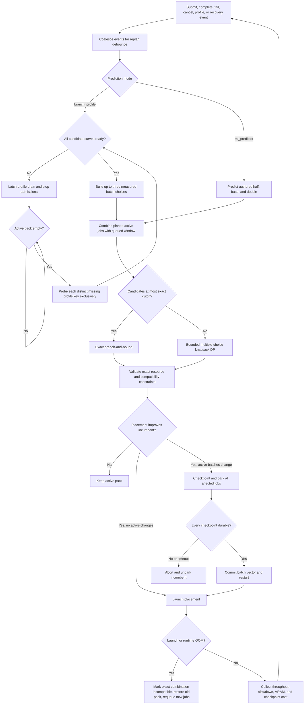

# MLEvolve adaptive GPU scheduler

The local scheduler provides event-driven, single-GPU packing for elastic MLEvolve training jobs. There is one scheduler mode: `adaptive`. Set `gpu_scheduler.enabled: false` when jobs should execute directly without scheduler placement.

Prediction has two strict modes:

- `branch_profile` uses measured v3 batch curves and end-to-end samples/second.
- `ml_predictor` predicts VRAM and SM for authored half/base/double batches. SM is a safety guardrail; occupancy is used only after admission and fairness.

Old scheduler and prediction mode names are rejected. This is intentionally a cold rollout: old queued jobs must be resubmitted and old profile contracts remain stored only for audit.

## Realtime workflow



Healthy active jobs are pinned. A plan may resize them and admit waiting work, but it cannot evict them in favor of another healthy job.

## Batch and profile contract

Every job has two batch identities:

- `authored_batch_size` is the immutable power-of-two value submitted by generated code.
- `current_batch_size` is the mutable scheduler placement value.

The scheduler never rewrites `runner_kwargs` or generated source when it changes a placement.

Branch profiles use `BatchProfileCurve` and `BatchProfilePoint` contract version 3. A curve is keyed by profile namespace, model/branch, shape, hardware, backend, and contract version. Successful points store batch size, peak VRAM, median throughput, median step time, dispersion, and observation count. The first OOM is a curve boundary, not a feasible point.

Profiling starts at the authored batch and downshifts until it finds a feasible point. It then fills missing powers of two from the configured minimum through the first OOM or batch 4096 cap. Each point uses two warmup and five measured optimizer steps by default, with a clean process per point.

Profile states are `READY`, `WAITING_FOR_DRAIN`, `PROBING`, and `UNAVAILABLE`. Missing keys are deduplicated. Once any key is missing, existing jobs drain naturally, no new training is admitted, and all accumulated missing keys are probed serially. If no point succeeds, dependent jobs become exclusive at the minimum batch; a failed training attempt is terminal.

## Placement and repacking

Hard checks run before scoring: safe VRAM, SM guardrail in ML mode, backend eligibility, explicit incompatibilities, active pinning, and maximum group size.

Branch-profile plans are ordered lexicographically by:

1. Number of waiting jobs admitted.
2. Waiting-job priority and age.
3. Aggregate predicted samples/second.
4. Checkpoint/restart cost and distance from authored batches.
5. Safe VRAM occupancy.

Exact measured combination throughput is preferred. Otherwise, standalone curve throughput is divided by the worst measured pair slowdown; unknown pairs use the configured maximum acceptable slowdown, normally 1.3.

ML plans use the same admission and fairness ordering, then VRAM occupancy and batch deviation. Active ML packs are not interrupted solely to improve occupancy because that mode has no throughput signal.

An active pack is repacked when it admits waiting work after the 15-second minimum runtime and 60-second cooldown, or when branch-profile throughput improves by at least 5% and estimated time saved exceeds both 15 seconds and twice measured checkpoint/restart cost.

Repacking is transactional. All affected jobs checkpoint after a completed optimizer step and park. The new vector commits only after every checkpoint is durable. A barrier timeout aborts without batch mutation. Launch or runtime OOM marks the exact vector incompatible, restores the prior active vector from durable checkpoints, and returns newly admitted jobs to the queue.

## Search bounds

Each queued job has exclusion plus at most three batch choices; active jobs have no exclusion choice. The unconstrained space is therefore up to `4^N - 1` plans.

- Up to eight candidates: exact branch-and-bound with incremental compatibility checks and capacity/admission/throughput pruning.
- Larger windows: conservative 128 MiB multiple-choice-knapsack buckets, at most 32 nondominated states per bucket, and exact validation of the best 64 finalists.

With GPU capacity, frontier width, and group size bounded, the DP cost grows approximately linearly with the 16-job candidate window. Per-profile choices, predictions, and compatibility evidence are cached for a planning cycle.

## Elastic generated-code API

Scheduler-managed generated code must use `ElasticTrainingSession`:

```python
from localml_scheduler.elastic import ElasticTrainingSession

session = ElasticTrainingSession.from_env()
train_loader = session.make_dataloader(train_dataset, shuffle=True)
session.register_training_state(
    model,
    optimizer,
    lr_scheduler=scheduler,
    scaler=scaler,
    extra_state=extra_state,
)
progress = session.restore_if_present()

# After optimizer.step(), never during partial accumulation:
session.optimizer_step_completed(
    samples=len(inputs),
    epoch=epoch,
    batch_index=batch_index,
    global_step=global_step,
    metrics={"loss": float(loss.item())},
)
```

Atomic checkpoints include model, optimizer, scheduler, scaler, Python/NumPy/Torch CPU and CUDA RNG, sampler position, epoch/global step, accumulation state supplied through extra state, and metrics. Generated code is validated before submission, receives one repair attempt, and is rejected if the contract remains incomplete. There is no AST rewriting or legacy generated-runner fallback.

## Default configuration

```yaml
prediction:
  mode: branch_profile

gpu_scheduler:
  enabled: true
  mode: adaptive
  candidate_window_size: 16
  max_packed_jobs_per_gpu: 8
  memory:
    vram_budget_fraction: 0.95
  adaptive:
    exact_search_max_jobs: 8
    vram_bucket_mb: 128
    frontier_width: 32
    finalist_limit: 64
    replan_debounce_seconds: 1.0
```

Configuration examples are in `config.example.yaml` and `localml_scheduler/examples/job.example.yaml`.

## Verification

Focused scheduler tests cover A/B/C resizing and admission, infeasible admission without interruption, drain/probe deduplication, full curves and OOM boundaries, exact search versus exhaustive enumeration, bounded-DP safety, checkpoint timeout, launch and runtime-OOM rollback, recovery, and a 16-candidate planner p95 below 100 ms.
