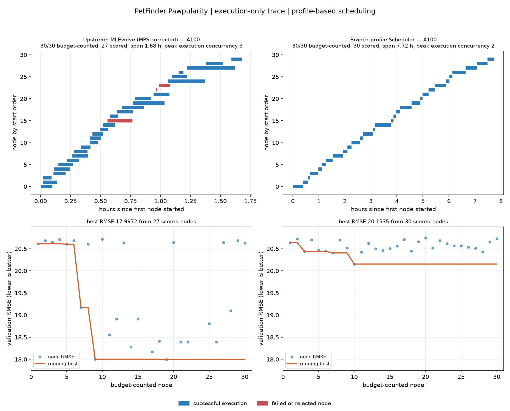

# PetFinder on one A100: upstream MLEvolve versus profile-based Scheduler

## Scope and accounting

- Task: `petfinder-pawpularity-score` (PetFinder Pawpularity).
- Agent for code and feedback: Codex GPT-5.6 Terra Medium (`gpt-5.6-terra`), automatically routed to `codex_cli` by the upstream `llm` package.
- Hardware: one NVIDIA A100 80 GB PCIe (the physical GPU exposed through its UUID), on `ssh ABA`.
- A budget-counted/effective node is a non-root journal node with `exec_time >= 30 s`. Nodes below 30 s remain in the raw journal but are excluded from every 30-node comparison.
- A buggy node is a node whose final `is_buggy` field is `true`, irrespective of runtime. Thus a long failure can be both effective and buggy.
- Both panels below use the first 30 effective nodes, ordered by actual `created_time`; no wall-clock result is compared at unequal node counts.



## Runs retained for the comparison

| Item | Upstream MLEvolve | This repository with Scheduler |
| --- | --- | --- |
| Source revision | `InternScience/MLEvolve` `9c5c8a3b23f0361708b59a401452dddc00f97189` | Remote scheduler checkout `e130f6643f8b196dbaeadcd6cf7ef617a05cb95e` |
| Scheduler | Disabled: true upstream behavior | Enabled; branch-profile prediction, `mps_process` backend, backend-aware admission |
| Parallel job cap | Not present | `parallel_job_cap=null` (no fixed maximum) |
| Search parallelism observed | Peak execution concurrency 3 | Peak execution concurrency 2 |
| Selected sample | 30 effective from 52 candidates | 30 effective from 32 candidates |
| Buggy nodes in selected sample | 3 | 0 |
| Nodes with a numeric RMSE | 27 | 30 |
| Span of the equal 30-node sample | 1.68 h | 7.72 h |
| Median execution time | 377.79 s | 858.00 s |
| Best validation RMSE | 17.9972 | 20.1535 |

The Gantt bars show execution time only. Blue is a non-buggy execution and red is a final `is_buggy=true` execution. The lower panels show node RMSE and its running best; lower is better.

## Important validity notes

This is an operational trace comparison, **not evidence that the Scheduler improves throughput or final RMSE**. In this controlled 30-effective-node sample, upstream completed its sample sooner, admitted three simultaneous executions, and reached a lower best RMSE. The Scheduler admitted at most two compatible executions from its live branch profiles. This is observed behavior, not an externally imposed maximum: the scheduler cap was null.

The two workflows also retain their native search settings (`agent.initial_drafts=0` and `parallel_search_num=3` upstream; Scheduler run used its existing initial-draft/search settings). Therefore the figure should not be used as a causal scheduler-only ablation without a subsequent run that equalizes those agent-search settings.

## Excluded failed setup

The first upstream launch, `petfinder_terra_a100_upstream_60_followup_20260905T170116Z`, is deliberately excluded. Scheduler had left an NVIDIA Multi-Process Service (MPS) server bound to GPU UUID `GPU-65a437dd-45a3-2750-8677-f6cf5f866726`. The launch passed `CUDA_VISIBLE_DEVICES=1` but omitted the MPS pipe/log variables. PyTorch could enumerate the A100 but `model.to("cuda")` raised `torch.AcceleratorError: CUDA-capable device(s) is/are busy or unavailable`; generated candidates caught that error and ran on CPU.

The issue was reproduced with a minimal `timm` model migration. It was fixed for the retained upstream run by setting all three variables before launch:

```text
CUDA_VISIBLE_DEVICES=GPU-65a437dd-45a3-2750-8677-f6cf5f866726
CUDA_MPS_PIPE_DIRECTORY=/data1/downeyflyfan/MLEvolve_terra_a100/mps_device1_uuid_pipe
CUDA_MPS_LOG_DIRECTORY=/data1/downeyflyfan/MLEvolve_terra_a100/mps_device1_uuid_log
```

The minimal model then migrated and executed on the A100 successfully. During the retained run, GPU-1 used approximately 9--13 GiB with high utilization. The invalid CPU-fallback run was terminated and preserved remotely for diagnosis, but is not a data source for the chart or table.

## Reproduction artifacts

- Scheduler journal: `.cache/petfinder_terra_a100_20260905/scheduler_final/journal.json`
- Retained upstream journal: `.cache/petfinder_terra_a100_20260905/upstream_60_mpsuuid/journal.json`
- Chart command:

```bash
.venv/bin/python scheduler_benchmark_test/draw_petfinder_comparison.py \
  --target-nodes 30 \
  --run 'Upstream MLEvolve|A100|.cache/petfinder_terra_a100_20260905/upstream_60_mpsuuid/journal.json' \
  --run 'Scheduler|A100|.cache/petfinder_terra_a100_20260905/scheduler_final/journal.json' \
  --out records/2026-09-05_petfinder_a100_terra_upstream_vs_scheduler_30_effective.png
```
