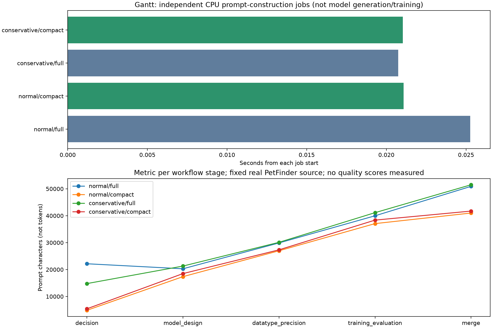
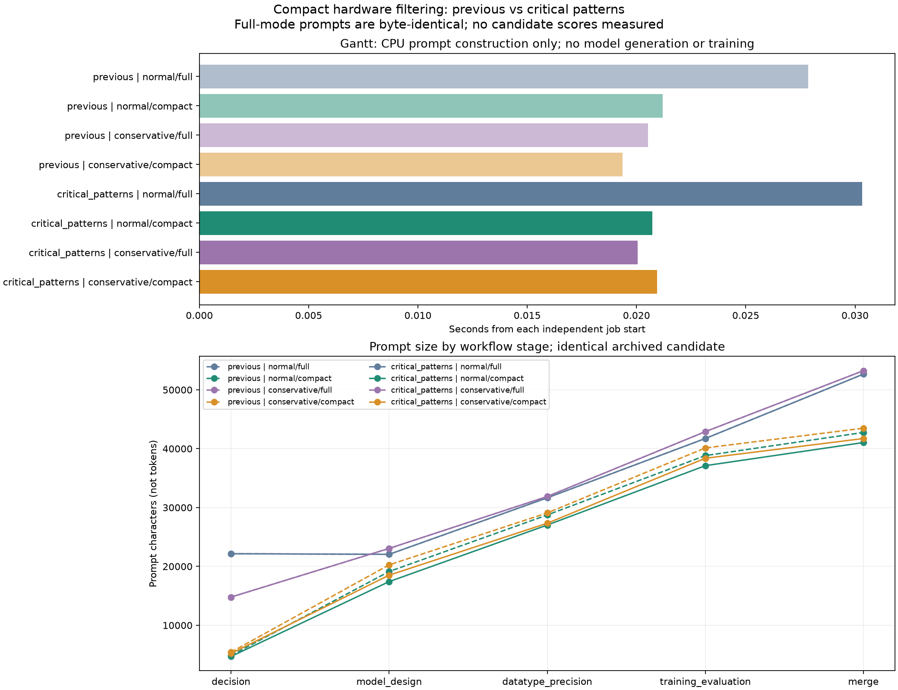

# Conservative precision and hardware-context audit

The implementation now offers two independent controls:

```yaml
agent:
  precision_optimization_mode: conservative
  hardware_context_mode: compact
```

Use those overrides with the existing run configuration:

```bash
.venv/bin/python run.py agent.precision_optimization_mode=conservative agent.hardware_context_mode=compact
```

The defaults remain `normal` / `full`. Conservative precision applies to candidate
models throughout generation, repair, review and the final execution guard,
including baseline/origin mode and unavailable hardware services. It allows FP32
and, with confirmed compatible hardware, TF32; it excludes AMP, FP16, BF16,
lower formats, quantized models and explicit FP64. Integer indices/labels remain
valid. The agent LLM's own INT8/FP16 inference configuration is independent.
TF32 retains float32 tensors with reduced internal mantissa precision and is
available from Ampere onward; V100/T4 use FP32 in this mode.
[PyTorch CUDA semantics](https://docs.pytorch.org/docs/stable/notes/cuda.html).

## What the evidence supports

**Context and orchestration overhead are established problems. The claim that
Qwen is unfamiliar with FP16 remains a hypothesis.** No controlled end-to-end
precision comparison was completed in this work.

The [saved Qwen recovery record](2026-09-01_petfinder_zero_node_long_context_recovery.md)
documents five generated/reviewed drafts, four review rejections, one preflight
rejection and zero executed candidates after 4 h 21 min. An exact merge request
had 26,438 input tokens and requested 8,192 output tokens against a 32,768-token
server limit: 34,630 required tokens. A later merge exhausted its 8,192-output
budget three times and consumed about 14 minutes in retries. These are input
capacity and output-completion failures; removing FP16 alone cannot fix them.
The record also documents subsequent context/output-budget fixes, so these
historical defects are not claimed to be newly discovered or still active.

The same record contains a particularly relevant counterexample: a TF32/FP32
candidate with `USE_AMP=False` was misclassified as FP16 because dormant helper
code mentioned `torch.float16`. Five approving reviewer decisions were overridden
and four repair rounds failed to resolve the false report. That normal-mode
introspection issue was previously fixed. The new conservative guard separately
checks explicit operations, so `USE_AMP=False` cannot conceal an actual
`model.half()` call, while comments and logging strings do not constitute casts.
Conservative mode deliberately asks agents to remove explicit lower-precision
declarations/fallbacks too. This is static validation of supported Python
patterns, not a proof about arbitrary dynamic code or hidden third-party casts.

Other recorded blockers included unavailable offline weights, import-time side
effects, incomplete adapter contexts, a missing persistent loss object, stale
preflight issues, and delayed submission while candidates were being generated.
They lower successful-node throughput before GPU utilization can help.

The [Qwen baseline record](2026-08-31_petfinder_a100_agent_a10_comparison.md)
reports a recovered baseline with 50 effective nodes, 30 scored nodes, 17.70 h
and best RMSE 17.9433. It also explicitly invalidates its paired comparison after
agent hardware changed from an 80 GB to a 40 GB A100. Those numbers therefore
cannot establish a scheduler or precision effect. The newer
[Terra/A100 comparison](2026-09-05_petfinder_a100_terra_upstream_vs_scheduler_30_effective.md)
has 30 effective nodes in 1.68 h versus 7.72 h and best RMSE 17.9972 versus
20.1535, but uses Terra rather than Qwen and differing search settings. It is
another operational regression, not an FP16 ablation. Nautilus hostname
resolution failed during this audit, so those historical records were inspected
locally; their original remote run directories were not refreshed.

## Audit of the complete candidate path

| Stage | Relevant cost or failure mechanism | Treatment / remaining question |
| --- | --- | --- |
| Search selection and drafting | Initial drafts delay first feedback; rejected candidates can consume time without consuming the effective-node budget | Preserve branch-feedback logic; measure all attempts and time to first valid result |
| Hardware lookup and design feature selection | An extra feature-selection LLM call and a catalog before any matching profile exists | Compact mode skips the selection call and catalog; no invented timing evidence |
| Pipeline decision | Structured filtered hardware dictionaries bypassed the rendered 3,500-character prompt limit | Compact mode passes one rendered evidence view; conservative mode restricts the per-call precision schema and normalizes invalid selections |
| Model / precision / training generation | Shared instructions plus accumulated earlier code; an extra precision stage in hardware-aware mode | Retain the stage interfaces; apply precision filtering to internal stage views and remove incompatible conservative recommendations |
| Merge | All earlier code/plans plus three separately bounded hardware views | Compact mode supplies a single bounded merge view; complete-code output remains a separate budget requirement |
| Review and scoped repair | Additional model calls, inconsistent advice, stale inherited decisions | Conservative rule reaches review and every repair owner; critical precision issues still block execution |
| CPU preflight | Actual adapter/import/data-contract failures independent of GPU scheduling | Keep checks; use existing source-specific repair guidance rather than weakening validation |
| Scheduler admission / execution | Profile availability, probing, live VRAM, generated epoch/fold/architecture budget | No scheduler policy changes, fixed job cap, or new GPU experiments; retain branch-profile admission |
| Parsing / validation / best-node selection | A completed program can still fail metric/submission validation; low valid-node count reduces search opportunities | Count generated, admitted, completed and validated nodes separately; verify score and submission evidence |

The initial compact view preserved precision/backend constraints, a matching
profile where present, relevant symptoms and bounded risks. It avoided generic
optimization recipes when there is no matching profile or observed symptom.
The tighter compact view described below replaces those summaries with critical
patterns. Full evidence remains available in diagnostics. It does **not** shrink lesson
profiles, CUDA-documentation evidence, task descriptions, prior code or all
shared implementation instructions; those are remaining sources of growth.

## Controlled local prompt measurement

The replay used real archived stage outputs from Sonnet PetFinder node
`73940669b6a84cae94cb7a45b92f771c`. Its source prompt SHA-256 is
`0b408ded90b4ccf6c5bac0be4095c8eb6b86b7223153820b9421bfbf1c620644`.
Task, prior code and plans are identical in all four cells. Hardware knowledge
was requested from the repository's static graph using an A100 name; the follow-up
below found that this lookup actually returns A10 evidence. No runtime profiles
were fabricated. The pipeline decision is a labelled deterministic fallback; no new
LLM output or candidate quality was measured.

| Prompt | Normal/full characters | Normal/compact | Conservative/full | Conservative/compact |
| --- | ---: | ---: | ---: | ---: |
| Pipeline decision | 22,156 | 4,867 | 14,789 | 5,426 |
| Model design | 20,291 | 17,371 | 21,298 | 18,504 |
| Precision | 29,894 | 26,981 | 30,118 | 27,329 |
| Training | 39,975 | 37,069 | 41,139 | 38,368 |
| Merge | 50,911 | 40,998 | 51,495 | 41,723 |
| Total across five calls | 163,227 | 127,286 | 158,839 | 131,350 |

Compact mode reduces this normal-mode total by **22.0%**, including **78.0%**
at decision and **19.5%** at merge. With conservative precision held fixed,
compact mode reduces total characters by **17.3%**. These are character counts,
not tokenizer counts, model latency or a quality improvement. Conservative
instructions can lengthen coding prompts slightly; precision restriction alone
is not a context-compression strategy.

The original archive logs four used prompts together. Its first draft has
32,265 / 42,783 / 51,629 / 65,533 characters per call. The approximately
192,000-character saved draft is an aggregate, not one model request. Separating
those quantities avoids overstating single-call context use.



[Machine-readable results](2026-09-08_precision_context_audit.json) include
source provenance. Full reconstructed prompts and frozen stage outputs are in
`runs/precision-context-audit-20260908-verified/`. Reproduce without API/GPU use:

```bash
.venv/bin/python benchmarks/audit_precision_context.py \
  --pipeline-db runs/20260828_154842_petfinder_sonnet5090_50nodes/logs/pipeline.sqlite3 \
  --output-dir runs/precision-context-audit-new
```

## Follow-up: critical patterns in compact mode

Compact mode now caps each hardware section at **1,000 characters**, with only
**250 characters** for optional patterns. It selects at most two recommendations
and two avoid patterns for the current stage, deduplicates them, and keeps whole
conditions. Eligible patterns describe failure prevention or explicit restrictions;
feature-level patterns require `verified=True`. Optimizer advice, generic speed
recipes, profile/symptom dumps, and evidence-reference lists are excluded from
this prompt view. Precision, backend, VRAM, scheduler ownership and task/modeling
budget constraints retain priority. Shared hardware instructions are shortened.
The task agent still chooses an optimizer; the hardware catalog no longer supplies
optimizer recommendations. Full evidence remains in diagnostics.

The replay also found a source-selection defect: `NVIDIA A100 SXM4 80GB` matches
the A10 first through the existing substring lookup. The returned evidence has
compute capability 8.6 and includes `sm_86` advice, while the declared target is
8.0. Compact mode now rejects patterns with a known compute-capability mismatch.
The global lookup behavior is unchanged by this follow-up. This fixture exercises
the mismatched-evidence fallback; compatible pattern retention is covered by tests.

The same archived candidate was replayed before and after this change. Both
versions now include shared `hardware_context_instructions` in every coding/merge
prompt, which the initial measurement above omitted. These totals therefore
should be compared within this table, not directly to the earlier table.

| Compact precision mode | Previous total characters | Current total characters | Reduction |
| --- | ---: | ---: | ---: |
| Normal | 134,322 | 127,300 | 7,022 / 5.23% |
| Conservative | 138,386 | 131,164 | 7,222 / 5.22% |

Totals cover decision, model design, precision, training and merge for one fixed
candidate. Full-mode prompts were byte-identical before/after. These are CPU
prompt measurements, not token counts, model reasoning capacity, success rates,
latency improvements or best-node quality. No API calls or GPU training were used.



[Machine-readable comparison](2026-09-08_compact_critical_patterns.json) contains
the source hash, actual hardware lookup, stage sizes and trace paths. Before-source
files are retained in `runs/critical-patterns-20260908-source-before/`; full prompts
are in `runs/critical-patterns-20260908-final-before/` and
`runs/critical-patterns-20260908-verified-after/`. The existing audit command above
reconstructs the current view.

Validation: **185 tests passed** across hardware context, pipeline decision,
stage prompt preview, precision policy and stage review; prompt equality checks,
Python compilation and `git diff --check` passed.

## OpenRouter probe and budget

A bounded 2×2 probe was prepared for `qwen/qwen3.5-9b` and
`qwen/qwen3.5-27b`, using real sklearn digits, fixed train/validation/test splits,
three epochs, decision + three coding stages + merge, and CPU execution.
It is a transfer diagnostic, not the deployed Qwen3.8 checkpoint or a full
search/review/preflight/scheduler experiment. Source requests are retained.

All requests were blocked by HTTP 402. The final captured response explicitly
says `Insufficient credits` with `limit_source=openrouter_credits`. There were
**zero completed generations, zero training runs and zero reported generation
charges**. The initial probe attempted 16 requests; a subsequent single-request
check verified the corrected stop-on-billing-error behavior. Reserved worst-case
cost across both attempts was $0.438, not actual spend; the user's $20 budget
was not consumed by successful calls. API failures must not be counted as
candidate-model failures or scores.

Evidence: `runs/precision-context-probe-20260908/` and
`runs/precision-context-probe-20260908-billing-check/`, including redacted-by-design
request payloads (no authorization headers), responses, budget ledgers and
combined charts. The reusable probe reads `OPEN_ROUTER_API_KEY`, bounds provider
prices/output tokens, reserves cost before each request, and stops on
authentication/billing rejection. [OpenRouter provider price ceilings](https://openrouter.ai/docs/guides/routing/provider-selection#max-price).

```bash
.venv/bin/python benchmarks/probe_precision_context.py \
  --output-dir runs/precision-context-live-new \
  --models qwen/qwen3.5-9b qwen/qwen3.5-27b --seeds 7 19 --max-cost-usd 5
```

## Next matched end-to-end comparison

Use the same task/data, agent checkpoint and serving options, physical training
GPU, seed, initial draft/search settings, wall-clock limit, epoch limits, review,
preflight, lesson/CUDA-doc settings and branch-profile scheduler in each cell:

| Cell | Precision | Hardware context |
| --- | --- | --- |
| Scheduler-only baseline | normal | disabled with `experiment.mode=baseline` |
| Existing hardware-aware | normal | full |
| Precision isolation | conservative | full |
| Context isolation | normal | compact |
| Combined | conservative | compact |

Run multiple seeds and randomize order; reset or identically seed profile/lesson
state and distinguish warm from cold provider caches. Compare validated success
count at common wall-clock cutoffs, best validated RMSE at those cutoffs, success
rate over **all** generated candidates, per-stage tokens/time/retries, review and
preflight rejection reasons, queue/probe/execution time, and optimizer completed
versus skipped steps. Preserve the exact same effective-node threshold if that
secondary metric is used; historical records used both 30 s and 60 s conventions.
Final submissions and splits must match before quality numbers are compared.

FP32 may improve numerical stability and simplify generated code but can consume
more memory and reduce throughput. A win in valid nodes/time therefore requires
measurement. If compact context helps but overall generation still dominates,
the next scoped experiment should reduce repeated stage instructions and code
assembly/retry cost while retaining the existing validation contracts.

## Verification

The final suite passed **304 tests in 24.82 seconds**, covering precision,
hardware prompts, config, pipeline decisions, review, offline contracts,
diagnostics, script introspection and model-preflight integration. Python
compilation, the live-probe CLI help and `git diff --check` also passed. The CPU
prompt replay completed and its combined PNG was visually inspected. No live
GPU experiment, scheduler launch or end-to-end quality improvement is claimed.

Credential setup: the original `.bashrc` declaration used a dollar sign before
the variable name, so sourcing it failed to export the requested variable and
Bash echoed the credential in its error output. Rotate that key and replace the
declaration with `export OPEN_ROUTER_API_KEY="..."` using the new value. Shell
configuration was not edited. Probe artifacts were checked and contain no key.
