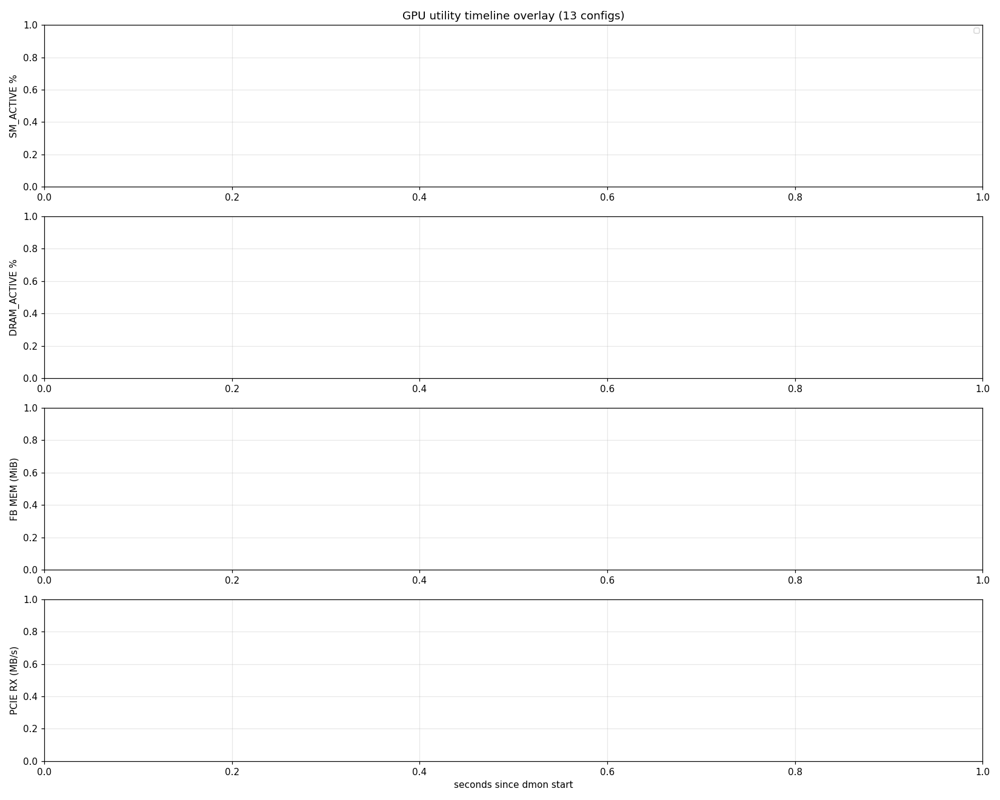
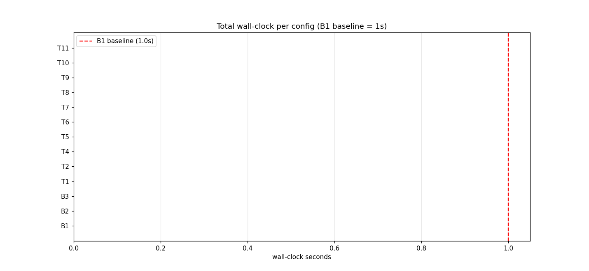
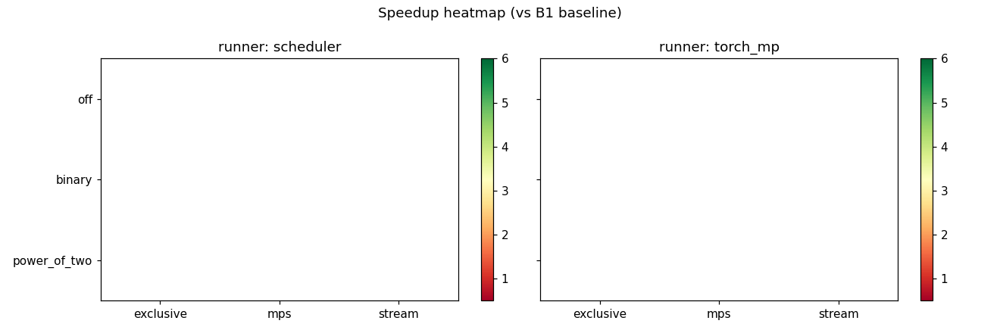
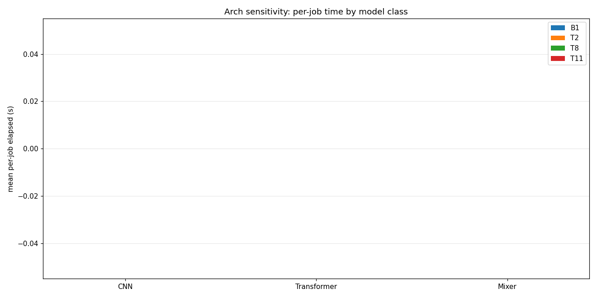
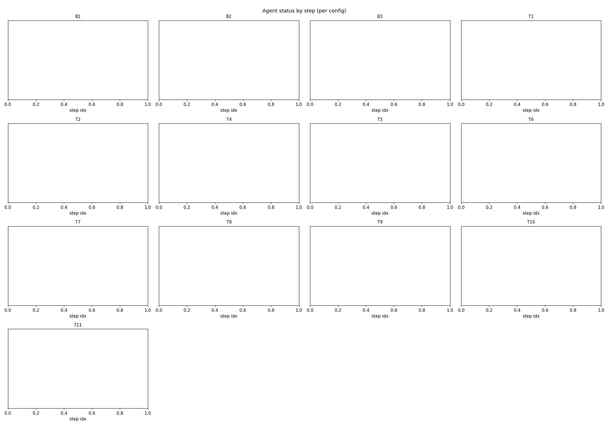

# Scheduler Benchmark Results — 13-Config × W3 Trace

## Setting
- Hardware target: RTX 5090 class GPU (scheduler safe budget default 30 GiB)
- Workload: cassava-leaf-disease-classification (12 GB)
- Trace: W3 — 7 CNN + 7 Transformer + 6 Mixer (real timm models, real cassava data)
- Per-job: subset 4000, epochs 2, bs ∈ {16,24,32,48} per-arch capped

## Per-config wall-clock

| ID | Mode | Backend | Probe | Runner | Wall-clock | Speedup vs B1 |
|---|---|---|---|---|---|---|
| B1 | serial_basic | exclusive | off | scheduler | 0.0s | 0.00x |
| B2 | serial_batch_optimized | exclusive | binary | scheduler | 0.0s | 0.00x |
| B3 | serial_batch_optimized | exclusive | power_of_two | scheduler | 0.0s | 0.00x |
| T1 | parallel_default | mps | off | scheduler | 0.0s | 0.00x |
| T2 | parallel_default | stream | off | scheduler | 0.0s | 0.00x |
| T4 | parallel_batch_optimized | mps | binary | scheduler | 0.0s | 0.00x |
| T5 | parallel_batch_optimized | mps | power_of_two | scheduler | 0.0s | 0.00x |
| T6 | parallel_batch_optimized | stream | binary | scheduler | 0.0s | 0.00x |
| T7 | parallel_batch_optimized | stream | power_of_two | scheduler | 0.0s | 0.00x |
| T8 | parallel_batch_optimized | mps | binary | torch_mp | 0.0s | 0.00x |
| T9 | parallel_batch_optimized | mps | power_of_two | torch_mp | 0.0s | 0.00x |
| T10 | parallel_batch_optimized | stream | binary | torch_mp | 0.0s | 0.00x |
| T11 | parallel_batch_optimized | stream | power_of_two | torch_mp | 0.0s | 0.00x |

## Plots

- 
- 
- 
- 
- 
