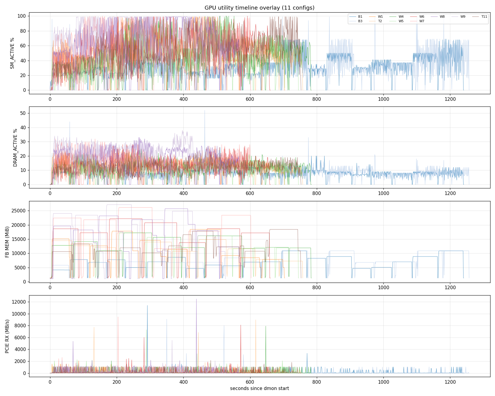
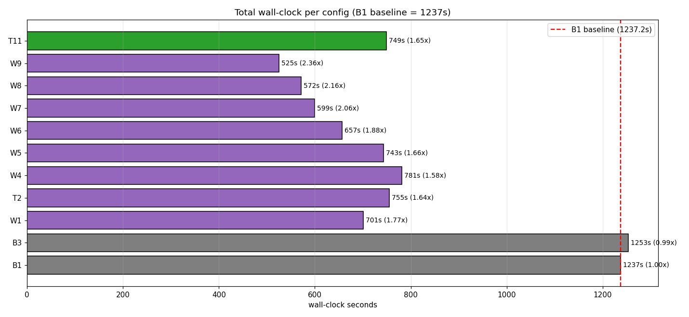
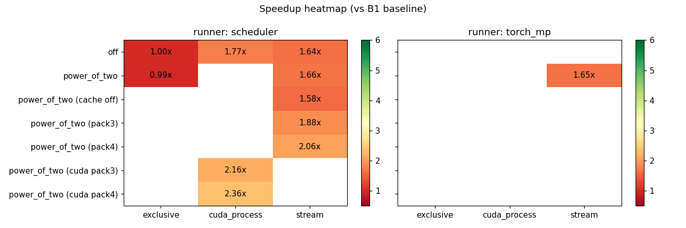
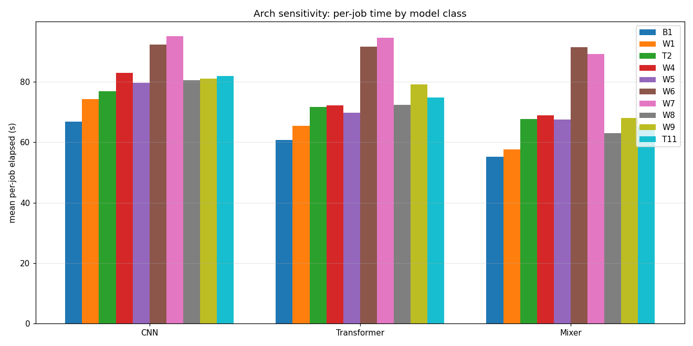
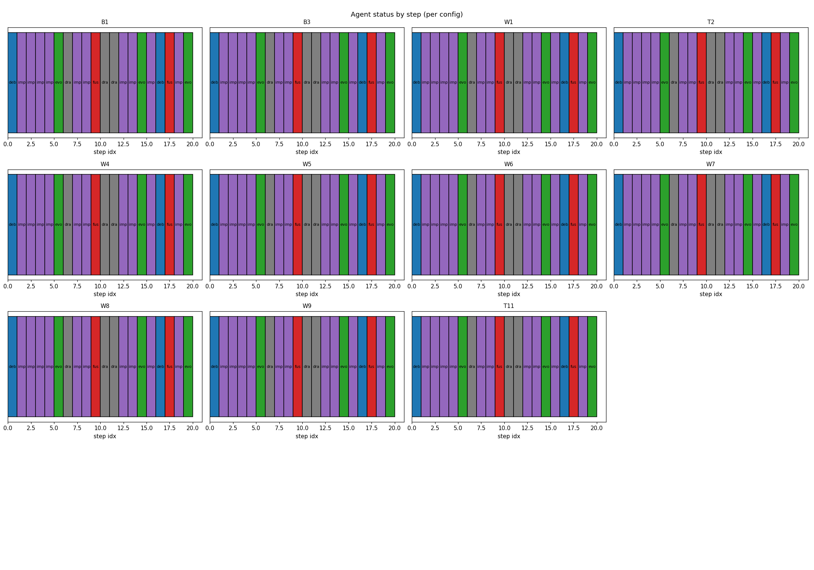

# Scheduler Benchmark Results — 11-Config × W3 Trace

## Setting
- Hardware target: RTX 5090 class GPU (scheduler safe budget default 30 GiB)
- Workload: cassava-leaf-disease-classification (12 GB)
- Trace: W3 — 7 CNN + 7 Transformer + 6 Mixer (real timm models, real cassava data)
- Per-job: subset 4000, epochs 2, bs ∈ {16,24,32,48} per-arch capped

## Per-config wall-clock

| ID | Mode | Backend | Probe | Runner | Wall-clock | Speedup vs B1 |
|---|---|---|---|---|---|---|
| B1 | serial_basic | exclusive | off | scheduler | 1237.2s | 1.00x |
| B3 | serial_batch_optimized | exclusive | power_of_two | scheduler | 1253.3s | 0.99x |
| W1 | parallel_default | cuda_process | off | scheduler | 700.7s | 1.77x |
| T2 | parallel_default | stream | off | scheduler | 755.1s | 1.64x |
| W4 | parallel_batch_optimized | stream | power_of_two (cache off) | scheduler | 781.4s | 1.58x |
| W5 | parallel_batch_optimized | stream | power_of_two | scheduler | 743.4s | 1.66x |
| W6 | parallel_batch_optimized | stream | power_of_two (pack3) | scheduler | 657.2s | 1.88x |
| W7 | parallel_batch_optimized | stream | power_of_two (pack4) | scheduler | 599.3s | 2.06x |
| W8 | parallel_batch_optimized | cuda_process | power_of_two (cuda pack3) | scheduler | 571.5s | 2.16x |
| W9 | parallel_batch_optimized | cuda_process | power_of_two (cuda pack4) | scheduler | 525.3s | 2.36x |
| T11 | parallel_batch_optimized | stream | power_of_two | torch_mp | 749.1s | 1.65x |

## Plots

- 
- 
- 
- 
- 
