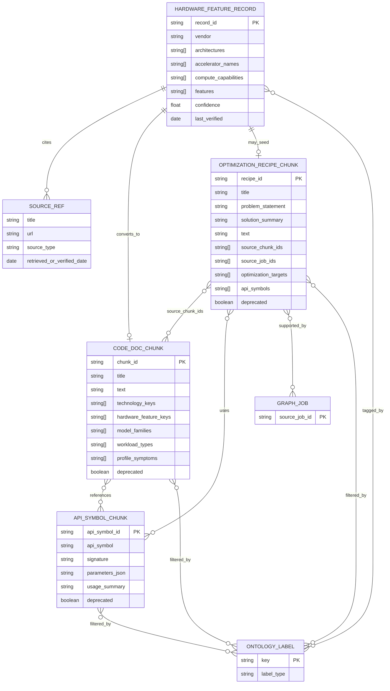

# Analytical Report on the Hardware Knowledge Vector Database Markdown

## Executive summary

The uploaded markdown is not just narrative documentation; it is a curation-and-ingestion specification for the MLEvolve hardware-aware knowledge layer. It explicitly separates a **profile graph database** that stores measured run evidence from a **code-knowledge vector database** that stores reusable implementation knowledge, and it defines four allowed YAML schema versions for that vector side: `hardware_feature_record_v1`, `code_doc_chunk_v1`, `optimization_recipe_chunk_v1`, and `api_symbol_chunk_v1`. The same markdown also warns that, if prose and code disagree, the current implementation files are authoritative. (Uploaded markdown, lines 11–18, 21–30, 34–52, 191–198, 814–823.) fileciteturn0file0L11-L18 fileciteturn0file0L21-L30 fileciteturn0file0L34-L52 fileciteturn0file0L191-L198 fileciteturn0file0L814-L823

Functionally, the four schemas form a layered reasoning stack. **Schema A** is the hardware-capability and hardware-guidance layer; **Schema B** is the explanatory/documentation layer; **Schema C** is the action-planning layer; and **Schema D** is the exact API-grounding layer. The intended agent loop is: read graph evidence, derive diagnosis labels, filter vector retrieval with those labels, retrieve code docs/recipes/APIs, generate a mutation, validate it, and write the empirical result back to the graph store. (Uploaded markdown, lines 55–68, 212–223, 309–363, 398–453, 497–551.) fileciteturn0file0L55-L68 fileciteturn0file0L212-L223 fileciteturn0file0L309-L363 fileciteturn0file0L398-L453 fileciteturn0file0L497-L551

The most important architectural insight is that these schemas are connected less by hard foreign keys than by **shared ontology labels** and a few explicit ID links. The markdown names the important shared keys—`technology_keys`, `hardware_feature_keys`, `model_families`, `workload_types`, `profile_symptoms`, `optimization_targets`, and `api_symbols`—and states that current search filters rely on exact metadata matches. That means ontology spelling, versioning, and provenance are not “nice to have”; they are the logical join mechanism of the system. (Uploaded markdown, lines 83–177, 852–858.) fileciteturn0file0L83-L177 fileciteturn0file0L852-L858

For implementation, the report strongly supports keeping the current **Qdrant + YAML corpus + SQLite control-plane** pattern as the initial baseline, because it matches the repository’s documented ingestion path. Qdrant stores vectors plus structured payloads, supports vector search combined with payload filtering, and recommends creating payload indexes for fields used in filters. SQLite is acceptable for a lightweight control plane, but its type system is loose: booleans are stored as integers and dates/times are typically stored as text, real, or integer values, so stricter application-level validation is necessary. Alembic is a good migration companion if you add a relational mirror. citeturn3view6turn7view1turn3view5turn7view0turn3view8turn3view9turn3view10

## What the uploaded markdown defines

At a high level, the attachment defines a **curated corpus format** for hardware-aware coding knowledge, not a generic knowledge base. The document says manual labor is required because hardware optimization advice is version-sensitive, source-sensitive, and highly conditional; it therefore requires each record to carry sources, confidence, applicability tags, and recommended-versus-avoid patterns. It also narrows the corpus to reusable coding knowledge rather than raw profiler facts, which remain in the graph database. (Uploaded markdown, lines 72–81, 658–660, 862–872.) fileciteturn0file0L72-L81 fileciteturn0file0L658-L660 fileciteturn0file0L862-L872

The comparison below normalizes the schema purposes, validator minima, and storage roles described in the upload. (Uploaded markdown, lines 212–223, 317–353, 408–443, 507–542, 826–850.) fileciteturn0file0L212-L223 fileciteturn0file0L317-L353 fileciteturn0file0L408-L443 fileciteturn0file0L507-L542 fileciteturn0file0L826-L850

| Schema | What it is | Minimum validator surface | Important richer metadata | Storage target |
|---|---|---|---|---|
| **A — `hardware_feature_record_v1`** | Curated record about an architecture, accelerator, compute capability, or generic hardware capability, plus programming guidance | Rich required record, including provenance | `architectures`, `accelerator_names`, `compute_capabilities`, `features`, `recommended_patterns`, `avoid_patterns`, `source_refs`, `confidence`, `last_verified` | `hardware_feature_knowledge`; may auto-convert into B and C |
| **B — `code_doc_chunk_v1`** | Explanatory documentation chunk about a concept, API family, framework guide, or hardware-aware technique | `schema_version`, `chunk_id`, `title`, `text` | Source metadata, ontology labels, `api_symbols`, `risk_level`, `confidence`, `deprecated` | `code_doc_chunks` |
| **C — `optimization_recipe_chunk_v1`** | Actionable recipe that can be turned into a concrete code mutation proposal | `schema_version`, `recipe_id`, `title`, `text`, `optimization_targets` | `problem_statement`, `solution_summary`, patterns, `source_chunk_ids`, `source_job_ids`, ontology labels, risk/confidence | `optimization_recipe_chunks` |
| **D — `api_symbol_chunk_v1`** | Exact API usage record for a function, class, method, or config surface | `schema_version`, `api_symbol_id`, `api_symbol`, `usage_summary` | `signature`, `parameters_json`, source metadata, ontology labels, risk/confidence (runnable code examples live only in Schema B, not in D) | `api_symbol_chunks` |

Analytically, the four schemas are not interchangeable chunks with different labels. Schema A is **hardware-first** and provenance-heavy; Schema B is **explanation-first** and retrieval-oriented; Schema C is **decision-first** and action-oriented; Schema D is **syntax-first** and code-generation-oriented. That division is coherent with the stated agent workflow and is one of the strongest parts of the design, because it separates “what is supported,” “why it matters,” “what to try,” and “how to write it.” (Uploaded markdown, lines 55–68, 212–223, 309–363, 398–453, 497–551.) fileciteturn0file0L55-L68 fileciteturn0file0L212-L223 fileciteturn0file0L309-L363 fileciteturn0file0L398-L453 fileciteturn0file0L497-L551

## Schema field dictionary and sample records

Because the source format is YAML and the storage target is a vector database with payloads, the markdown mostly defines **logical field types** rather than rigid SQL DDL types. The tables below therefore use “canonical type” to mean the most faithful logical type implied by the schema text and templates. The markdown’s own corpus wrapper accepts either a top-level list of records or an object with a `records` list. (Uploaded markdown, lines 179–189.) fileciteturn0file0L179-L189

**Schema A — `hardware_feature_record_v1`.** The required fields, exceptions, and construction rules below come directly from the uploaded schema block. (Uploaded markdown, lines 212–303.) fileciteturn0file0L212-L303

| Field | Canonical type | Required | Meaning |
|---|---|---|---|
| `schema_version` | constant string | yes | Must be `hardware_feature_record_v1` |
| `record_id` | string | yes | Stable unique identifier |
| `title` | string | yes | Human-readable name |
| `summary_text` | string | yes | Short summary, ideally one or two sentences |
| `detail_text` | string | yes | Longer explanation with constraints/caveats |
| `vendor` | string | yes | Vendor name, e.g. `nvidia` |
| `architectures` | string[] | yes | Architecture families |
| `accelerator_names` | string[] | yes, may be empty | Product/device names and aliases |
| `compute_capabilities` | string[] | yes, may be empty | Compute capability identifiers |
| `toolkits` | string[] | yes | Toolkit tags such as `cuda` |
| `frameworks` | string[] | yes | Relevant frameworks such as `pytorch` |
| `workload_types` | string[] | yes | Workload ontology labels |
| `features` | string[] | yes | Capability tags that can convert into ontology keys |
| `recommended_patterns` | string[] | yes | Actionable recommended coding patterns |
| `avoid_patterns` | string[] | yes, may be empty | Specific warnings/contraindications |
| `source_refs` | object[] | yes | Provenance list |
| `source_refs[].title` | string | yes | Source title |
| `source_refs[].url` | string | yes | Source URL |
| `source_refs[].source_type` | string | yes | Source classification |
| `source_refs[].retrieved_or_verified_date` | ISO date string | yes | Verification or retrieval date |
| `confidence` | float in `[0,1]` | yes | Curation confidence |
| `tags` | string[] | yes | Additional retrieval/review tags |
| `last_verified` | ISO date string | validator-optional, recommended | Explicit freshness marker; otherwise inferred from `source_refs` |

Two design details matter here. First, Schema A is the only schema that is explicitly **multi-source by design** through a nested `source_refs` list. Second, the markdown states that a Schema A record can be ingested into the compatibility collection and also converted automatically into exactly one Schema B record and, if `recommended_patterns` is non-empty, exactly one Schema C record. That makes Schema A both a direct knowledge object and a seed object for downstream records. (Uploaded markdown, lines 218–223, 249–271.) fileciteturn0file0L218-L223 fileciteturn0file0L249-L271

**Schema B — `code_doc_chunk_v1`.** The validator minimum is intentionally small, but the recommended metadata surface is wide because retrieval quality depends on it. (Uploaded markdown, lines 305–394.) fileciteturn0file0L305-L394

| Field | Canonical type | Required | Meaning |
|---|---|---|---|
| `schema_version` | constant string | yes | Must be `code_doc_chunk_v1` |
| `chunk_id` | string | yes | Stable unique chunk ID |
| `title` | string | yes | Chunk title |
| `text` | string | yes | Main explanatory content |
| `text_hash` | string | derived/optional | Content hash; validator computes it if omitted |
| `source_id` | string | recommended | Stable source identifier |
| `source_type` | string | recommended | Official doc, tutorial, internal note, etc. |
| `source_title` | string | recommended | Human-readable source title |
| `source_url` | string | recommended | Source URL |
| `source_version` | string | recommended | Version label for the source |
| `framework` | string | recommended | Main framework, e.g. `pytorch` |
| `framework_version` | string | recommended | Framework version scope |
| `technology_keys` | string[] | recommended | Technology ontology keys |
| `hardware_keys` | string[] | recommended | Device-specific hardware keys |
| `hardware_feature_keys` | string[] | recommended | Capability-class keys |
| `model_keys` | string[] | recommended | Specific model identifiers |
| `model_families` | string[] | recommended | Family labels such as `transformer` |
| `workload_types` | string[] | recommended | Workload ontology labels |
| `optimization_targets` | string[] | recommended | Intended optimization outcomes |
| `profile_symptoms` | string[] | recommended | Diagnosed symptoms that should retrieve this chunk |
| `api_symbols` | string[] | recommended | APIs discussed in the text |
| `precision_modes` | string[] | recommended | Precision tags such as `bf16`, `fp16`, `mixed` |
| `risk_level` | enum string | recommended | `low`, `medium`, or `high` |
| `confidence` | float | recommended | Confidence in guidance |
| `deprecated` | boolean | recommended | Whether the content is version-obsolete |

Schema B is the document-level conceptual layer. The upload explicitly says one chunk should cover “one coherent concept, API family, or hardware-aware technique,” and that chunks should be stripped of web-page noise. This is a strong sign that the intended granularity is **retrieval chunk**, not document mirror. (Uploaded markdown, lines 355–363.) fileciteturn0file0L355-L363

**Schema C — `optimization_recipe_chunk_v1`.** This is where explanatory knowledge becomes mutation logic. (Uploaded markdown, lines 396–493.) fileciteturn0file0L396-L493

| Field | Canonical type | Required | Meaning |
|---|---|---|---|
| `schema_version` | constant string | yes | Must be `optimization_recipe_chunk_v1` |
| `recipe_id` | string | yes | Stable recipe identifier |
| `title` | string | yes | Recipe title |
| `text` | string | yes | Main actionable recipe text |
| `optimization_targets` | string[] | yes | Required optimization goals |
| `problem_statement` | string | recommended | Condition under which to apply the recipe |
| `solution_summary` | string | recommended | Short summary of the fix |
| `recommended_patterns` | string[] | recommended | Action steps and implementation guidance |
| `avoid_patterns` | string[] | recommended | Failure modes and contraindications |
| `source_chunk_ids` | string[] | recommended | Upstream Schema B chunks supporting the recipe |
| `source_job_ids` | string[] | recommended | Supporting graph-job evidence IDs |
| `technology_keys` | string[] | recommended | Relevant technology ontology keys |
| `hardware_feature_keys` | string[] | recommended | Required hardware features |
| `model_families` | string[] | recommended | Relevant model families |
| `workload_types` | string[] | recommended | Relevant workload labels |
| `profile_symptoms` | string[] | recommended | Symptoms that should trigger the recipe |
| `api_symbols` | string[] | recommended | APIs needed to implement it |
| `precision_modes` | string[] | recommended | Precision modes involved |
| `framework` | string | recommended | Framework scope |
| `framework_version` | string | recommended | Version scope |
| `risk_level` | enum string | recommended | `low`, `medium`, or `high` |
| `confidence` | float | recommended | Confidence in the recommendation |
| `deprecated` | boolean | recommended | Whether the recipe should be avoided in current versions |

Schema C is particularly important because it formalizes the causal structure of optimization: **symptom + hardware context + code change + validation expectation**. The markdown even says to write a recipe as a conditional action, and to link it to both documentation (`source_chunk_ids`) and measured graph evidence (`source_job_ids`) where appropriate. (Uploaded markdown, lines 445–453, 646–660.) fileciteturn0file0L445-L453 fileciteturn0file0L646-L660

**Schema D — `api_symbol_chunk_v1`.** This is the syntax-grounding layer that helps an agent write correct code instead of merely offering plausible prose. (Uploaded markdown, lines 495–587.) fileciteturn0file0L495-L587

| Field | Canonical type | Required | Meaning |
|---|---|---|---|
| `schema_version` | constant string | yes | Must be `api_symbol_chunk_v1` |
| `api_symbol_id` | string | yes | Stable record identifier |
| `api_symbol` | string | yes | Fully qualified import path or API name |
| `usage_summary` | string | yes | Main API usage guidance |
| `signature` | string | recommended | API signature when stable enough to record |
| `parameters_json` | JSON string in YAML; ideally JSON object in relational mirror | recommended | Machine-readable parameter descriptions |
| `source_id` | string | recommended | Stable source ID |
| `source_type` | string | recommended | API reference, official doc, etc. |
| `source_title` | string | recommended | Source title |
| `source_url` | string | recommended | Source URL |
| `source_version` | string | recommended | Version label |
| `framework` | string | recommended | Framework scope |
| `framework_version` | string | recommended | Version scope |
| `technology_keys` | string[] | recommended | Related technology keys |
| `hardware_feature_keys` | string[] | recommended | Related hardware features |
| `optimization_targets` | string[] | recommended | Expected optimization outcomes |
| `profile_symptoms` | string[] | recommended | Problems this API can address |
| `api_symbols` | string[] | recommended | Self and related APIs |
| `precision_modes` | string[] | recommended | Relevant precision modes |
| `risk_level` | enum string | recommended | `low`, `medium`, or `high` |
| `confidence` | float | recommended | Confidence in the API usage record |
| `deprecated` | boolean | recommended | Deprecation marker |

The subtle but important design choice in Schema D is that `api_symbol` “can act as the title” and `usage_summary` “can act as text.” That means Schema D is deliberately compatible with chunk-style vector retrieval while still carrying structured API metadata. (Uploaded markdown, lines 507–518.) fileciteturn0file0L507-L518

For physical storage, I recommend the following type mapping. Qdrant points are vectors with payload metadata, and Qdrant explicitly supports payload-based filtering and indexing. SQLite has no dedicated boolean or date/time type, while PostgreSQL provides native arrays and `jsonb`, which are attractive if you want a relational mirror with richer structured queries. citeturn0search18turn3view5turn7view0turn3view8turn5search1turn5search4turn5search6

| Logical field type | YAML source-of-truth | Qdrant payload | SQLite mirror | PostgreSQL mirror |
|---|---|---|---|---|
| Scalar string | string | keyword/text payload | `TEXT` | `TEXT` |
| Enum string | string | keyword payload | `TEXT` + app/`CHECK` validation | `TEXT` or enum/`CHECK` |
| String list | YAML list | payload array of keywords | JSON-in-`TEXT` or child table | `TEXT[]` or join table |
| Boolean | YAML bool | boolean payload | integer `0/1` | `BOOLEAN` |
| Float confidence | float | numeric payload | `REAL` | `DOUBLE PRECISION` / `REAL` |
| Date / last verified | ISO date string | string payload | ISO-8601 `TEXT` preferred | `DATE` / `TIMESTAMPTZ` |
| Nested objects (`source_refs`) | YAML object list | nested payload | JSON-in-`TEXT` or child table | `JSONB` or normalized child table |
| `parameters_json` | JSON string | string or object payload | JSON-in-`TEXT` | `JSONB` |

The sample records below are illustrative records consistent with the upload’s templates and the official PyTorch/NVIDIA/Qdrant documentation surfaces it points toward. The AMP, TF32, CUDA Graphs, and DataLoader examples align with official PyTorch docs, NVIDIA compute-capability guidance, and the uploaded templates. fileciteturn0file0L275-L303 fileciteturn0file0L366-L394 fileciteturn0file0L457-L493 fileciteturn0file0L555-L586 citeturn3view7turn0search0turn0search4turn1search5turn8view0turn1search0turn1search4

```yaml
records:
  - schema_version: hardware_feature_record_v1
    record_id: nvidia.ampere.tensor_core.mixed_precision
    title: NVIDIA Ampere Tensor Cores for BF16/FP16/TF32 training
    summary_text: Ampere-class GPUs expose Tensor Core paths that make BF16, FP16, and TF32 relevant for training throughput.
    detail_text: Use mixed precision only when framework support and numerical validation are confirmed; use TF32 for matmul-heavy FP32 paths and BF16/FP16 when the workload and framework support them.
    vendor: nvidia
    architectures: [ampere]
    accelerator_names: [a100, nvidia_a100]
    compute_capabilities: ["8.0"]
    toolkits: [cuda]
    frameworks: [pytorch]
    workload_types: [transformer_training, vision_training, matmul_heavy]
    features: [tensor_core, bf16_support, fp16_support, tf32_support]
    recommended_patterns:
      - Prefer BF16 autocast when supported and numerically stable.
      - Log throughput, peak VRAM, and first validation metric against an FP32 baseline.
    avoid_patterns:
      - Do not infer training safety from inference-only precision guidance.
    source_refs:
      - title: CUDA GPU Compute Capability
        url: https://developer.nvidia.com/cuda/gpus
        source_type: vendor_reference
        retrieved_or_verified_date: "2026-05-20"
    confidence: 0.92
    tags: [precision, tensor_core, training]
    last_verified: "2026-05-20"

  - schema_version: code_doc_chunk_v1
    chunk_id: pytorch.amp.autocast.training.doc.001
    title: PyTorch AMP autocast for mixed-precision training
    text: >
      Use torch.amp.autocast around forward and loss computation, choose dtype from hardware and framework support,
      and validate throughput, peak memory, and metric drift against FP32.
    source_id: pytorch.amp.docs
    source_type: official_doc
    source_title: Automatic Mixed Precision package - torch.amp
    source_url: https://docs.pytorch.org/docs/stable/amp.html
    source_version: pytorch-2.12
    framework: pytorch
    framework_version: "2.12"
    technology_keys: [pytorch_amp, bf16_autocast, fp16_autocast]
    hardware_feature_keys: [tensor_core, bf16_support, fp16_support]
    model_families: [transformer, cnn, vit]
    workload_types: [transformer_training, vision_training, matmul_heavy]
    optimization_targets: [improve_throughput, enable_tensor_core, reduce_vram]
    profile_symptoms: [low_sm_utilization, precision_not_optimized, tensor_core_not_used]
    api_symbols: [torch.amp.autocast, torch.amp.GradScaler]
    precision_modes: [bf16, fp16, mixed]
    risk_level: medium
    confidence: 0.90
    deprecated: false

  - schema_version: optimization_recipe_chunk_v1
    recipe_id: pytorch.amp.tensor_core.low_sm.recipe.001
    title: Try AMP when FP32 training underuses Tensor Cores
    problem_statement: >
      A PyTorch training job runs in FP32 on Tensor Core-capable hardware, shows low SM utilization, and has VRAM headroom.
    solution_summary: >
      Add BF16 or FP16 autocast around forward and loss computation, keep an FP32 fallback, and compare throughput, VRAM, and validation metrics.
    text: >
      Make precision configurable, enable autocast for the critical forward path, and use GradScaler for FP16 where needed.
    recommended_patterns:
      - Prefer BF16 first when available.
      - Record selected dtype, tokens-or-images per second, and peak VRAM.
    avoid_patterns:
      - Do not combine multiple precision changes in one ablation.
    source_chunk_ids: [pytorch.amp.autocast.training.doc.001]
    source_job_ids: []
    framework: pytorch
    framework_version: "2.12"
    technology_keys: [pytorch_amp, bf16_autocast, fp16_autocast]
    hardware_feature_keys: [tensor_core, bf16_support, fp16_support]
    model_families: [transformer, cnn, vit]
    workload_types: [transformer_training, vision_training, matmul_heavy]
    optimization_targets: [improve_throughput, enable_tensor_core, reduce_vram]
    profile_symptoms: [low_sm_utilization, precision_not_optimized, tensor_core_not_used]
    api_symbols: [torch.amp.autocast, torch.amp.GradScaler]
    precision_modes: [bf16, fp16, mixed]
    risk_level: medium
    confidence: 0.86
    deprecated: false

  - schema_version: api_symbol_chunk_v1
    api_symbol_id: pytorch.torch_amp_autocast.api.001
    api_symbol: torch.amp.autocast
    signature: "torch.amp.autocast(device_type, dtype=None, enabled=True, cache_enabled=None)"
    usage_summary: >
      Context manager for mixed-precision execution; on CUDA it is commonly used around forward and loss computation.
    parameters_json: >
      {"device_type":"cuda","dtype":"torch.bfloat16 or torch.float16","enabled":"runtime feature flag"}
    source_id: pytorch.amp.docs
    source_type: api_reference
    source_title: Automatic Mixed Precision package - torch.amp
    source_url: https://docs.pytorch.org/docs/stable/amp.html
    source_version: pytorch-2.12
    framework: pytorch
    framework_version: "2.12"
    technology_keys: [pytorch_amp, bf16_autocast, fp16_autocast]
    hardware_feature_keys: [tensor_core, bf16_support, fp16_support]
    optimization_targets: [improve_throughput, enable_tensor_core, reduce_vram]
    profile_symptoms: [precision_not_optimized, tensor_core_not_used]
    api_symbols: [torch.amp.autocast]
    precision_modes: [bf16, fp16, mixed]
    risk_level: medium
    confidence: 0.90
    deprecated: false
```

## Relationships, cardinality, and data flow

The upload describes a hybrid architecture in which graph evidence and vector knowledge are separate but intentionally bridged. The graph side records empirical run facts such as hardware, model, training config, packing behavior, runtime, throughput, VRAM, RAM, SM utilization, and validation metrics. The vector side stores coding knowledge in four schema types and is queried via Qdrant collections. Critically, the graph side does not tell the agent *how* to change code; it tells the agent *why* a change is justified now. (Uploaded markdown, lines 19–30, 32–68.) fileciteturn0file0L19-L30 fileciteturn0file0L32-L68

From an entity-relationship standpoint, the schemas mix **hard links**, **soft links**, and **transformational links**. Hard links are explicit IDs such as `source_chunk_ids` and `source_job_ids`. Soft links are ontology arrays such as `technology_keys`, `hardware_feature_keys`, `model_families`, `workload_types`, `profile_symptoms`, and `optimization_targets`. Transformational links arise because one Schema A record can automatically seed one Schema B record and optionally one Schema C record. This is not a classical normalized ER design; it is a **retrieval-oriented semantic graph expressed through metadata payloads**. That interpretation is consistent with both the upload and Qdrant’s payload-filtered vector search model. (Uploaded markdown, lines 85–177, 218–223, 429–452, 854–858.) fileciteturn0file0L85-L177 fileciteturn0file0L218-L223 fileciteturn0file0L429-L452 fileciteturn0file0L854-L858 citeturn3view6turn7view1turn3view5



The practical relationship matrix is as follows. The cardinalities are partly explicit in the markdown and partly inferred from the record shapes. (Uploaded markdown, lines 218–223, 429–452, 478–488, 578–583.) fileciteturn0file0L218-L223 fileciteturn0file0L429-L452 fileciteturn0file0L478-L488 fileciteturn0file0L578-L583

| Relationship | Cardinality | Mechanism | Why it matters |
|---|---|---|---|
| A → `source_refs` | 1:N | Nested objects | Schema A is explicitly multi-source and review-heavy |
| A → B | 1:1 when conversion path used | Auto-conversion | Turns hardware facts into retrievable explanatory chunk |
| A → C | 1:0..1 when `recommended_patterns` is non-empty | Auto-conversion | Seeds recipe layer from curated hardware guidance |
| C → B | M:N | `source_chunk_ids` | Lets recipes trace back to explanatory support |
| C → graph jobs | M:N | `source_job_ids` | Binds reusable recipes to empirical evidence |
| B ↔ D | M:N | shared `api_symbols` | Explanatory docs can point to precise APIs |
| C ↔ D | M:N | shared `api_symbols` | Recipes can specify which exact APIs implement the fix |
| A/B/C/D ↔ ontology labels | M:N | metadata arrays | This is the real join fabric for retrieval |

A key dependency follows from the current search implementation: because “search filters currently use exact metadata matches,” retrieval quality depends not only on embeddings but also on exact ontology spelling and payload indexing. Qdrant itself recommends indexing fields used in filters and, if you want to enforce discipline, enabling strict mode so clients cannot filter on unindexed fields. In other words, the ontology files are operational infrastructure, not mere documentation. (Uploaded markdown, lines 177–178, 854–858.) fileciteturn0file0L177-L178 fileciteturn0file0L854-L858 citeturn3view5turn7view0turn7view1

## Hardware-aware reasoning enabled by the schemas

The schemas jointly enable **constraint-aware retrieval and mutation planning**. The markdown’s own examples make this explicit: graph evidence such as FP32 transformer training on a Tensor Core GPU with low SM utilization is turned into labels like `low_sm_utilization`, `precision_not_optimized`, and `tensor_core_not_used`, which then retrieve relevant mixed-precision and API records. That is the core hardware-aware reasoning loop. (Uploaded markdown, lines 55–68.) fileciteturn0file0L55-L68

The table below shows how A, B, C, and D contribute different kinds of reasoning power. The example scenarios come directly from the upload’s suggested retrieval-test queries and recipe categories, and they align with official PyTorch/NVIDIA documentation for AMP, TF32, DataLoader tuning, CUDA Graphs, and `torch.compile`. (Uploaded markdown, lines 631–654, 725–741.) fileciteturn0file0L631-L654 fileciteturn0file0L725-L741 citeturn0search0turn0search4turn1search5turn1search0turn1search4turn0search2turn8view0turn0search1turn0search27

| Scenario | Schema A contribution | Schema B contribution | Schema C contribution | Schema D contribution | Key checks |
|---|---|---|---|---|---|
| **FP32 training underuses Tensor Cores** | Gates whether `tensor_core`, `bf16_support`, `fp16_support`, or `tf32_support` apply | Explains autocast, dtype selection, validation requirements | Codifies “when symptom X and hardware Y, try mixed precision Z” | Supplies exact `torch.amp.autocast` / `GradScaler` syntax | Throughput, SM utilization, peak VRAM, metric drift |
| **Matmul-heavy FP32 workload may benefit from TF32** | Identifies `tf32_support` for the hardware | Explains that TF32-style control affects internal float32 matmul precision | Encodes a safe “try TF32 matmul first” recipe | Grounds code in `torch.set_float32_matmul_precision` | Step time, stability, whether convolutions dominate instead |
| **Dataloader bottleneck** | Usually little direct hardware gating beyond system/GPU context | Explains `DataLoader` knobs and pinned-memory behavior | Encodes a tuning workflow for `num_workers`, `pin_memory`, `prefetch_factor`, `persistent_workers` | Gives exact constructor/API surfaces | GPU utilization, host-side stall time, samples/s |
| **Launch-overhead-bound loop** | Tags workloads/hardware where `cuda_graphs` is relevant | Explains graph capture, constraints, and warnings | Codifies “if dynamic behavior is limited, try CUDA Graphs” | Supplies `torch.cuda.CUDAGraph` or related API surfaces | Capture success, latency, idle gaps, correctness |
| **`torch.compile` opportunity** | Hardware context influences whether extra compilation effort is worthwhile | Explains what `torch.compile` does and that untraceable code can cause graph breaks | Encodes try/fallback behavior for compilation | Provides exact API call site | Compile success, graph breaks, runtime speedup |

Constraint propagation is the central reasoning mechanism. In practice, the pipeline should propagate at least five constraint families across schemas: **hardware constraints** (`architectures`, `compute_capabilities`, `features`/`hardware_feature_keys`); **software constraints** (`framework`, `framework_version`, `source_version`, `deprecated`); **workload/model constraints** (`model_families`, `workload_types`); **symptom constraints** (`profile_symptoms`, `optimization_targets`); and **risk/provenance constraints** (`confidence`, `risk_level`, `last_verified`). If any of those families are missing or poorly normalized, the agent will retrieve either irrelevant advice or overly generic advice. (Uploaded markdown, lines 83–177, 200–209, 249–271, 330–352, 422–442, 520–541.) fileciteturn0file0L83-L177 fileciteturn0file0L200-L209 fileciteturn0file0L249-L271 fileciteturn0file0L330-L352 fileciteturn0file0L422-L442 fileciteturn0file0L520-L541

Some compatibility checks are especially important because the official docs impose non-obvious limits. PyTorch’s AMP documentation treats mixed-precision training as the joint use of autocast and `GradScaler` in the common FP16 case; `torch.set_float32_matmul_precision` changes the **internal** precision of float32 matrix multiplications rather than the output dtype and does not govern convolution precision; `torch.compile` can graph-break and fall back to eager on untraceable code; `torch.cuda.CUDAGraph` is a beta API, and NVIDIA’s own best-practices guide emphasizes both performance upside and compatibility/troubleshooting requirements. Those facts are exactly the kind of subtle constraints the schemas should preserve and expose to the agent. citeturn0search0turn0search4turn1search5turn0search1turn0search27turn0search2turn8view0

A final design observation: Schema A is best at **eligibility and guardrails**, Schema B at **explanation and conditioning**, Schema C at **action selection**, and Schema D at **surface-form correctness**. If the system lacks A, it may try incompatible optimizations; if it lacks B, it may retrieve recipes without rationale; if it lacks C, it may know facts but not what to do; if it lacks D, it may propose the right tactic with the wrong API syntax. The four schemas are therefore complementary rather than redundant. (Uploaded markdown, lines 212–223, 309–363, 398–453, 497–551.) fileciteturn0file0L212-L223 fileciteturn0file0L309-L363 fileciteturn0file0L398-L453 fileciteturn0file0L497-L551

## Build-from-scratch checklist, tooling, and maintenance

The upload already gives a strong source-priority policy: official vendor references, architecture PDFs, compute-capability tables, CUDA docs, official framework docs, API references, official tutorials, release notes, and repeated internal findings should dominate the corpus; weaker sources should receive lower confidence or be excluded. The markdown also explicitly says do not store raw profiler facts in the vector DB, only reusable coding lessons. (Uploaded markdown, lines 72–81, 200–209, 593–660.) fileciteturn0file0L72-L81 fileciteturn0file0L200-L209 fileciteturn0file0L593-L660

A practical source hierarchy for an intern should therefore look like this. The examples below use primary vendor/framework documentation that is current as of May 20, 2026. citeturn3view7turn0search0turn0search1turn0search2turn1search0turn1search5turn3view6turn3view5turn7view0

| Priority | Source class | What to extract | How to score it |
|---|---|---|---|
| **Highest** | Official vendor hardware docs | Architecture names, product names, compute capability, supported precisions, feature support, compatibility notes | `0.90–1.00` when directly verified |
| **Highest** | Official framework/API docs | Canonical usage, signatures, caveats, version changes, deprecations | `0.90–1.00` when directly verified |
| **High** | Repository implementation files | Actual validator requirements, field names, ingest behavior, collection names | Treat as authoritative over prose for repository-specific behavior |
| **Medium** | Official tutorials and best-practice guides | Recommended patterns, operational caveats, validation workflows | `0.75–0.89` |
| **Medium** | Repeated internal benchmark findings | Corpus-specific lessons tied to graph evidence | `0.75–0.89` if repeated and linked |
| **Low** | Third-party blogs/benchmarks | Supplemental ideas only | `0.40–0.74`, and only if clearly labeled |

For storage and tooling, I recommend matching the repository’s documented shape first, then adding structure only where it materially improves quality. The current implementation uses Qdrant collections plus SQLite for the live scheduler control plane. Qdrant advises payload indexing for fields used in filters and notes that a single collection with payload-based separation is often efficient, although the uploaded implementation intentionally uses multiple collections for schema isolation. Alembic is suitable if you introduce a relational mirror; its migration environment is intended to live with application source code. SQLite is fine for lightweight local control but should be treated as weakly typed; if you want richer structured search over arrays/nested metadata, PostgreSQL’s native arrays, `jsonb`, and GIN indexes are attractive. (Uploaded markdown, lines 42–52, 826–850.) fileciteturn0file0L42-L52 fileciteturn0file0L826-L850 citeturn3view6turn3view5turn7view0turn3view8turn3view9turn3view10turn5search1turn5search4turn5search6

| Layer | Recommended baseline | Trade-off |
|---|---|---|
| Source of truth | YAML files in Git | Human-reviewable, reproducible, works with existing ingest flow; less convenient for ad hoc analytics |
| Validation | Python validators + repository dry-run ingest + unit tests | Closest to repo behavior; depends on disciplined CI |
| Vector serving | Qdrant, using the existing collections | Aligned with implementation; requires good payload indexing and ontology normalization |
| Control plane | Keep current SQLite scheduler state | Simple and repository-aligned; typing must be enforced in code |
| Optional relational mirror | PostgreSQL for metadata/provenance analytics | More operational work, but better arrays/JSONB and structured querying |
| Schema migration | Alembic if you add relational tables | Mature Python migration flow; another component to maintain |
| Version control | Git + PR review on YAML changes | Clear audit trail and rollback |
| Search de-duplication | Optional `group_by` on source/document identifiers in Qdrant | Helps avoid near-duplicate chunks, but requires key discipline and indexing |

The intern checklist below is the most direct implementation path from zero to a working database. It blends the repository’s own labor division, validation commands, and source policy with operational best practices from Qdrant/PyTorch/NVIDIA docs. (Uploaded markdown, lines 662–812.) fileciteturn0file0L662-L812 citeturn3view5turn7view0turn7view1turn3view10

| Step | Action | Deliverable | Validation |
|---|---|---|---|
| **Set the ontology contract** | Freeze the allowed labels from `schema/ontology/` and define naming rules for IDs, dates, risk levels, and confidence | `ontology_snapshot.yaml`, style guide | Reject any record that uses out-of-vocabulary metadata unless explicitly approved |
| **Create a source register** | Make a spreadsheet or YAML register of every vendor/framework/source doc to be mined | `sources.yaml` with URL, title, type, version, date, reviewer | Every future record must point back to a register entry |
| **Lay out corpus directories** | Create separate files for hardware, docs, recipes, APIs, and validation outputs | `hardware_feature_records.yaml`, `code_doc_records.yaml`, `optimization_recipe_records.yaml`, `api_symbol_records.yaml`, `validated_records/` | File names and layout should match ingest scripts and PR review workflow |
| **Populate Schema A first** | Start with the highest-value hardware capabilities: Tensor Cores, BF16/FP16/TF32 support, compute capabilities, CUDA Graph relevance, MPS/MIG if needed | Initial `hardware_feature_record_v1` corpus | Check every record has source refs, confidence, and `last_verified` |
| **Populate Schema D second** | Extract exact PyTorch/CUDA API records for AMP, matmul precision, `torch.compile`, CUDA Graphs, DataLoader knobs, checkpointing, OOM handling | Initial `api_symbol_chunk_v1` corpus | Verify signatures, parameter notes, example code, version/deprecation notes |
| **Populate Schema B third** | Write coherent concept chunks that explain “when and why” for each optimization area | Initial `code_doc_chunk_v1` corpus | Ensure each chunk is concept-scoped, not a pasted webpage |
| **Populate Schema C fourth** | Write conditional recipes for the key symptoms in the upload: low SM utilization, dataloader bottleneck, OOM, launch overhead, packed training slowdown | Initial `optimization_recipe_chunk_v1` corpus | Require explicit problem statement, solution summary, validation metrics, and avoid patterns |
| **Capture provenance extensions** | Add reviewer, review date, repo commit SHA, extraction method, source hash, and supersession links even if the current validators do not require them | Sidecar metadata or relational mirror | Provenance must permit re-verification and rollback |
| **Run static validation** | Apply YAML linting, schema checks, confidence-range checks, date checks, ontology checks, and referential checks (`source_chunk_ids`, `api_symbols`) | CI report | Fail CI on missing required fields, invalid dates, or broken references |
| **Run repository dry-runs** | Use the documented `--dry-run` ingestion commands before any write | Dry-run logs | Must pass all dry-runs before import into Qdrant |
| **Provision Qdrant indexes** | Create payload indexes on fields used in filtering: `technology_keys`, `hardware_feature_keys`, `model_families`, `workload_types`, `profile_symptoms`, `optimization_targets`, `framework`, `deprecated`, and any grouping key like `source_id` | Indexed collections | Measure filtered-query latency before and after indexing; enable strict mode if desired |
| **Run golden retrieval tests** | Use the upload’s example queries plus your own labeled set; evaluate top-k relevance and check for duplicates | Golden query suite and judged results | Track recall/precision or NDCG-style metrics over time |
| **Run runtime mutation smoke tests** | For a small benchmark set, verify import/compile success, numerical stability, and metric/throughput changes | End-to-end smoke results | Reject records that consistently produce invalid or misleading edits |
| **Establish maintenance cadence** | Re-verify official docs on framework/vendor release cadence and whenever hardware or PyTorch versions change | Monthly or release-driven revalidation log | Mark stale records `deprecated` or lower `confidence` until refreshed |

The validation stack should be layered, not single-pass. First perform **schema validity** checks against required fields and value ranges; second perform **ontology validity** checks against approved keys; third perform **referential integrity** checks over `source_chunk_ids`, `api_symbols`, and source IDs; fourth perform **retrieval quality** checks using a labeled golden query set; fifth perform **runtime smoke tests** against a small set of representative jobs. This layered approach is the only reliable way to prevent a corpus from being syntactically valid yet operationally unsafe. The upload’s own human-review checklist and dry-run commands already support the first half of that stack. (Uploaded markdown, lines 747–812.) fileciteturn0file0L747-L812 citeturn7view0

Operationally, I would keep the current multi-collection design for now, even though Qdrant often recommends a single collection with payload-based separation for many use cases. In this repository, separate collections match the semantic roles of documentation chunks, recipes, and API symbols, simplify retrieval routing, and preserve the existing implementation. Revisit consolidation only when you have hard evidence that operational overhead outweighs the benefits of schema-specific isolation. (Uploaded markdown, lines 42–52, 826–858.) fileciteturn0file0L42-L52 fileciteturn0file0L826-L858 citeturn3view6turn7view0

## Recommended next steps and implementation timeline

The immediate next step is to formalize the corpus as a **reviewed, versioned build artifact** rather than a loose collection of notes. The attachment already contains almost everything needed for that transition: schema definitions, confidence policy, source priorities, role division, validator commands, and collection names. What is missing is disciplined execution, provenance capture, and a retrieval-quality gate. (Uploaded markdown, lines 200–209, 662–812, 862–872.) fileciteturn0file0L200-L209 fileciteturn0file0L662-L812 fileciteturn0file0L862-L872

The prioritized implementation timeline below is the shortest path to a credible first release.

| Priority | Timeframe | Recommended next step | Why it comes now | Exit criterion |
|---|---|---|---|---|
| **P0** | Days 1–3 | Freeze ontology, ID conventions, confidence rules, and source register format | Prevents downstream metadata drift | Style guide and `sources.yaml` approved |
| **P0** | Week 1 | Build the validation harness and wire in the repository’s documented dry-run ingestion commands | Prevents accumulation of invalid records | CI validation passes on empty/demo corpus |
| **P0** | Week 1 | Populate first-pass Schema A and D records for the highest-leverage areas: Tensor Cores, BF16/FP16/TF32, AMP, matmul precision, `torch.compile`, `torch.cuda.CUDAGraph`, DataLoader | These records unlock the biggest amount of hardware-aware reasoning quickly | At least one reviewed record per high-value feature/API |
| **P1** | Weeks 2–3 | Populate Schema B explanatory chunks and Schema C recipes for the top symptoms in the upload | Turns isolated facts into actionable retrieval context | Golden queries return useful docs + recipes + APIs together |
| **P1** | Week 3 | Add Qdrant payload indexes on all filter-heavy metadata fields; optionally enable strict mode for unindexed filtering | Exact-match filtering is central to this design | Filtered query latency and relevance stabilize |
| **P1** | Week 4 | Create a golden retrieval benchmark using the upload’s suggested test queries plus repository-specific scenarios | Makes relevance measurable instead of anecdotal | Retrieval dashboard or regression test exists |
| **P2** | Week 4–5 | Add provenance extensions: reviewer, commit SHA, extraction method, supersedes chain, source hash | Makes the corpus auditable and maintainable | Every record is reproducible and reviewable |
| **P2** | Ongoing | Convert repeated internal successes from graph evidence into new or stronger recipes | Completes the graph→recipe feedback loop envisioned by the upload | New successful job patterns become curated recipe updates |
| **P2** | Monthly / per release | Re-verify vendor/framework docs and mark stale items `deprecated` or lower confidence | Hardware/software guidance ages quickly | Freshness report and re-verification log maintained |

My recommendation is to treat the first production milestone as **“retrieval-safe corpus v1,” not “complete corpus.”** In practical terms, that means shipping a smaller set of highly reviewed records that cover the major reasoning paths—mixed precision, TF32/matmul precision, DataLoader bottlenecks, CUDA Graphs, and compile-related workflows—before expanding into long-tail hardware and optimization topics. That sequencing is faithful to both the uploaded markdown and the official documentation surfaces it relies on. (Uploaded markdown, lines 633–644, 864–870.) fileciteturn0file0L633-L644 fileciteturn0file0L864-L870 citeturn0search0turn0search1turn0search2turn1search0turn1search5turn8view0